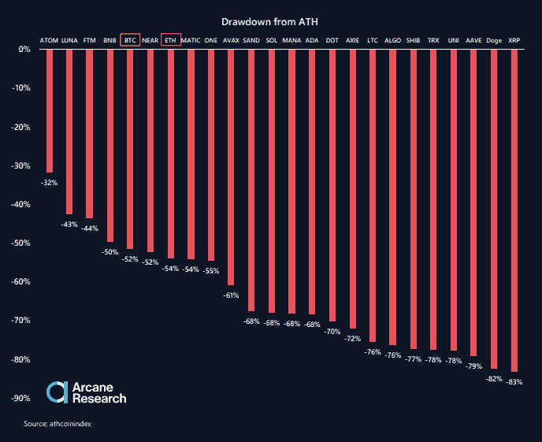
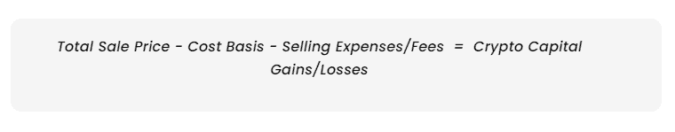

# 超级碗明星 OBJ 用比特币领薪水的秘密税教训

> 原文：<https://medium.com/coinmonks/crypto-tax-lessons-from-super-bowl-star-obj-taking-salary-in-bitcoin-b6b6d0ab25be?source=collection_archive---------32----------------------->

他们说时间就是金钱。这句话最真实不过了，尤其是当你要进行耗时的报税过程的时候。

现在，另一个难题被添加到计算税收的古老过程中:需要计算出你需要为你的加密交易支付多少税。由于这是一个如此陌生的领域——而且美国国税局将秘密投资者[置于其十字路口](https://time.com/nextadvisor/investing/cryptocurrency/infrastructure-bill-crypto-taxes/)——计算你的秘密税肯定会让你紧张，无论你是普通人还是像小奥黛尔·贝克汉姆这样的 NFL 超级明星。

现在今年的超级碗已经尘埃落定，让我们看看我们可以从其中一名球员身上学到什么。

# 小贝克汉姆和比特币

时机就是一切。考虑一下 NFL 外接员小奥德尔·贝克汉姆(Odell Beckham Jr .)(OBJ)的正面例子，他于 2021 年 11 月初从克利夫兰·布朗被释放，但随后立即被添加到洛杉矶公羊队的名单中，并赢得了超级碗。这是一个绝佳时机的例子。

另一方面，一个糟糕时机的例子是 OBJ 公开宣布，当他[在 11 月 22 日发推文](https://twitter.com/obj/status/1462836953888534528)时，他将收到 2021-22 赛季剩余的比特币工资。贝克汉姆向他的 410 万推特粉丝发布了下面这条推特。

[The Action Network](https://twitter.com/darrenrovell/status/1485321862276165634) 报道称，OBJ 的交易是在 11 月 12 日达成的，当时每比特币的价格为 64158.00 美元——接近比特币的历史最高价，据报道，这将使他获得约 75 万美元的工资总额。从那以后，整个加密领域的总市值[损失了超过 1 万亿美元](https://www.bloomberg.com/news/articles/2022-01-21/crypto-meltdown-erases-more-than-1-trillion-in-market-value)，整个行业平均下降了 30%。在下面 2022 年 1 月的神秘研究图表中，你可以看到比特币(BTC)从市场顶部下跌了 50%。尚不清楚 OBJ 是否一次性拿走了这笔钱，并立即将其兑换成比特币，但如果他这样做了，他将在超级碗比赛期间损失 39 万美元。现在**那个**是糟糕的时机。

# OBJ 纳税义务研究

让我们做一个小小的思想实验:假设我们回到了超级碗周末，OBJ 决定现在就为他的比特币工资向国税局纳税。根据加密货币税务解决方案公司 [Cointelli](https://cointelli.com/features) 的说法，OBJ 需要明白的第一件事是，美国国税局不把加密货币视为实际货币，而是把[视为财产。](https://cointelli.com/blog/cryptocurrency-tax-laws)当某人接受包括虚拟货币在内的财产作为履行服务的交换时，个人将密码视为普通收入。因此，OBJ 必须将 75 万美元的比特币申报为普通收入。

接下来，OBJ 或他的税务会计师将确定这些加密收入的“[成本基础](https://cointelli.com/blog/crypto-cost-basis)”。根据 Cointelli 的说法,“成本基础”仅仅意味着当个人第一次获得它们时，密码的价值是多少。根据成本基础的计算方式，所得收入和加密税率可能会有很大变化。对 OBJ 来说，成本基础将是 75 万美元。

虽然计算 OBJ 的成本基础非常简单，但 Cointelli 团队指出，计算其他类型的加密交易的成本基础可能会很快变得相当复杂。事实上，这里有四种不同的方法，加密税务准备提供商显示如何计算成本基础，以适应您的具体情况。

1.  **FIFO(先进先出):** FIFO 是一种成本基础方法，您可以将最早购买的单位作为您的成本基础。
2.  **LIFO(后进先出):** LIFO 是 FIFO 的反义词；您使用最近购买的单位作为成本基础。
3.  **HIFO(先进先出):**与先进先出和后进先出不同，HIFO 使用最贵的采购价格作为成本基础。
4.  **特定 ID:** 特定 ID 是一种更加灵活(也可以说是风险最大)的计算资本收益的方式，因为它让你选择一个特定的单位作为你的成本基础。它不一定是最早、最晚或最贵的单元。

如果 OBJ 拿到了这单 75 万美元的巨额交易，他就万事俱备了。但是请记住，必须为每个加密交易确定成本基础。对于拥有数十或数百项加密交易的个人来说，如果他们试图独自管理，就会陷入一个耗时的项目。

但了解成本基础只是加密税难题的一部分。每笔交易都有一个复杂的公式需要求解，以确定发生的是资本利得还是资本损失。Cointelli 在其网站上提供了以下公式。

这个公式非常有用，但值得怀疑的是，OBJ 或任何普通的报税人有时间或倾向于使用它来手动计算他们的加密资本损益。幸运的是，Cointelli 提供了一个简单易行的解决方案，可以在几乎没有任何时间的情况下，准确计算超过 100 个数字钱包、加密交易所和区块链的数百项加密交易的资本损益。

# 赛后分析

虽然我们都不能像 OBJ 一样进入这个领域，但多亏了 Cointelli，我们都可以在加密税务准备和报告游戏方面节省时间。Cointelli 让您快速轻松地获得您需要的税务表格！忘记担心它会有多贵。Cointelli 只收取 49 美元加税的固定费用。

就像公羊队赢得了今年的超级碗一样，你可以放心，你也将赢得与科因特利的比赛。来看看我们的能力，并准备惊讶于你的加密税可以有多简单！

*免责声明:本帖仅供参考，不应被解释为或依赖于替代财务、法律或税务专业人士的建议。此外，本内容仅涉及美国公民和居民的美国联邦所得税后果，不涉及可能与受特殊规则约束的特定人员(如经销商或贸易商)相关的税务后果。您应该咨询您自己的财务、法律或税务专业人士，以报告和提交您的加密税或根据您的特定情况做出决定。法律、法规或现有法律的解释可能会发生变化，这可能会对未来或追溯产生不利影响。这篇文章的内容可能会有变化。*