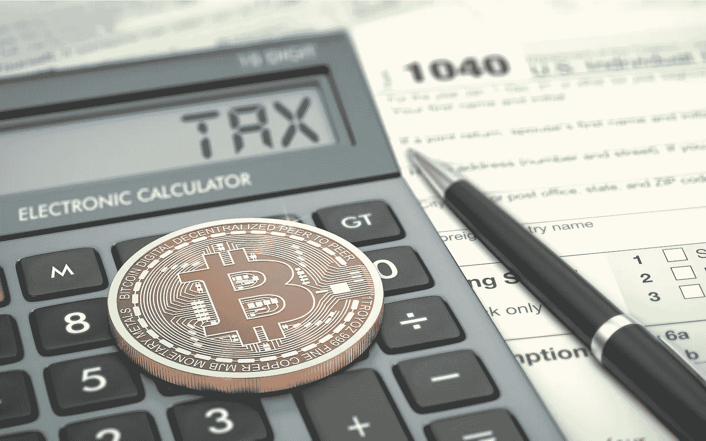
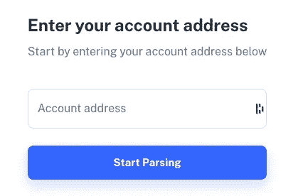
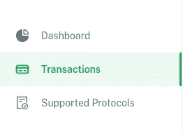
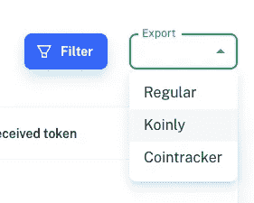
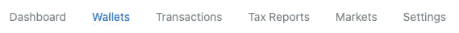
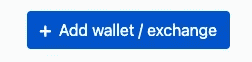
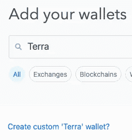
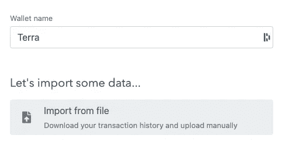
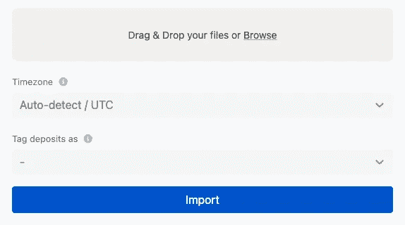

# 秘密税收季节:Koinly + TrackTerra 在这里提供帮助

> 原文：<https://medium.com/coinmonks/crypto-tax-season-koinly-trackterra-are-here-to-help-cbeafe8425b9?source=collection_archive---------8----------------------->

*按照以下步骤，了解您在 Terra 上的交易需要缴纳多少税款*

不幸的是，对于 Terra 社区，大多数加密税务软件不支持 Terra 钱包。为了解决这个问题，我们将使用 TrackTerra 将我们的 Terra wallet 交易转换为 CSV 格式，然后导入到 Koinly 中。

## 创建[唯一账户](https://koinly.io/?via=35490A8C)

点击注册。创建一个帐户或登录 Google。

## **从** [**TrackTerra**](https://www.trackterra.org/) 下载 Terra Transactions CSV

1.  输入您的 **Terra 钱包地址**。然后点击**开始解析**。这可能需要一点时间。耐心点，让窗户开着。

3.导航至**交易**选项卡

4.点击**导出**，然后点击**仅**

5.点击**下载**。

## 将 TrackTerra 的 csv 文件上传到 Koinly

1.  导航至**钱包**页面。点击**添加钱包**。

2.输入**地形**。然后选择**创建定制的“Terra”钱包**。

3.从文件中选择**导入。**

4.拖放或选择 TrackTerra 生成的 csv 文件。那你就完了！您已正式将您的 Terra wallet 交易添加到 Koinly！

不幸的是，集成并不完美，需要一些手工操作。我强烈推荐阅读 [Koinly 的美国税收加密指南](https://koinly.io/cryptocurrency-taxes/)。

导入后，我建议在 excel 中打开您的 TrackTerra csv 并让 Koinly 打开。在处理事务时，最好在 csv 中修复错误，而不是在 Koinly 中。有时候一句话会让事情变得难以挽回。

## 需要注意的事项:

不包含 UST 的 LP 进出不会显示成本基础。您需要手动填写。

此外，最后创建成本事务处理，以将您的余额与在链上报告的内容相匹配。

如果你对某个交易感到困惑，你可以点击 Koinly 上的 edit，或者在 csv 中找到交易散列，并在 [TerraFinder](https://finder.terra.money/) 或[外星人 Finder](https://finder.extraterrestrial.money/) 上输入。

> 加入 Coinmonks [电报频道](https://t.me/coincodecap)和 [Youtube 频道](https://www.youtube.com/c/coinmonks/videos)了解加密交易和投资

# 另外，阅读

*   [BlockFi vs 摄氏](/coinmonks/blockfi-vs-celsius-vs-hodlnaut-8a1cc8c26630) | [Hodlnaut 点评](/coinmonks/hodlnaut-review-best-way-to-hodl-is-to-earn-interest-on-your-bitcoin-6658a8c19edf) | [KuCoin 点评](https://coincodecap.com/kucoin-review)
*   [Bitsgap 审查](/coinmonks/bitsgap-review-a-crypto-trading-bot-that-makes-easy-money-a5d88a336df2) | [Quadency 审查](/coinmonks/quadency-review-a-crypto-trading-automation-platform-3068eaa374e1) | [Bitbns 审查](/coinmonks/bitbns-review-38256a07e161)
*   [密码本交易平台](/coinmonks/top-10-crypto-copy-trading-platforms-for-beginners-d0c37c7d698c) | [Coinmama 审核](/coinmonks/coinmama-review-ace5641bde6e)
*   [印度的加密交易所](/coinmonks/bitcoin-exchange-in-india-7f1fe79715c9) | [比特币储蓄账户](/coinmonks/bitcoin-savings-account-e65b13f92451)
*   [OKEx vs KuCoin](https://coincodecap.com/okex-kucoin) | [摄氏替代品](https://coincodecap.com/celsius-alternatives) | [如何购买 VeChain](https://coincodecap.com/buy-vechain)