# 5 款最佳加密税务软件

> 原文：<https://medium.com/coinmonks/crypto-tax-software-ed4b4810e338?source=collection_archive---------3----------------------->

加密报税可能是一个漫长而艰巨的过程。此外，选择最好的加密税务软件似乎是另一项复杂的任务，但如果你找到了正确的，它可以帮助你在正确的时间支付正确的税款，节省你的时间来提交加密税务报告，从而使你的工作更简单。因此，这里有一些最好的加密税务软件给你:

> **——[**硬币跟踪**](https://cointracking.info?ref=T987862)——[**tax bit**](https://taxbit.com/ref?fp_ref=up6nz)**

**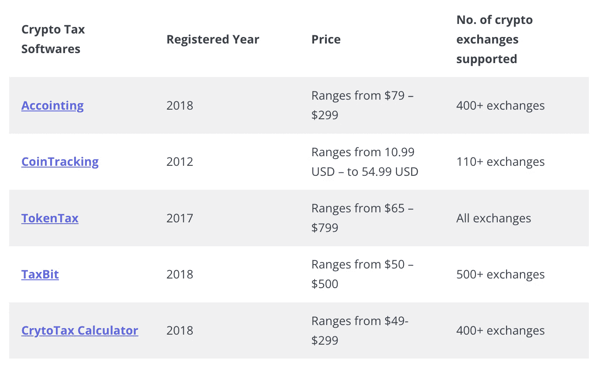**

# **什么是加密税务软件？**

**加密税务软件是可以帮助你为你持有的加密货币资产准备税务的工具。此外，这些工具允许您估计加密货币交易的利润和损失，并扣除费用。此外，该软件从钱包和交易所导入数据，以跟踪加密资产的成本，并生成税务报告。**

# **1.硬币追踪**

**[CoinTracking](https://cointracking.info/?ref=T987862) 是全球首个[加密货币投资组合管理器](https://coincodecap.com/free-crypto-portfolio-trackers)和测试报告工具。它成立于 2012 年，于 2013 年 4 月上线。这家公司的目标是让加密货币交易者的生活更轻松，而不仅仅是在纳税季节。CoinTracking 拥有超过 106 名税务律师和税务顾问来协助国际税务申报。该平台的工作是分析你的所有交易，并生成关于你的硬币价值、未实现和已实现收益、利润和损失的实时报告，报告税收和许多其他事情。**

****

## **硬币追踪:功能**

1.  ****Crypto CPAs:** 这是最好的税务软件之一，是您开始为加密货币交易商提供服务和扩展服务菜单所需要的。CoinTracking 始终是加密货币注册会计师的首选，因为它价格实惠，适用于所有主要的加密货币交易所。**
2.  ****基金经理:** CoinTracking 为所有处理多种加密货币投资组合的基金经理提供了一个便捷的环境。**
3.  ****专业帮助:**平台为您提供专业帮助，全程服务团队审核您的税务。此外，还有 100 多个国家实施的秘密税法。**
4.  ****税务报告:**如果您在一年内进行了 100 笔或更少的交易，CoinTracking 允许您免费生成税务报告。**
5.  ****交易进口:**您可以通过 API 自动交易来自 110 多个交易所的进口，或者直接与[区块链](https://coincodecap.com/what-is-blockchain-a-simple-guide-for-dummies)同步。**
6.  ****硬币图表&趋势:**该平台提供了所有列出的 18345 枚硬币的图表历史，并显示了所有硬币的最新价格。此外，你可以在图表中找到所有硬币的历史价格。**

**您可以阅读我们完整的 [CoinTracking 评论](https://coincodecap.com/cointracking-review-a-reliable-cryptocurrency-tax-software)以更好地了解该平台。**

**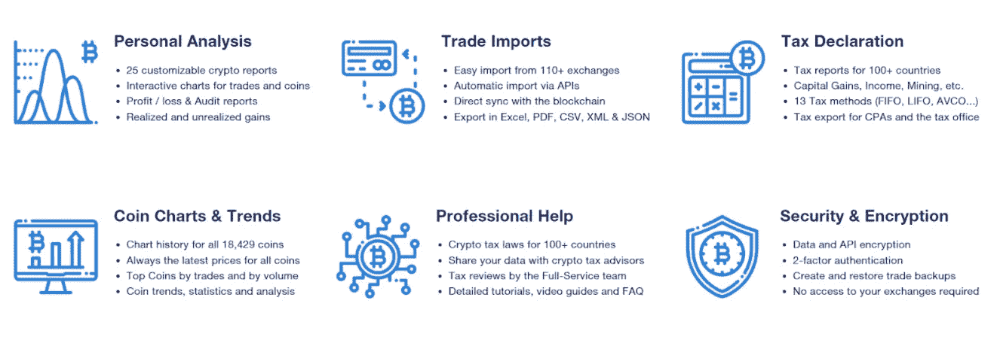**

**Features of CoinTracking**

## **硬币追踪:费用结构**

**[CoinTracking](https://coincodecap.com/cointracking-review-a-reliable-cryptocurrency-tax-software) 为您提供四种不同的[定价结构](https://cointracking.info/pro.php)，其中一种是免费的。此外，你可以选择你的计划的持续时间，如一年，两年，或一生。这些定价计划如下:**

1.  ****免费计划:**该计划面向新加密投资者，支持 200 笔交易。它还提供 2 个备份和多个帐户的有限链接。**
2.  ****Pro Plan:** 该计划每月收费约 10.99 美元，按年计费，面向高级投资者。它支持多达 3500 个事务和 5 个备份。**
3.  ****专家计划:**该计划是您能获得的最超值计划，每月收费 16.99 美元，按年计费。这是为有经验的投资者强大的投资组合跟踪。有两种不同的交易可供选择，即 20，000 笔交易、50，000 笔交易和 100，000 笔交易。此外，它支持 10 个备份。**
4.  **无限计划:无限计划每月花费 54.99 美元，按年计费。它给你完全的硬币跟踪能力，是为专业投资者设计的。它支持的事务数量是无限的，并提供 20 个备份。**

****

**Fee Structure of CoinTracking**

## **硬币追踪:利弊**

**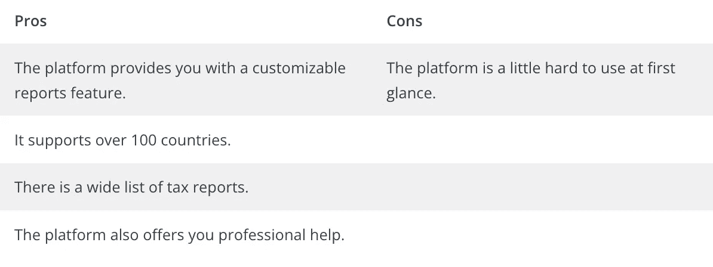**

# **2.TaxBit**

**[TaxBit](https://coincodecap.com/taxbit-review) 是最值得信赖的平台，它统一了政府、消费者和企业的会计和数字资产税。该平台由注册会计师、软件开发商和税务律师于 2018 年创立。他们的税务专家、卓越的客户服务和软件可以帮助您颠覆和解决新的合规协议或报告问题的障碍。TaxBit 的工作原理是将你钱包和交易所中的所有加密货币余额和交易集中到一个地方。此外，TaxBit 的总部设在西雅图和盐湖城。**

****

## **TaxBit:功能**

1.  ****无缝集成:**API 可以直观、轻松地与任何本机平台集成，实现即时优化和自动化。**
2.  ****智能优化:**消费工具和智能税务综合服务中的数十亿数据点，进一步帮助用户做出更好的决策。**
3.  ****投资组合管理** : TaxBit 提供了一个易于导航的平台，并从超过 500 家交易所、 [DeFi 协议](https://coincodecap.com/top-defi-protocols-to-watch-out-for-in-2022)、 [NFT 市场](https://coincodecap.com/nft-marketplaces)、钱包等处免费收集数据。**
4.  ****监管合规:** TaxBit 与全球一些最重要的监管机构合作，提供数据分析、税务计算和检查支持等。**
5.  ****安全性和隐私:**该平台非常担心其数据安全性，因为它独立通过了 SOC 2 认证。此外，这是一个零错误的游戏，当谈到 1099 发行和税务表格备案。**

*****了解更多，可以阅读我们的完整*** [***TaxBit 评论***](https://coincodecap.com/taxbit-review) ***这里。*****

**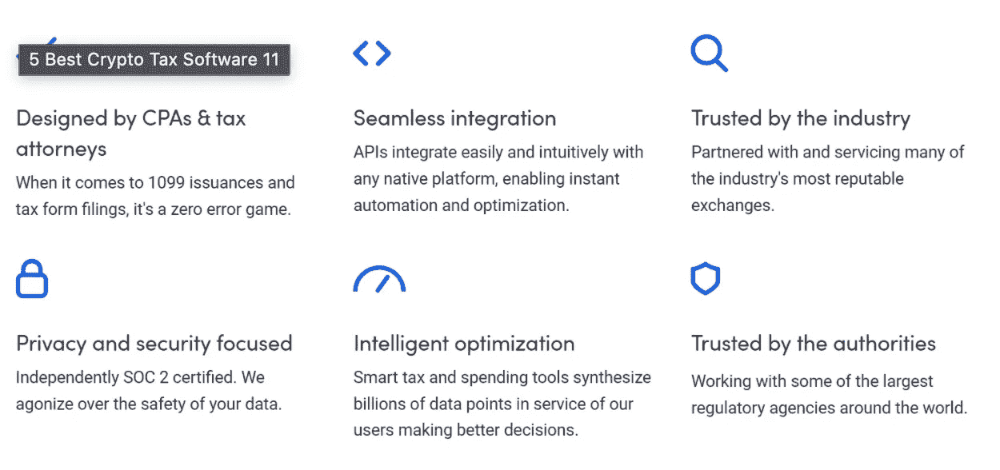**

**Features of TaxBit**

## **TaxBit:费用结构**

**你可以从 TaxBit 的[定价结构](https://taxbit.com/consumer)免费入手。TaxBit 将其定价结构分为四个方案。**

1.  ****网络计划:**这是一个免费计划，支持电子邮件，不限交易次数，并连接钱包地址。它还支持跨 500 多个平台以及 DeFi 和 NFT 税务引擎的数据接收。**
2.  ****基本计划:**该计划每年花费 50 美元，并提供实时网络聊天支持，交易次数不限，并连接钱包地址。此外，该计划还支持许多其他功能。**
3.  ****Plus+计划:**该计划每年花费 175 美元，并提供实时网络聊天支持，交易次数不限，并连接钱包地址。此外，这里还有比基本计划更多的功能。**
4.  ****Pro Plan:** 该计划每年花费约 500 美元，有专门的礼宾服务、实时网络聊天、无限交易和连接的钱包地址。除此之外，它包括所有的功能，如注册会计师审查和国税局审计支持，NFT 套件，历史税务表格，等等。**

****

**TaxBit Fee Structure**

## **TaxBit:利弊**

**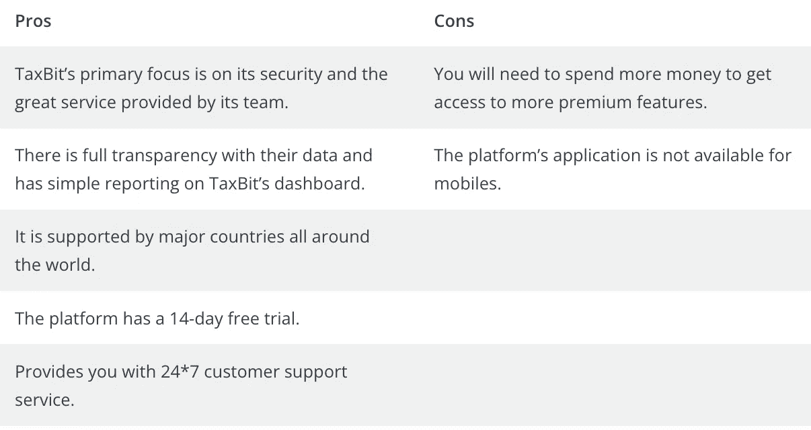**

# **3.会计**

**Accointing 可以通过 API 或 Xpubs 从 300 多个钱包和交易所自动导入您的所有交易，或者通过提供的 Excel 模板手动输入，这有助于软件计算税收。这是一个一体化的平台，为其客户提供许多服务，如加密税计算器、交易税优化器、加密跟踪器和 hub。此外，除了加密跟踪器，它还有一个加密货币税收计算器，可以提供德国、瑞士、奥地利、英国、美国或任何其他国家的特定输出。**

*****亦读，*** [***会计核算回顾——一个完整的加密税务解决方案***](https://coincodecap.com/accointing-review-a-complete-crypto-tax-solution)**

## **会计:特征**

1.  ****加密跟踪器:**借助该平台的加密跟踪和洞察工具，您可以深入了解您的所有交易。你所有的钱包和交易都会自动连接到它的[加密投资组合跟踪器](https://coincodecap.com/free-crypto-portfolio-trackers)。除此之外，他们还为您提供免费模板，使您的投资组合易于管理。**
2.  ****仪表板:**该平台为您提供了一个直观的仪表板，其中汇总了您所有代币的买卖、总体收益、净利润等。此外，你可以跟踪你的整个[加密组合](https://coincodecap.com/crypto-portfolio-rebalancing)，并获得实时性能。**
3.  ****加密税收计算器:**这个特殊的平台是为美国公民提供的，他们可以向 IRS 或通过 Turbotax 提交年收入和应税收益。**
4.  ****分类和计算加密税:**accounting 根据您所在国家的保证金交易、Defi [赌注](https://coincodecap.com/staking-crypto)和采矿等法规，自动对您的所有交易进行分类。此外，它通过检查持有近一年的代币来识别可能的节税机会，从而优化交易，从而帮助您减少损失。**
5.  ****交易税优化器:**平台的交易税优化器(TTO)期待优化其加密税。这是暂时免费提供的，是你的加密税包的一部分。此外，它提供低风险和高回报。**

**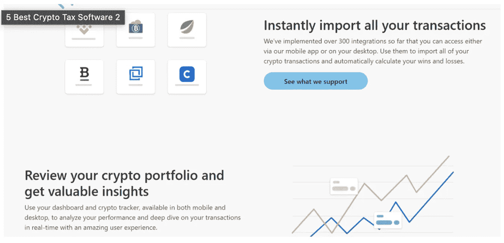**

## **会计:费用结构**

**有了[accounting](https://coincodecap.com/accointing-review-a-complete-crypto-tax-solution)，你可以免费开始，但每年最多只限 25 笔交易。除此之外，该平台还提供三种主要的[定价方案](https://www.accointing.com/pricing)，它们是:**

1.  ****爱好者:**这个计划基本上是针对持有者的，每年费用 79 美元。它总共支持多达 500 个交易。**
2.  ****交易者:**该计划是他们最受欢迎的选择之一，每年花费约 199 美元。它总共支持多达 5000 个交易。**
3.  **这个计划是为经常交易的人设计的，每年花费 299 美元。它总共支持多达 50000 笔交易。**

***所有上述计划还提供了投资组合跟踪仪表板、税收损失收获工具和加密跟踪器应用程序。此外，它还可以让你跟踪你的整个投资组合。***

**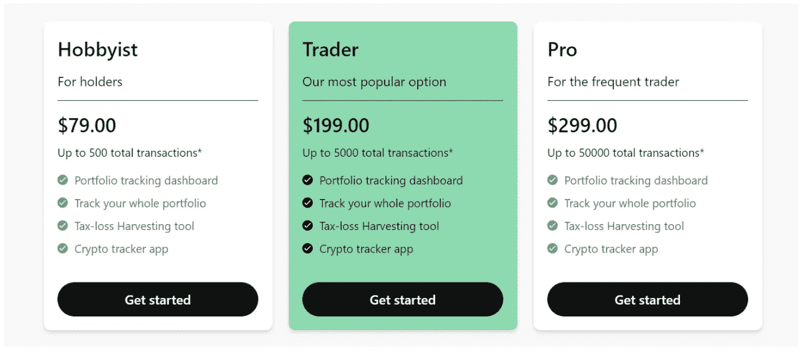**

**`Fee Structure of Accointing**

## **会计:利弊**

**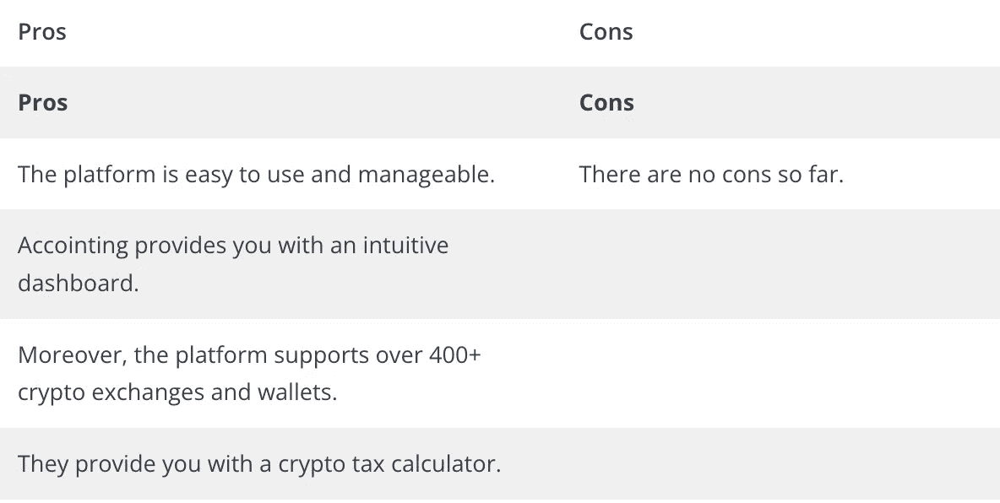**

# **4.象征税**

**如果你正在寻找一个平台，可以在专业人士的帮助下处理你的税务，但价格仍然比所有其他竞争对手低得多，我们强烈推荐 [TokenTax](https://coincodecap.com/tokentax-review-bitcoin-tax-software-and-accounting) 。他们的定制平台处理数字资产税的所有方面，从自动税单生成到资本收益计算。此外，TokenTax 有助于无缝跟踪每笔虚拟货币交易的资本损失、收益和纳税义务。**

******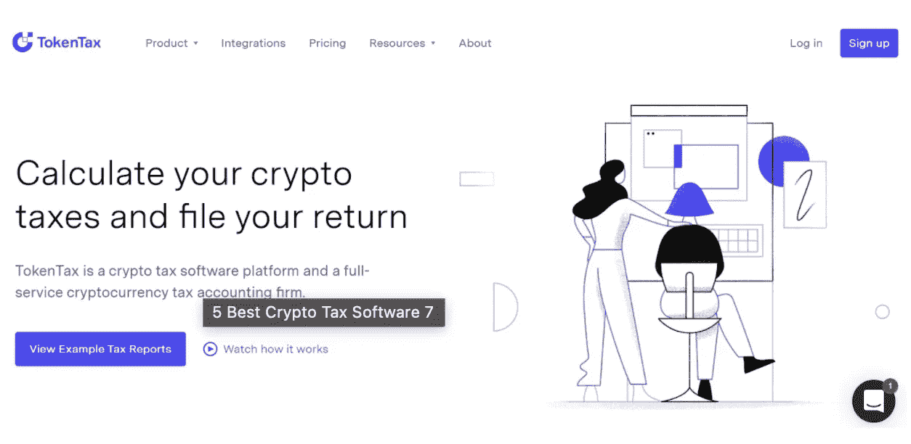**

**TokenTax**

## **令牌税:功能**

1.  **连接到交易所:这是唯一的加密税收计算器，连接到每个加密交易所。无论你的交易历史在哪里，他们都会导入你的数据并使之一致。**
2.  ****跟踪交易活动:**对于每一笔虚拟货币交易，无缝跟踪您的资本收益、纳税义务和资本损失。然后，节省您的钱使用层税损失收获工具。**
3.  ****支持每一个交易所:** TokenTax 支持并连接每一个交易所，如 [BitMEX](https://coincodecap.com/bitmex-review) 、[币安](https://coincodecap.com/binance-review)、[比特币基地](https://coincodecap.com/coinbase-review)与 API 导入。**
4.  ****税损收获:**平台的税损收获仪表盘告诉你，你的未实现损益到底是多少。**
5.  ****国际税:**您可以在英国、瑞典、澳大利亚、加拿大、南非、日本或任何其他国家计算您的加密税，因为该平台支持任何国家的任何货币。**

*****有机会了解一下加密税务软件更好的用出***[***token tax 复习***](https://coincodecap.com/tokentax-review-bitcoin-tax-software-and-accounting) ***。*****

**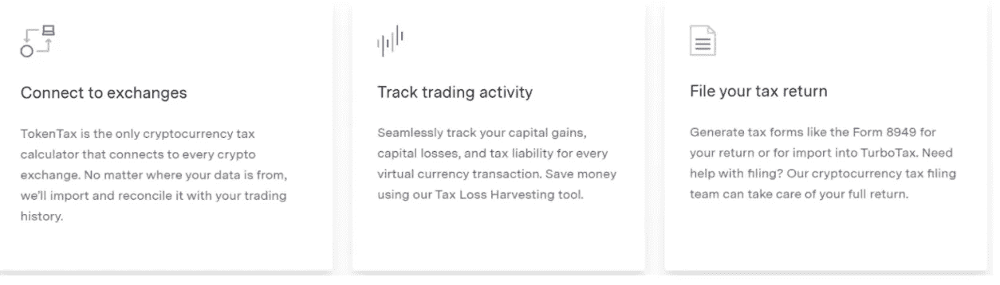**

**Features of TokenTax**

## **令牌税:费用结构**

**TokenTax [定价结构](https://tokentax.co/pricing/crypto/)由四个计划组成，包括一个 VIP 计划。除此之外，如果购买多年期计划，还可以节省 10%。这些计划如下:**

1.  ****基本计划:**每个纳税年度花费 65 美元，计算比特币基地和比特币基地的纳税义务。它支持多达 500 个交易。**
2.  ****高级计划:**该计划每个纳税年度的费用为 199 美元，面向在多个交易所和服务机构进行交易的加密投资者。该计划最多可支持 5，000 笔交易。**
3.  ****Pro 计划:**该计划每个纳税年度的费用为 799 美元，并为高级投资者和保证金交易者提供额外的功能。例如，它支持多达 20，000 笔交易。**
4.  ****VIP 计划:**VIP 计划每个纳税年度花费您 3500 美元，为您提供实际操作的加密对账以及高级税务&会计支持。此外，它支持多达 30，000 笔交易。**

**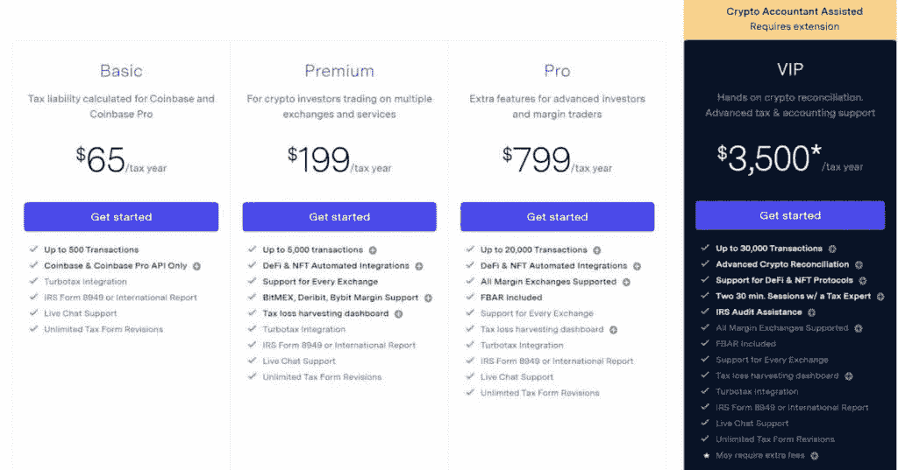**

## **象征税:利弊**

**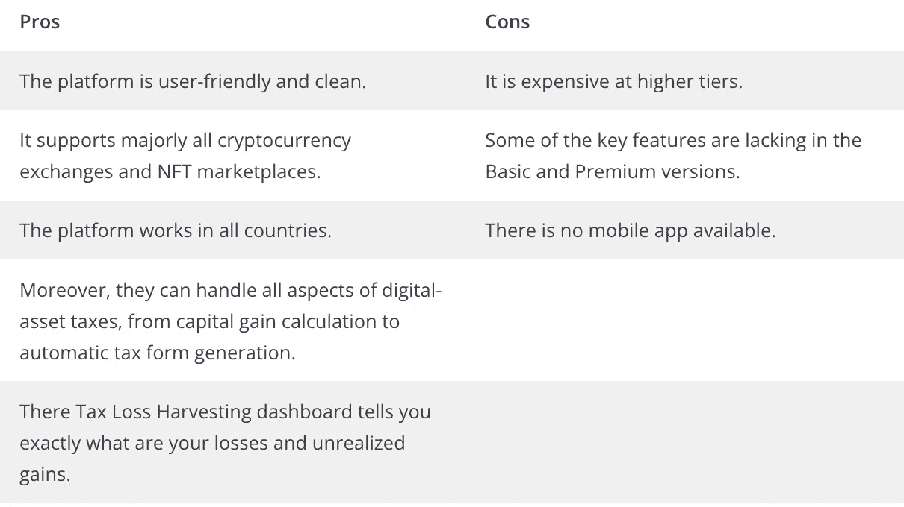**

# **5.密码计算器**

**CryptoTaxCalculator 是以这样一种方式构建的，他们可以简单地理解你的纳税义务。他们的工具有助于准确、轻松地识别、组织和跟踪您在数百个交易所和区块链的所有加密活动。这个平台是由蒂姆兄弟和谢恩·布鲁内特兄弟共同创建的。它于 2018 年进入市场，总部位于澳大利亚悉尼。此外，不要再纠结于 excel，使用加密税收计算器来获得可配置的税收设置。此外，它集成了主要的交易所、钱包和连锁店，还涵盖了 NFTs、DEX 和 DeFi 交易。**

**[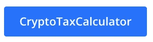](https://coincodecap.com/go/cryptotaxcalculator)****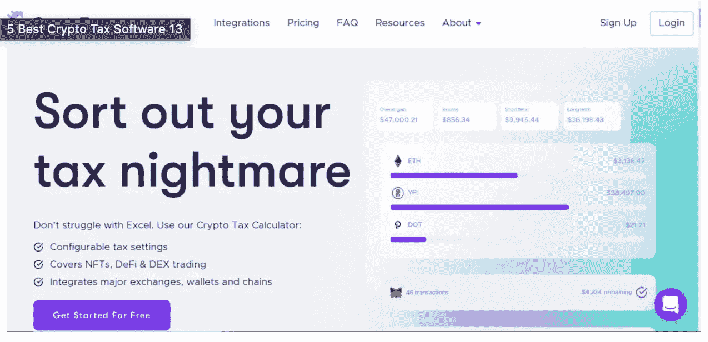**

**CryptoTaxCalculator**

## **CrytoTaxCalculator:功能**

1.  ****强大而准确的税务报告**:cryptax calculator 以极高的准确性执行所有税务计算。此外，他们还会仔细考虑所有复杂的情况，如 DEX 交易、[杠杆交易、](https://coincodecap.com/margin-trading)、 [DeFi 贷款、](https://coincodecap.com/what-are-flash-loans-on-ethereum)、[赌注回报、](https://coincodecap.com/best-crypto-staking-coins)以及汽油费。**
2.  ****简单计算:**该平台为您提供每项计算的完整明细，让您轻松了解您的税款是如何计算的，以及应用了哪些规则。**
3.  ****支持 DeFi 和 DEX 交易:**他们的软件甚至可以处理复杂的 DeFi 产品。此外，如果你使用了像 [PancakeSwap](https://coincodecap.com/buy-pancakeswap) 、 [SushiSwap](https://coincodecap.com/how-to-swap-on-sushiswap) 或 [Uniswap](https://coincodecap.com/uniswap) 这样的 DEX，那么他们也会为你提供这方面的帮助。**
4.  ****受会计师信任:**cryptax calculator 受到重视准确和详细报告的行业领先会计师的信任。**

**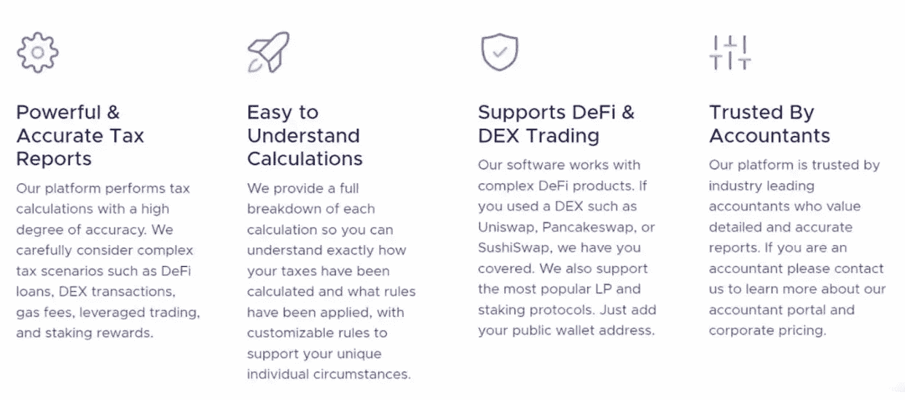**

**Features of CryptoTaxCalculator**

## **CrytoTaxCalculator:费用结构**

**CrytoTaxCalculator 的[定价结构](https://cryptotaxcalculator.io/en/pricing/personal)为您的个人账户提供了四种不同的计划。为了获得您的加密税务报告，您需要支付该计划。平台的定价结构采用年度订阅方式。此外，如果你对工作不满意，所有计划都有 30 天的退款保证。因此，这四种类型的计划是:**

1.  ****菜鸟:**这种定价结构是为涉足加密领域的用户准备的。它的年费是 49 美元。它支持 100 个交易，是密码爱好者或爱好者的理想选择。**
2.  ****爱好者:**这种定价结构每年收费 99 美元，面向使用集中交换的密码爱好者。它支持在钱包中存储资产和多达 1，000 笔交易。**
3.  ****投资者:**该计划每年 189 美元起，面向交易复杂的活跃投资者。它涵盖了 DeFi、dex、赌注、衍生品和 10，000 笔交易。**
4.  ****交易者:**这是第四个也是最后一个计划，每年为高交易量的日交易者收取 299 美元。它支持所有投资者计划和多达 100，000 笔交易。**

**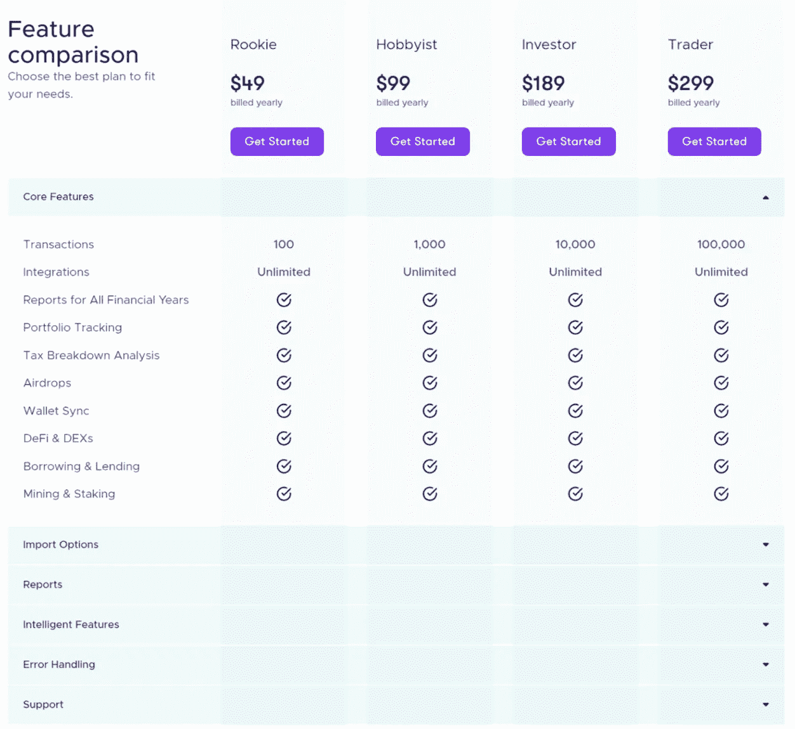**

**CryptoTaxCalculator Fee Structure**

## **密码计算器:利弊**

**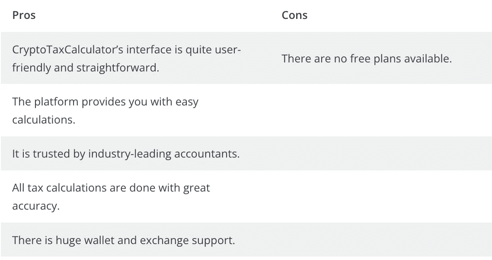**

# **结论**

**在很短的时间内，加密货币变得非常流行。这背后的原因是它获得巨额利润的高机会。但是如果你进行加密交易，那么你可能也需要交税，为此，你需要加密税务软件。希望上面文章中提到的最好的加密税务软件能让你对所有的税务平台有一个简单的了解。**

# **常见问题**

## **会计安全吗？**

**Accointing 非常重视其安全性。它们为数据加密实现 SSL、OAuth 和特定于用户的密钥。除此之外，他们还执行所有 GDPR 要求，并与所有服务提供商签订数据处理协议。**

## **税收在 Crypto 中是如何工作的？**

**每个认可加密的国家都有一个框架，该框架包括不同的方面，具体取决于对哪种加密征税。例如，在美国，你应该支付 15-20%的税，这取决于你的公寓。然而，在印度，每个人都必须为他们的加密资本收益缴纳 30%的统一税。**

*****这里有一些在美国最好的*** [***加密税工具***](https://coincodecap.com/best-crypto-tax-software-usa) ***可以帮助你在美国节省加密税。*****

## **如何使用 crypto 进行税务工作？**

**做你自己的加密税很简单，你可以简单地使用一个加密税软件，比如 Taxbit 或 CoinTracking。这些是一些最好的工具来做你的加密税，而不需要雇用一个机构或代理人。**

*****这里有一些*** [***最好的会计和加密税务软件***](https://coincodecap.com/crypto-tax-bitcoin-accounting-softwares) ***可以帮助你简化加密税务。*****

## **如何将 crypto 输入 TurboTax？**

**要将您的加密交易输入 TurboTax，您只需从 TurboTax 仪表板登录您的 exchange 帐户，该平台将自动导入您的所有交易，并根据您的交易历史创建一份税务报告。此外，如果您使用多个交换机，您可以逐一连接所有交换机，TurboTax 将为您完成其余工作。**

## **哪些加密交易需要纳税？**

**如果你刚刚起步，如果你只是简单地购买、持有或从一个钱包转移到另一个钱包，你就不必申报税收。如果你出售你的密码，你只有权向国税局申报你的税款。**

*****如果你是第一次做加密税，这里有一些作为比特币纳税人应该问的*** [***问题***](https://coincodecap.com/five-questions-about-cryptocurrency-tax-and-bitcoin-tax) ***。*****

## **在比特币基地转换密码是应税行为吗？**

**不，在您出售您的密码并从您的密码投资中获得资本收益之前，您无权享受任何税收。然后，国税局以两种方式描述你的加密收益，一种是短期资本收益，另一种是长期资本收益。**

## **税收如何与加密一起工作？**

**IRS 只对出售、完成交易或转换密码的人征税。如果你的任何行为属于以下类别，在这种情况下，你将不得不使用像硬币跟踪这样的工具来做你的加密税，并让国税局远离你的家门口。**

## **exodus 向 IRS 报告吗？**

**Exodus 是业内最好的加密硬件钱包提供商之一；然而，它们不存储任何关于钱包或种子短语的数据。因此，国税局可能无法提取你的私人硬件钱包中的密码信息。**

## **TurboTax 怎么报税？**

**一旦你将所有的加密交易导入 TurboTax，该平台将自动创建一份详细的报告，如果你应该支付的总税款。此外，该平台还可以结合你的股票、金属等其他交易来源的收益。并单独报告你的总应纳税额。**

## **什么是加密中的应税事件？**

**crypto 中有三种主要的应纳税事件:**

> **当你出售密码时**
> 
> **当你交换密码时**
> 
> **当你用密码换菲亚特的时候**

## **比特币基地费用可以扣税吗？**

**比特币基地收取的费用是他们经营交易所的方式。此外，这是交易所的运作方式，而非认购制，股票市场也是如此。然而，在 2017 年减税和就业法案(TCJA)之后，对交换费的税收减免被取消。**

## **TaxBit 网络包含哪些交易所？**

**TaxBit 每天都在向其网络添加越来越多的平台。这个网络中的一些加密平台是币安。美国，布洛克菲，比特币基地，CEX。IO，Gemini，Okcoin，MetalPay，SuperRare，还有很多，不包括这些。**

## **加密税是如何运作的？**

**加密税都是关于计算你的资本收益和损失总额。它也可以是获得一项资产的成本和出售价格之间的价值差异。**

## **加密交易如何计税？**

**您可以通过记录购买和销售时使用的当地货币的加密值来计算加密到加密交易的税收。然而，这可能是平凡的工作，因为它是耗时的，并且一些交换记录不包括参考价格点。**

**也读了，**

*   **[Bookmap 点评——最佳交易软件？](https://coincodecap.com/bookmap-review-2021-best-trading-software)**
*   **[印度的秘密税:你应该纳税吗？](https://coincodecap.com/crypto-tax-india)**
*   **[coin tracking Review——一款可靠的加密税务软件](https://coincodecap.com/cointracking-review-a-reliable-cryptocurrency-tax-software)**
*   **[TokenTax Review:加密税务软件和会计服务](https://coincodecap.com/tokentax-review-bitcoin-tax-software-and-accounting)**
*   **[ko only 点评——它真的是一款好的税务软件吗？](https://coincodecap.com/koinly-review)**

***原载于 2022 年 3 月 30 日 https://coincodecap.com***。****