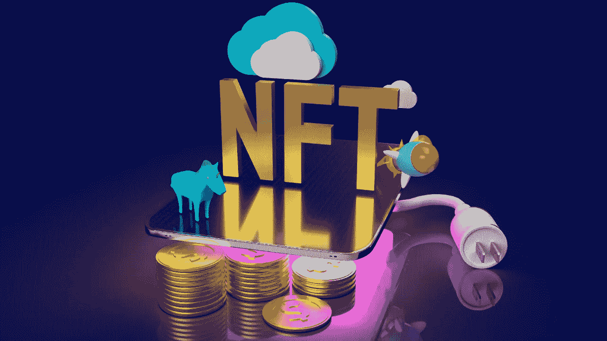

# 加密代币和游戏——我们可以通过玩游戏获得加密代币吗？

> 原文：<https://medium.com/coinmonks/crypto-token-and-game-can-we-earn-crypto-tokens-by-playing-games-caffc586af67?source=collection_archive---------58----------------------->

NFTs are growing day by day

从视频游戏中赚钱传统上仅限于电子竞技运动员或内容创作者。在不断发展和变化的数字化时代，加密货币游戏行业已经成为数字世界的新兴领域之一。通过提供 NFT 贸易的区块链技术，加密货币游戏产业是一个价值数十亿美元的市场。以至于玩游戏的时候，甚至还有数字经济给你付钱。

# NFTs 和游戏

NFT 赚钱游戏是允许玩家通过战斗、升级角色和完成特定任务来享受其中的游戏。我认为要问的问题应该是 NFTs 是如何变得如此流行的。你可以将 NFT 转移到加密货币钱包中。此外，可以将 NFT 转换为游戏中的货币，这些货币可以出售或交换为可用于现实世界支付或货币的代币。那些玩加密游戏的人会收到我上面提到的报酬。玩家赢得的代币是玩家需要积极参与这些游戏的主要动机来源之一。所以，你一边玩一边赢，你也享受赢。

随着世界开始利用区块链技术，这种去中心化的操场继续成长。最新的趋势是“玩赢”模式，它弥合了虚拟空间和现实之间的差距，为游戏玩家提供了以用户为导向的经济。

得益于赢来玩，玩家提供了许多功能，如成长角色，解锁升级和购买物品。玩家通过参与游戏经济为社区和开发者创造价值。

游戏赚取事件的范围从不同的奖励系统到游戏中的资产，如车辆和武器。在金融术语中，可令牌化资产可以作为加密货币和不可替代令牌(NFT)出售。

# 从玩到赚:它是如何工作的？

在去中心化的世界里，先玩后赚强调了两种创造流动性的方法。这些方法是:

**1。买卖游戏内 NFT**

**2。玩游戏赚取游戏内加密货币**

在第一种情况下，玩家在加密货币市场中创建独特的游戏内 NFT 物品，并将这些加密货币出售给其他玩家。在后一种情况下，玩家可以获得游戏中的加密资产，这些资产可以用来购买更多的游戏内容或兑换成菲亚特和其他数字货币。

# 1.NFT 买卖

创建、购买和出售游戏中的非功能性资产是“玩到赢”模式背后的核心概念。最著名的例子是基于 NFT 的游戏，它允许用户在游戏市场中购买、出售和交易 NFT 收藏品，如手工制作的武器、化妆品和增强能量的药剂。

例如，Axie Infinity 是 NFT 在线游戏的一个很好的例子，玩家可以制作或购买 Axie 与其他玩家战斗并获得奖励。每个轴也是一个独特的 NFT。这意味着这两个轴是不同的，它们的所有权在区块链上是分开追踪的。玩家也可以在市场上出售他们的 NFT 斧头，并获得所有利润。因此，Axie Infinity 为收藏家和游戏玩家创造了一个面向用户的市场经济。

# 2.赚取游戏内奖励和加密货币

除了 NFT 的游戏内资产，Mobox 等游戏平台也通过免费游戏向玩家奖励加密货币。任何人都可以参与该平台提供的各种游戏，从 NFT 农业到农业和区块链游戏。此外，用户可以在流动性池中下注，或使用陌陌 NFT 赚取以当地 MBOX 货币支付的赌注奖励。赌注 MBOX 代币可以奖励独特的陌陌 NFT 神秘盒子，为用户持有和使用平台的原生代币创造额外的激励，以获得被动收入。在这篇文章中，我试图看看代币和游戏之间的关系。在我的下一篇文章中，我将尝试检查适应性和令牌。

**参考文献**:

1.  [https://zipmex.com/learn/top-play-to-earn-crypto-games/](https://zipmex.com/learn/top-play-to-earn-crypto-games/)
2.  [https://www . analyticsinsight . net/top-cryptocurrency-games-where-you-can-get-token-gifts-in-2022/](https://www.analyticsinsight.net/top-cryptocurrency-games-where-you-can-get-token-gifts-in-2022/)
3.  [https://www . binance . com/en/blog/NFT/7-NFT-games-to-playtoearn-in-2022-421499824684903225](https://www.binance.com/en/blog/nft/7-nft-games-to-playtoearn-in-2022-421499824684903225)

> 加入 Coinmonks [电报频道](https://t.me/coincodecap)和 [Youtube 频道](https://www.youtube.com/c/coinmonks/videos)了解加密交易和投资

# 另外，阅读

*   [最佳加密分析或链上数据](https://coincodecap.com/blockchain-analytics) | [Bexplus 评论](https://coincodecap.com/bexplus-review)
*   [NFT 十大市场造币集锦](https://coincodecap.com/nft-marketplaces)
*   [AscendEx Staking](https://coincodecap.com/ascendex-staking)|[Bot Ocean Review](https://coincodecap.com/bot-ocean-review)|[最佳比特币钱包](https://coincodecap.com/bitcoin-wallets-india)
*   [Bitget 回顾](https://coincodecap.com/bitget-review)|[Gemini vs block fi](https://coincodecap.com/gemini-vs-blockfi)|[OKEx 期货交易](https://coincodecap.com/okex-futures-trading)
*   [美国最佳加密交易机器人](https://coincodecap.com/crypto-trading-bots-in-the-us) | [不断回顾](https://coincodecap.com/changelly-review)
*   [在印度利用加密套利赚取被动收入](https://coincodecap.com/crypto-arbitrage-in-india)