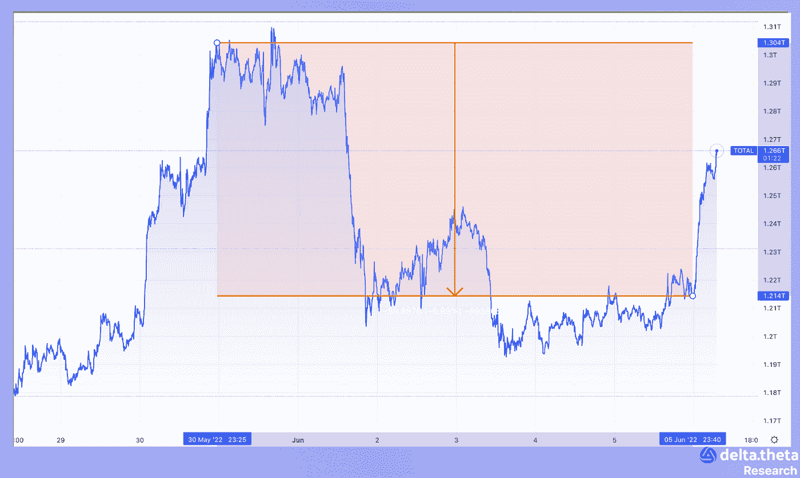
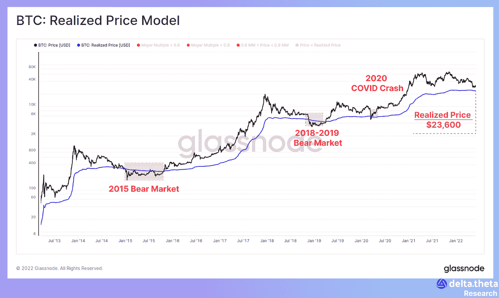
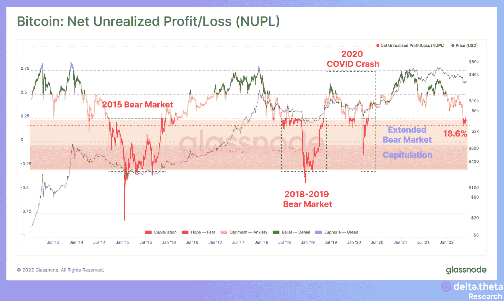
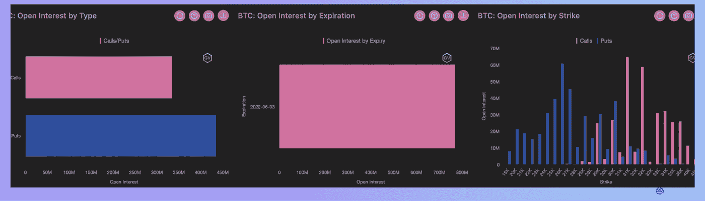
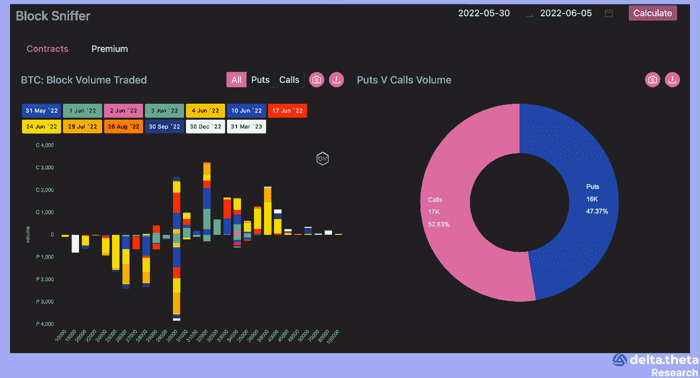
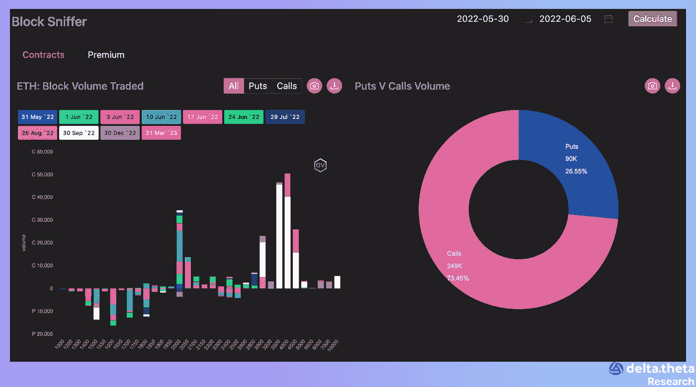

# 秘密交易者正在寻找最后的底部

> 原文：<https://medium.com/coinmonks/crypto-traders-are-in-search-of-a-the-final-bottom-60b26ab23692?source=collection_archive---------24----------------------->

过去一周，加密市场一直处于横盘整理状态。加密货币市场在这一时期开始时的规模为 1.291 万亿美元。然后，在本周中期，跌至 1.194 万亿美元的局部底部。到这一时期结束时，恢复到 1.271 万亿美元的水平。因此，到本周末，资本化指数的总变化为-1.54%。

比特币已经在 28 600 到 31 500 区间交易了近一个月。该资产在本周开始时为 30 680 点，在短期内上升至 32 097 点的局部峰值。然后，在本周中期，价格在 29 437 找到了一个局部底部。随后又回升到 31 410 人。于是，到期末，比特币涨了 2.38%。

以太坊价格运动几乎有一个类似的模式，从 1900 年开始，上升到 1994 年的局部峰值，然后在本周中期下降到 1750 年的局部底部。在那之后，我们可以看到在这个时期结束时恢复到 1905 年的水平。因此，我们可以说以太坊价格在本周几乎保持不变。

# 新闻

美国监管机构正在调查币安控股有限公司是否在五年前的早期销售代币违反了证券法规。美国证券交易委员会(sec)正在调查该公司及其 BNB 代币的历史，后者目前是全球第五大资本化代币。调查人员正在调查 2017 年的 ICO 是否构成了应登记的证券销售。最近几个月，币安受到了美国各监管机构的严密审查。

新的风险投资公司 Canonical Crypto [正式推出了其第一只 2000 万美元的基金](https://techcrunch.com/2022/06/02/microsoft-web3-solo-gp-venture-fund-backs-crypto-developer-tools-infrastructure/)，加入了最近几周筹集的一系列加密货币基金。Canonical Crypto 的支持者包括安德森霍洛维茨基金(Andreessen Horowitz)的马克安德森(Mark Andreessen)和克里斯迪克森(Chris Dixon)、风险投资公司的尚阿格沃尔(Shan Aggarwal)、风险投资公司的艾米吴(Amy Wu)、资本公司的哈西布库雷希(Hasib Qureshi)等人。在去年 9 月创建 Canonical 之前，Anand Layer(首席执行官)是 Pear Ventures 的客座合伙人，他专注于加密货币投资。迄今为止，Canonical 已经投资了 10 多家初创公司，包括基于 Solana 的数据基础设施项目 Vybe Network、web3 Notifi 通信基础设施平台和 web3 开发者工具制造商 Thirdweb。

渗透作用，即在宇宙生态系统中运作主要分散交换的区块链，[已经被叫停](https://www.theblockcrypto.com/post/150752/osmosis-dex-on-cosmos-exploited-for-5-million-as-validators-halt-the-network)。其流动性池中的一个严重缺陷导致了一次 500 万美元的黑客攻击，该网络的核心开发团队和验证人员停止了区块链。该漏洞首先被一名用户发现，他警告说，如果有人向渗透池添加资金并将其移除，头寸将以某种方式增加 50%。由于区块链关闭，渗透 DEX 和它的钱包仍然暂时无法使用。该团队目前正致力于在网络重启前修复漏洞。

PayPal [为其加密货币应用的用户推出了新功能](https://decrypt.co/102210/paypal-lets-users-transfer-bitcoin-and-ethereum-to-external-wallets)。这些变化将允许用户在 PayPal 和其他钱包之间转移加密货币。从现在开始，用户可以将支持的令牌——BTC、eth、比特币现金和莱特币——发送到外部地址，包括与交易所账户和硬件钱包相关的地址。他们还可以使用 PayPal 向该应用程序的其他用户发送加密货币。这类似于去年 5 月 Revolut 如何改进自己的加密应用程序。

# 市场情况

在交易周(周一亚洲时段)开始时的波动性飙升后，竞购者正在寻找价格底部和可能的进场点。从宏观战略角度来看，当前时期价格的主要压力来自矿商的抛售(根据 Glassnode analytical service 的数据，上月约 10 000 BTC)以及长期和短期加密货币持有者的可能退出。

根据链上指标，所有非交换地址之间的平均购买价格目前为 23 600 美元。目前的现货价格非常接近收益率边界。从历史上看，这种情况通常是一个可能的熊市价格运动周期结束的迹象。

此外，在市场下跌的最剧烈阶段，未实现的利润指标通常在低点做空。目前，在熊市周期的最后投降阶段之前，回报率仍然很低，这也可以被视为达到当地价格底部的迹象。

# 加密货币期权市场

市场上的主要交易活动与购买看跌期权有关，尽管这一方向不再像 5 月初价格大幅下跌时那样强劲。交易量最大的水平彼此接近——买入期权分别为 32 000 点和 34 000 点，卖出期权分别为 25 000 点和 30 000 点。

在大宗交易中，对比特币和以太坊的预期存在明显差异。就 BTC 而言，主要兴趣集中在对未来一个月(6 月)价格运动的不同解释上，交易集中在 30 000 点附近(两种期权类型)。就 ETH 而言，扭曲的交易活动更加明显，9 月份的看涨期权的执行日期远高于当前的现货价格 3 000、4 000 和 5 000(在看涨期权价差策略中)。这也可能表明以太坊相对于比特币有更大的优势，以及市场对股权证明转变的预期对该资产基本面价值的重新评估。

> 加入 Coinmonks [电报频道](https://t.me/coincodecap)和 [Youtube 频道](https://www.youtube.com/c/coinmonks/videos)了解加密交易和投资