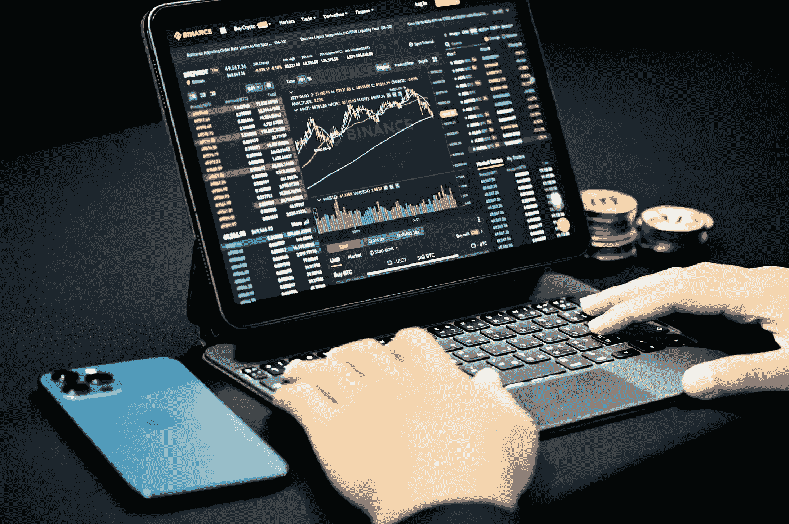
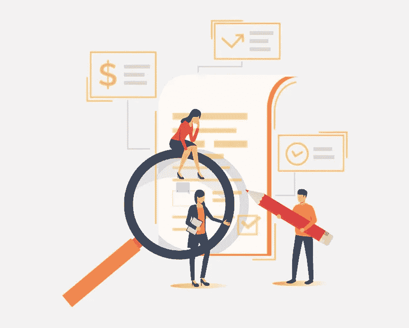

# 帮助你负责任地交易密码的 5 个免费提示

> 原文：<https://medium.com/coinmonks/crypto-trading-5-free-tips-to-help-you-trade-crypto-responsibly-a28b57c55c8?source=collection_archive---------48----------------------->

“我认为投资心理是最重要的因素，其次是风险控制，最不重要的是你在哪里买卖的问题。”–汤姆·巴索

汤姆·巴索关于投资风险管理的最佳名言之一。

负责任的加密货币交易涉及管理您交易行为的所有方面。

试着将这五个建议融入你的日常生活。他们会帮助你改善你的交易策略。

## 1.创建交易策略:

防止你的情绪影响你交易的最好方法是制定一个策略并坚持下去。

这样，突然的盈利、亏损、嗡嗡声或 FUD 都不会影响你的决策。

你的策略应该总结你想做的交易类型、交易条件和你的交易目标。

你的风险承受能力和交易策略将决定你的极限。

你应该清楚地制定你的交易计划，并在以后的阶段对你的决定感到满意。

您的交易策略可能包括以下内容:

*   如果必须的话，你想使用多大的杠杆？
*   特定交易的进出场价格。
*   最高投资额占总资本的百分比
*   你的投资组合是多么多样化。
*   你的秘密资产分配
*   你什么时候应该停止交易(时间、成交量等)。)
*   最大损失
*   你交易什么资产？

## 2.避开 FOMO:

害怕错过投资机会会让你做出轻率的决定，从而放弃你的交易策略。

社交媒体上有许多新闻和广告让我们变得脆弱。

你应该时刻警惕骗子。骗子宣传他们的项目，而不考虑其实际价值。

如果你觉得你错过了一个你一无所知的项目，在拿你的钱冒险之前，花些时间对这个项目做彻底的研究。

以下是几件可能引发 FOMO 的事情:

*   社交媒体:Twitter、Telegram、Reddit 和其他社交平台充斥着谣言和错误信息。有影响力的人通过推广项目获得报酬。你应该永远 DYOR。
*   收益:当你获得更多收益时，开始对你的策略产生如此大的信心是很有诱惑力的。如果不小心，你可能会在其他投资上做出糟糕的决定。
*   损失:试图挽回损失可能会增加 FOMO。它最终会导致更大的损失。
*   波动性:两个方向的大幅价格波动都提供了获利机会。无论你投资并希望价格上涨还是做空市场。你可能会将下跌的市场视为一个投资的好机会，但最终还是失败了。

## 3.自己做研究(DYOR):

研究应该只是你分析的开始。做你的研究来验证你找到的任何信息。

只有你自己最清楚自己的风险承受能力，以及什么才是适合自己的投资组合。

在你开始投资之前，确切地知道你要把钱投资在哪里。

## 4.多样化你的投资组合:

投资加密货币时，首先要确定自己的资产配置。

你可以将你的投资分成 Defi 流动性池、赌注、衍生品、稳定硬币和替代硬币。

如果你减少对一个单一密码类别的风险敞口，你不太可能遭受大的损失。

例如，你可能在你投资的流动性池中遭受损失，但是在赌注上的收益抵消了损失。

## 5.使用限价止损单:

止损限价单允许你获得更多的交易控制权。你不能总是全天候坐在屏幕前。

加密货币非常不稳定，你可能会遭受意想不到的损失。

持有大量加密货币而不受波动性影响不是一种负责任的交易方式。

一旦你制定了交易策略，你应该在止损单的帮助下坚持下去。

想象一下，你以 5000 美元购买了 100 亿瓦坎达伊努(WKD)，100 亿瓦坎达伊努的价格现在是 20000 美元。

你要确保在价格下跌时，你的售价不会低于 15，000 美元。

这给你留下了 15，000 美元的利润。为了实现自动化，你可以设置一个止损限价单来卖出。

首先，将止损价格设为 17000 美元。这是触发你限价单的价格。

然后你把限价设置为 15000 美元，也就是说你的 100 亿瓦坎达伊努在达到止损价的时候会卖到 30000 美元或者更多。

在止损价和限价之间留下一个缺口，你的止损限价单最有可能被执行。

如果没有缺口，市价可能会跌破你的限价，而你的订单也不会被执行。

# 结论:

*无论您是交易数字资产、股票还是商品，您都应该始终使用适当的风险管理策略，并始终做好您的研究。*

*如果你感到压力太大，或者失去的东西超出了你的承受能力，这是你需要冷静一段时间的信号。*

*我相信你从这篇文章中获得了价值。如果是这样的话，请关注我，点击* [*Twitter*](https://twitter.com/bukzofwakanda) *获取更多类似的内容。别忘了给它鼓掌👏。*

*您也可以联系我，为密码相关的主题或品牌撰写工作。*

*欢迎在评论中提问。我愿意提供答案。*

> 加入 Coinmonks [电报频道](https://t.me/coincodecap)和 [Youtube 频道](https://www.youtube.com/c/coinmonks/videos)了解加密交易和投资

# 另外，阅读

*   [Bookmap 点评](https://coincodecap.com/bookmap-review-2021-best-trading-software) | [美国 5 大最佳加密交易所](https://coincodecap.com/crypto-exchange-usa)
*   最佳加密[硬件钱包](/coinmonks/hardware-wallets-dfa1211730c6) | [Bitbns 评论](/coinmonks/bitbns-review-38256a07e161)
*   [新加坡十大最佳密码交易所](https://coincodecap.com/crypto-exchange-in-singapore) | [收购 AXS](https://coincodecap.com/buy-axs-token)
*   [红狗赌场评论](https://coincodecap.com/red-dog-casino-review) | [Swyftx 评论](https://coincodecap.com/swyftx-review) | [CoinGate 评论](https://coincodecap.com/coingate-review)
*   [投资印度的最佳加密软件](https://coincodecap.com/best-crypto-to-invest-in-india-in-2021)|[WazirX P2P](https://coincodecap.com/wazirx-p2p)|[Hi Dollar Review](https://coincodecap.com/hi-dollar-review)
*   [加拿大最好的加密交易机器人](https://coincodecap.com/5-best-crypto-trading-bots-in-canada) | [库币评论](https://coincodecap.com/kucoin-review)