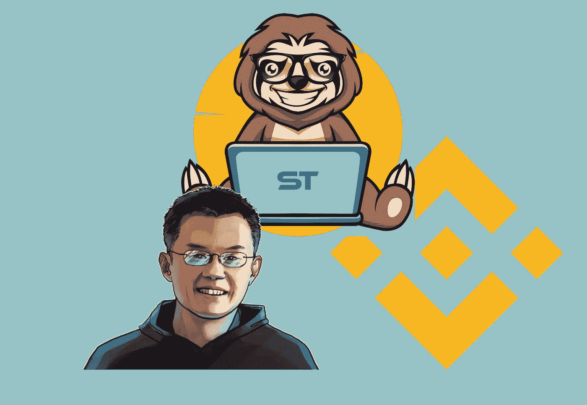
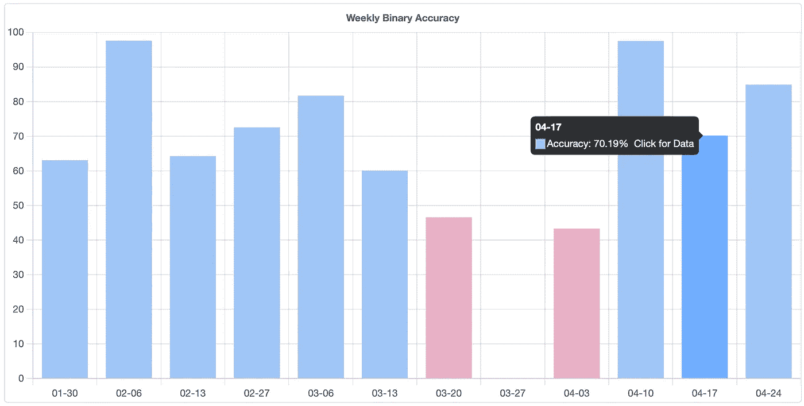

# 加密交易(BNB/USDT):上周准确率 70%

> 原文：<https://medium.com/coinmonks/crypto-trading-bnb-usdt-70-accuracy-over-the-last-week-a770f5dc2b57?source=collection_archive---------11----------------------->

在这篇简短的文章中，我将展示我的交易算法是如何运行的，以及我是如何在上周用币安期货交易 BNBUSDT 时达到高达 70%的准确率的。

对于那些第一次读我的人，我会推荐你看一下我的文章，这篇文章解释了我是如何为交易开发一个神经网络的，我所谓的[slot trading](/coinmonks/i-developed-a-profitable-trading-algorithm-with-proofs-24d08b1c0298)算法:)。

到目前为止，对 1 周时间框架的预测非常有效，现在我将向您展示上周 BNBUSDT 对币安期货的命中率。

精确度是在二进制的基础上计算的，取决于在 BNBUSDT 上预测下周价格方向时算法是对还是错。

正如您可能已经看到的，我们在上周获得了令人难以置信的 70%的准确率。这个结果相当不错，清楚地证明了我的神经网络与此有关。卷积神经网络目前被顶级对冲基金用于算法交易，这是有原因的。你输入算法的数据质量越高，你得到的结果就越好。大玩家知道这一点，几十年来一直在利用这种信息不平衡。

我的[网站](https://slothtrading.com)上提供了所有的信息以及更多信息，这里有对不同资产的每小时预测。

记得在[推特](https://twitter.com/SlothTradingCom):)上关注我。

给我们一笔[捐款](https://ko-fi.com/slothtrading)来继续发展这个项目，我们将不胜感激:)。

> 加入 Coinmonks [电报频道](https://t.me/coincodecap)和 [Youtube 频道](https://www.youtube.com/c/coinmonks/videos)了解加密交易和投资

# 另外，阅读

*   [如何在 Uniswap 上交换加密？](https://coincodecap.com/swap-crypto-on-uniswap) | [A-Ads 审查](https://coincodecap.com/a-ads-review)
*   [加密货币储蓄账户](/coinmonks/cryptocurrency-savings-accounts-be3bc0feffbf) | [YoBit 审核](/coinmonks/yobit-review-175464162c62)
*   [Botsfolio vs nap bots vs Mudrex](/coinmonks/botsfolio-vs-napbots-vs-mudrex-c81344970c02)|[gate . io 交流回顾](/coinmonks/gate-io-exchange-review-61bf87b7078f)
*   [CoinFLEX 评论](https://coincodecap.com/coinflex-review) | [AEX 交易所评论](https://coincodecap.com/aex-exchange-review) | [UPbit 评论](https://coincodecap.com/upbit-review)
*   [AscendEx 保证金交易](https://coincodecap.com/ascendex-margin-trading) | [Bitfinex 赌注](https://coincodecap.com/bitfinex-staking) | [bitFlyer 评论](https://coincodecap.com/bitflyer-review)