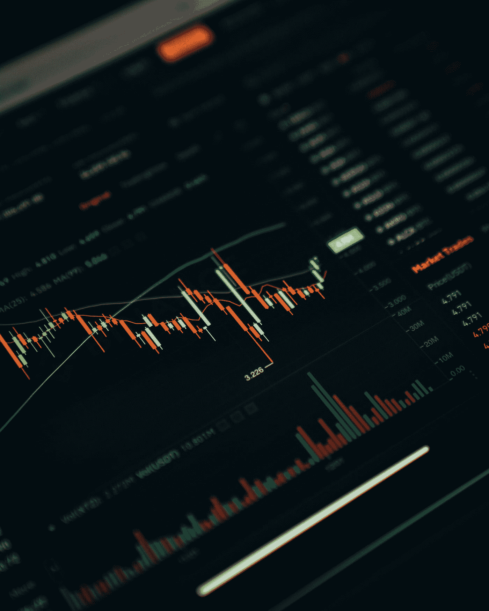

# 动荡时期的加密交易:如何赚钱和你需要知道什么

> 原文：<https://medium.com/coinmonks/crypto-trading-in-turbulent-times-how-to-make-money-and-what-you-need-to-know-5a5065ab25b?source=collection_archive---------25----------------------->

Photo by [Dylan Calluy](https://unsplash.com/@dylancalluy?utm_source=medium&utm_medium=referral) on [Unsplash](https://unsplash.com?utm_source=medium&utm_medium=referral)

在动荡时期，一些投资者更喜欢坚持可靠的投资，而另一些人则认为这是一个快速赚钱的机会。在电晕危机、猖獗的通货膨胀和俄罗斯入侵乌克兰之后，市场再次陷入过山车。