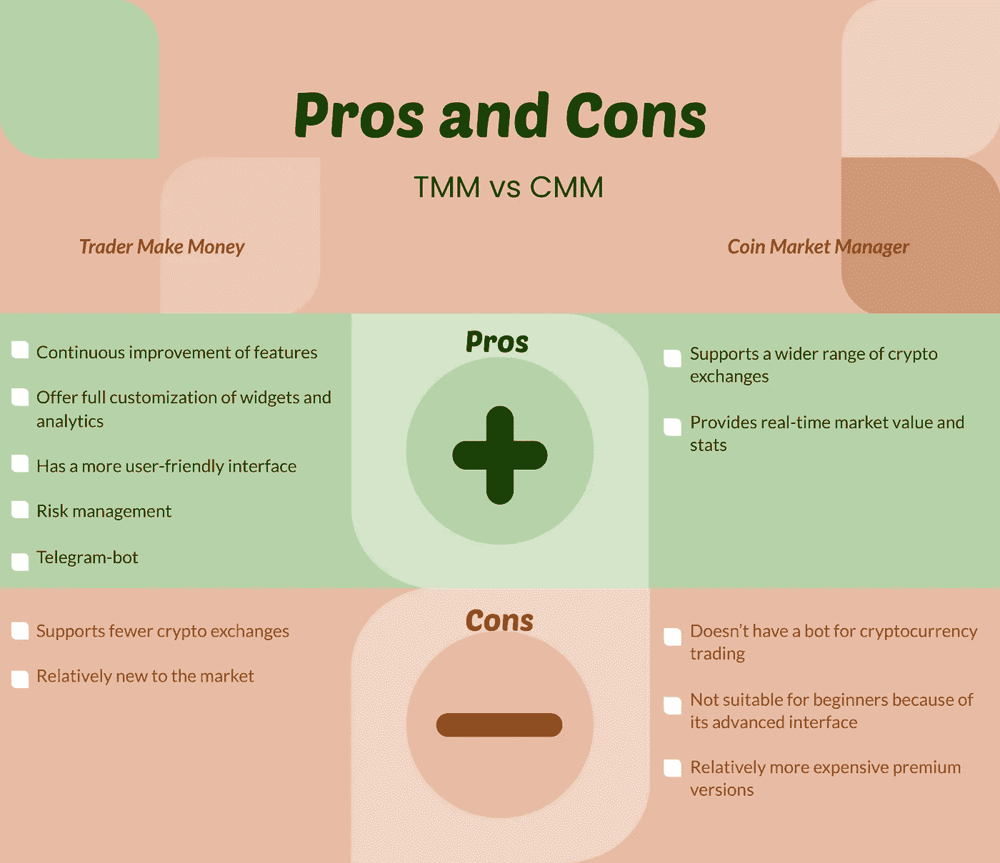

# 密码交易期刊评论:CoinMarketMan.com 与 TradersMake。金钱

> 原文：<https://medium.com/coinmonks/crypto-trading-journal-review-coinmarketman-com-vs-tradersmake-money-76d83d32c3e?source=collection_archive---------70----------------------->

> 密码交易是高风险、高回报的游戏…

一个密码交易者可以在几分钟内赚到几千美元或者输掉。因此，使用最好的加密交易工具是专业加密日内交易的建议，尤其是在投资组合不断增长的情况下。

在这种情况下，你需要寻找最好的加密投资组合跟踪，可以帮助你在你的加密交易之旅。

# 什么是加密交易日志？

简单地说，一个加密交易日志，有时被称为交易日记，是你所有交易背后的历史和原因，包括你可能影响你的决定的想法。

如果你不使用加密图表工具，加密技术分析，或者至少是免费的交易日志，加密交易就变成了猜测或赌博。最糟糕的情况是:你可能遭受连败，并因为缺乏策略、冲动的愤怒交易和炒作加密货币而毁掉你的整个投资组合。

# 使用加密交易日志的好处

密码交易是关于计划，策略，产生洞察力，根据数据行动，以及保持一致。现在，如果你还在研究如何交易加密货币，免费的加密交易杂志:

1.  在进行潜在交易前增加你的批判性分析
2.  允许您客观地评估自己的表现和成长
3.  对你的缺点和优点产生有用的见解
4.  防止你的情绪影响你的交易决定
5.  通过具体的数据保持您的责任感和战略性

交易员使用加密交易日志来记录数据并进行分析，以便随着时间的推移[改进他们的策略](https://tradermake.money/blog/how-trader-journal-helps-to-improve-your-trading/)。

但是具体怎么做呢？

# 如何使用加密交易日志

如果你刚刚开始，你可以用纸笔或者 Excel 表格来记录你所有的交易。一种简单的方法是为您的:

1.  录入日期
2.  密码符号对
3.  入帐价格
4.  获利水平
5.  止损水平
6.  利润或损失
7.  利润/亏损百分比
8.  原因/注释

每次交易后，你应该把结果输入盈利或亏损部分，并写下你盈利或亏损的原因。改变每一行的颜色，以表明它是赢了(绿色)还是输了(红色)。

在某些情况下，加密交易日志也可以包括日记部分，你可以写下你的情绪、想法或想法。

# 选择最好的免费加密交易杂志

虽然许多加密交易员开始在电子表格中记录他们的交易，但一旦你的投资组合随着时间的推移继续增长，这可能会变得很麻烦。如果你每天做几笔交易，很容易迷失方向或混淆，导致不一致或错误的数据。

当这种情况发生时，转向免费的加密交易日志是最好的行动。许多网站或提供商现在提供免费的加密交易日志软件，自动记录整个过程。

有些是有用的，有些是彻头彻尾的垃圾。因此，为了帮助你的搜索，我们将回顾两个提供免费交易日志服务的最佳平台。

当今市场上最好的加密交易期刊是:

# TraderMake。货币(TMM)

它的座右铭是:记录。分析一下。利润。，交易者赚钱脱颖而出，因为它的用户友好，直观的界面和多才多艺的分析功能。虽然它相对较新，但由于它不断努力创新平台的特性和功能，它很快在密码交易员中流行起来。

# 硬币市场经理(CMM)

这是一个自动化的投资组合管理和交易分析软件，可以根据您的交易历史提供有用的统计数据。它提供了许多有用的特性和功能，可以增加专业交易者的利润。

那么，哪本加密交易杂志最适合你呢？这些标准中的每一个都有助于加密交易日志的整体性能:

从加密货币交易图表到高级加密技术分析，最好的加密交易杂志应该能够帮助你提高每笔交易的盈利能力。

不是所有的交易者都一样。每个人都有一个特定的交易策略，这需要一个个性化的加密交易日志。因此，最好的加密交易日志应该允许分析工具的完全定制。

如果你认为这是你的加密交易之旅中的一个关键因素，TMM 是适合你的加密交易杂志。它提供了一个带有完全可定制的分析仪表板的[摘要页面](https://tradermake.money/blog/how-to-use-summary-page/)。在这里，您可以添加 60 多种小部件和相关的过滤器，包括图表、数字小部件和日历。每个小部件也可以基于相关的过滤器进行配置。

另一方面，CMM 提供了一个预先校准的“数学实验室”，交易者可以方便地输入数据和计算交易。它还有一个截图加密图表工具，可以附加到每笔交易中。

给定一个大的投资组合，最好的加密交易日志应该帮助交易者轻松地浏览无尽的数据。一份直观的交易清单应该具有以下必备的特征:

如果你还在研究如何日内交易加密货币，使用过滤器是一项有用的技能，可以减少交易列表中的混乱。

幸运的是，TMM 和 CMM 都将数据呈现在电子表格类型的列表上，您可以根据任何必要的参数过滤交易，如交易日期、持续时间、净利润、报价器、杠杆、交易量、输入原因关键字等。

并非所有的密码交易员都精通技术。一些密码交易员可能会发现很难理解或浏览软件的某些部分。如果你同意这一点，你应该选择包含辅助功能的加密交易日志。

在这种情况下，TMM 脱颖而出，因为它有一个辅助的“问题”特性，该特性定义了每一列的功能。您只需将鼠标悬停在问号图标上，就会出现弹出定义。

有时，当尝试新策略或实施一些理论时，加密交易者会进行测试交易。

一个直观的加密交易日志应该允许交易者在一个特殊的类别或档案中编辑这些类型的交易，这样当软件计算交易统计时，它们就不会被考虑在内。

如果这听起来很酷，TMM 是你的加密交易日志的选择。另一方面，CMM 还有一个“标记”特性，可以根据标记对交易进行分组。

除了交易列表中的功能，你还应该考虑它与其他平台的集成。

TMM 的[电报加密货币交易机器人](https://tradermake.money/blog/telegram-chatbot/)就是一个很好的例子；集成到每个成员的电报帐户中的通知系统。一旦整合到电报账户，它可以通知会员订单、平仓交易和利润，显示每日和每周报告，并与其他电报用户共享未平仓头寸。

CMM 还有很酷的分享功能，用户可以通过复制粘贴一个自定义的 URL 或者在 Twitter 上分享他们的实时只读账户数据。

没有风险管理协议，每个交易者都难逃一死。当你在密码交易中经历了糟糕的一天，你可以很容易地沉溺于愤怒交易。

因此，最好的免费加密交易杂志应该能够防止你，至少在其控制范围内，吹你的整个存款或投资组合。

在这种情况下，TMM 对每笔交易、存款和杠杆交易都有一个[风险管理协议](https://tradermake.money/blog/risk-management/)。在其风险管理部分，您可以设置推荐的参数，如果您违反了其中一个参数，则用红色突出显示交易。TMM 的电报机器人还会提醒你是否达到了极限。而且，你所有的红色交易都会记录在违规日志上，提醒你过去的违规行为。

另一方面，CMM 没有风险管理特性。

这一部分对于一个高级密码交易者来说至关重要，尤其是当你在多个密码交易所交易的时候。有了这个功能，交易者可以同时做多件事。你可以做币安投资组合跟踪，然后从 Deribit 快速切换到分析交易。

因为与 CMM 相比，TMM 相对较新，所以您可以看到它具有较少的兼容加密交换平台。然而，TMM 具有与交易所即时同步的功能，即使是免费账户，不像 CMM 需要手动输入数据。

*   TMM 兼容币安、币安期货、Bybit、 [FTX](https://ftx.com/en)
*   CMM 兼容 Bybit、币安、BitMEX、Deribit、Bittrex、FTX

在选择最好的自由交易日志时，价格肯定是许多交易者考虑的因素。所以，当选择最好的加密交易日志时，总是寻找免费版本，并在投资前先尝试这个平台。

[**TMM 提供三种套餐:**](https://tradermake.money/prices/) **CMM 也提供三种套餐:**

# 利弊:CMM 与 TMM

如果你读到了这篇文章的这一部分，也许你已经清楚地知道了满足你交易需求的最好的加密交易日志。否则，这里有一个总结来帮助你挑选:

*原载于 2022 年 5 月 19 日*[*https://trader make . money*](https://tradermake.money/blog/crypto-trading-journal-review/)*。*

> 加入 Coinmonks [电报频道](https://t.me/coincodecap)和 [Youtube 频道](https://www.youtube.com/c/coinmonks/videos)了解加密交易和投资

# 另外，阅读

*   [3 商业评论](/coinmonks/3commas-review-an-excellent-crypto-trading-bot-2020-1313a58bec92) | [Pionex 评论](https://coincodecap.com/pionex-review-exchange-with-crypto-trading-bot) | [Coinrule 评论](/coinmonks/coinrule-review-2021-a-beginner-friendly-crypto-trading-bot-daf0504848ba)
*   [莱杰 vs n rave](/coinmonks/ledger-vs-ngrave-zero-7e40f0c1d694)|[莱杰 nano s vs x](/coinmonks/ledger-nano-s-vs-x-battery-hardware-price-storage-59a6663fe3b0) | [币安评论](/coinmonks/binance-review-ee10d3bf3b6e)
*   [Bybit Exchange 审查](/coinmonks/bybit-exchange-review-dbd570019b71) | [Bityard 审查](https://coincodecap.com/bityard-reivew) | [Jet-Bot 审查](https://coincodecap.com/jet-bot-review)
*   [3 commas vs Cryptohopper](/coinmonks/3commas-vs-pionex-vs-cryptohopper-best-crypto-bot-6a98d2baa203)|[赚取加密利息](/coinmonks/earn-crypto-interest-b10b810fdda3)
*   最好的比特币[硬件钱包](/coinmonks/hardware-wallets-dfa1211730c6) | [BitBox02 回顾](/coinmonks/bitbox02-review-your-swiss-bitcoin-hardware-wallet-c36c88fff29)
*   [block fi vs Celsius](/coinmonks/blockfi-vs-celsius-vs-hodlnaut-8a1cc8c26630)|[Hodlnaut 审核](/coinmonks/hodlnaut-review-best-way-to-hodl-is-to-earn-interest-on-your-bitcoin-6658a8c19edf) | [KuCoin 审核](https://coincodecap.com/kucoin-review)
*   [Bitsgap 审查](/coinmonks/bitsgap-review-a-crypto-trading-bot-that-makes-easy-money-a5d88a336df2) | [Quadency 审查](/coinmonks/quadency-review-a-crypto-trading-automation-platform-3068eaa374e1) | [Bitbns 审查](/coinmonks/bitbns-review-38256a07e161)