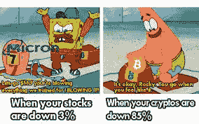
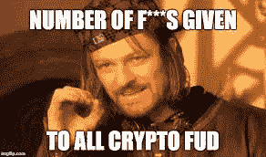
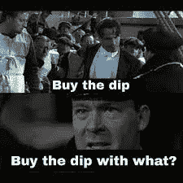
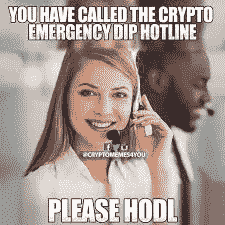

# 秘密交易秘密:如何在秘密市场下跌时管理你的情绪

> 原文：<https://medium.com/coinmonks/crypto-trading-secrets-how-to-manage-emotions-during-a-crypto-market-dip-e25a4f4c6a48?source=collection_archive---------19----------------------->

现在，由于即将来临的战争和最近的行动的谣言，有很多 FUD 在到处传播。这在金融市场中引起了轩然大波，导致金融市场的高度波动，加密货币市场肯定不会被排除在外。

由于下跌造成的损失，大多数投资者似乎都在减少损失，转换成稳定的硬币。尽管如此，一些新手投资者很可能已经遭受了很多损失，这在如此动荡的下跌中是很正常的。

然而，我们知道下跌只是暂时的，通过正确的战略规划，当一切恢复正常时，损失将会被弥补。

然而，并不是每个人都这样，因为并不是每个人都知道在这样的下跌中需要采取的基本技巧。

# 蘸料是什么？

> 下跌是一个用来描述金融市场停工期的术语。其特点是市场呈持续下跌趋势。这也被称为熊市，在此期间，资产价格在一段时间内持续大幅下跌。在这次下跌中，投资者损失了很多钱，尤其是那些在数字资产的高点买入，却不料该资产价格持续下跌的投资者。

# 在低迷时期提高情商的最佳实践

尽管看起来好像所有的地狱都在松动，整个金融市场都在崩溃，但作为一个投资者，在这个时期保持冷静是非常必要的，因为它最终会过去。

伴随着这次下跌的是大量的疯狂情绪，这是由于恐惧、不确定性和对相对年轻但快速增长的加密货币市场是否能够保持其地位并在下跌中生存的怀疑。

作为投资者，这里有 5 个技巧可以让你保持冷静，充分利用这次下跌。

## 1.没有 FUD

在这次加密下跌期间，有许多谣言、新闻、情绪和基本面因素被纳入市场，以增加 FUD，从而增加恐慌，导致投资者失去市场。

对 FUD 说不！请记住，在加密市场，下降并不是新现象，它总是会过去的。保持冷静，乘风破浪。

## 2.保持专注

这是你的注意力将受到最大考验的时期，由于加密市场的大规模停机，情绪会四处乱飞。但是作为一个聪明的投资者，与其随大流，不如现在是保持专注，按照你的策略做出明智决定的最佳时机。

在下跌时保持冷静是不容易的，然而，在秘密交易中掌握了情商艺术的聪明投资者是这个过程的最大受益者。

## 3.买蘸酱

我知道考虑到目前的趋势，这可能听起来疯狂和不合理，我的意思是，投资者正在失去辛苦赚来的美元，而你应该仍然买入？听起来很不合理，但这实际上是弥补损失的最佳方式。

这种下跌，尽管看起来很可怕，却给聪明的投资者带来了进场机会，让他们在市场再次走高时，低买高卖。举例来说，一个比特币单位的交易价格约为 63，000 美元，这对大多数投资者来说都非常昂贵，但现在由于价格下跌，你可以用一半的价格在 32，000 美元到 35，000 美元之间购买同样数量的比特币。

是不是很神奇？

## 4.与社区呆在一起

密码社区是区块链产业的心脏和灵魂。在这样的下跌中，最好的办法是靠近你所在的投资者和交易者群体。

然而，这是大多数投资者失去信心并离开社区的时期，最好的选择是坚持社区，因为这是你获得新闻、最新趋势和来自投资伙伴和社区的支持的地方。

## 5.停止责备

下跌伴随着很多负面情绪，可能已经损失了很多钱的投资者可能会失去它，并开始责怪加密社区领导人、加密导师、基本面分析师等。

加密市场是一个非常不稳定的市场，具有前所未有的波动，很难一直 100%准确地预测，没有人会因为这些波动而受到责备。

下跌只是市场中伴随着许多负面情绪、恐惧、怀疑和不确定性的一个阶段。作为一个聪明的投资者，你可以选择保持冷静，随波逐流，而不是屈服于噪音。

> 加入 Coinmonks [电报频道](https://t.me/coincodecap)和 [Youtube 频道](https://www.youtube.com/c/coinmonks/videos)了解加密交易和投资

## 也阅读

 [## 最佳加密交易所| 2022 年十大加密货币交易所| CoinCodeCap

### 哪一个是最好的加密交换？在本文中，我们将根据多种加密货币列出 10 大加密货币交易所

coincodecap.com](https://coincodecap.com/crypto-exchange)  [## 2022 年最佳加密交换平台| CoinCodeCap

### 随着时间的推移，我们大多数人将转向 dex 以获得更好的安全性和隐私。因此。在这里，我们将讨论…

coincodecap.com](https://coincodecap.com/best-swap-platforms)  [## 2021 年最佳加密借贷平台| 6 大比特币借贷平台

### 获得比特币和其他加密货币的最佳贷款利率

medium.com](/coinmonks/top-5-crypto-lending-platforms-in-2020-that-you-need-to-know-a1b675cec3fa)  [## 2021 年 6 大最佳硬件钱包|顶级加密硬件钱包[更新]

### 最好的加密货币硬件钱包是绝对必要的。我们将在 NGRAVE、Ledger Nano X 和…

medium.com](/coinmonks/the-best-cryptocurrency-hardware-wallets-of-2020-e28b1c124069)  [## 加密交易机器人——21 款最佳免费加密交易机器人

### 2022 年币安、比特币基地、库币和其他密码交易所的最佳密码交易机器人。Pionex，Bitsgap…

medium.com](/coinmonks/crypto-trading-bot-c2ffce8acb2a)