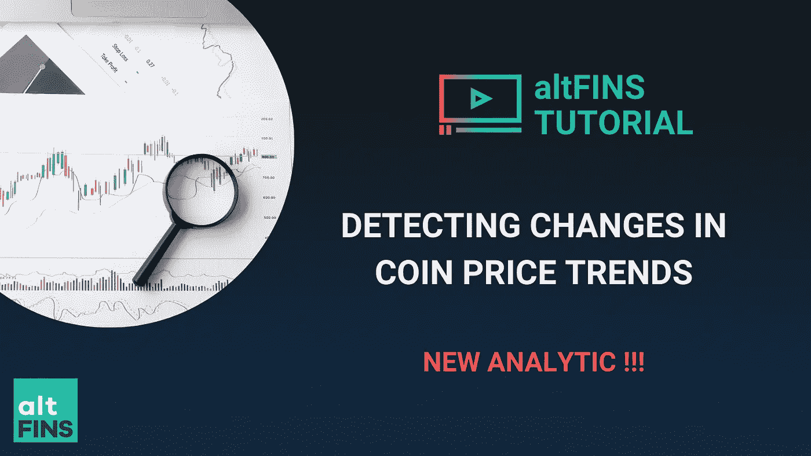

# 隐藏趋势和趋势变化

> 原文：<https://medium.com/coinmonks/crypto-trend-and-trend-changes-1b6508a87aac?source=collection_archive---------110----------------------->

Source: altFINS

# 加密趋势升级/降级:

识别趋势是成功交易策略的关键，尤其是趋势交易。

俗话说得好。趋势是你的朋友。顺势交易。

如果你的趋势正确，你就大大提高了你的胜算。

**现在，有了我们的** [**新解析**](https://youtu.be/5X3eXgwoYTw) **，交易者也可以在自己的趋势评级发生变化**(即升级或降级)时找到币。

假设你正在寻找近期(过去 3 天)中期趋势有所改善(升级)的硬币，特别是从中性到上涨或从上涨到强劲上涨。[查看实际结果](https://platform.altfins.com/screener?tab=COINS&timeInterval=60&filters=R%3Cmdi%2CmediumTermScoreString%2CmediumTermScoreChangeString%2CUP%2CUPGRADE%3E~A%3Cmdi%2CMARKET_CAP%2C500000.0%2C%3E)。

观看一个 5 分钟的[教程视频](https://youtu.be/5X3eXgwoYTw)，演示这个新的强大功能，如何创建和保存这个过滤器，以及如何创建一个警报，这样你就不会错过任何交易机会。

# **为什么要使用 altFINS screener？**

**交易者可以使用 Screener 发现交易机会。**

altFINS 包括许多预定义的[交易信号](https://altfins.com/knowledge-base/overview/)，或者你可以使用技术指标(SMA、EMA、RSI、MACD……)和市值、交易量和价格表现等变量的组合来设置自己的[自定义屏幕](https://altfins.com/knowledge-base/create-a-signal-or-filter/)。

作为[注册用户](https://altfins.com/knowledge-base/registered-user-benefits/)，您还可以保存您的自定义过滤器和[设置提醒](https://altfins.com/knowledge-base/create-an-alert-2/)，以便系统提醒您符合您的过滤标准的资产(通过电子邮件)。

筛选结果分为六个选项卡:概述、图表、记分卡、性能、趋势和振荡指标。您可以在这些列中添加列(指标、数据)。如果你是[注册用户](https://altfins.com/knowledge-base/registered-user-benefits/)，系统会保存你的偏好。注册是免费的。

当心你正在工作的时间间隔。即使在创建并运行屏幕后，您也可以更改时间间隔。

这里有一些[预定义屏幕](https://platform.altfins.com/summary)的例子，你可以用它们作为构建你自己的定制屏幕的起点。

# **您可以使用 Screener 创建自己的屏幕(过滤器)，保存它并设置一个警报来创建信号。**

当心你正在工作的时间间隔。当您创建警报时，它将只在特定的时间间隔内起作用。所以如果你想在 1 小时的时间间隔内得到均线(10) /均线(20)交叉的通知，确保你选择了这个时间间隔。然后，您将每小时收到一次屏幕结果更新。

**自定义筛选教程:**

*   [视频](https://youtu.be/5X3eXgwoYTw):寻找最近趋势升级的硬币
*   [视频](https://youtu.be/bgjurZL8bIw):新鲜看涨 MACD 交叉(趋势和动量交易策略)
*   [视频](https://youtu.be/-GGiLDJMTz4):带 RSI 确认的新鲜看涨 MACD 交叉(趋势和动量交易策略)
*   [视频](https://youtu.be/9BeFcXNfbZI):使用 MACD 直方图指示器早期检测动量拐点
*   [视频](https://youtu.be/3NWU_hd9kwc):基于特定硬币的看涨/看跌 MACD 交叉的买入/卖出信号(例如:Cardano (ADA))
*   [视频](https://youtu.be/IdR3g7u4eFc):均线交叉(例如:均线 12 / 50 多头交叉)
*   [视频](https://youtu.be/cKuhiqQqCnM):使用 ATH(最高)指示器(6 种不同的过滤器)
*   [视频](https://youtu.be/UJffUYCKvnE):长期上涨趋势中的超卖硬币

加入密码交易员社区！

[https://discord.gg/kgHHyEDC92](https://discord.gg/kgHHyEDC92)✅不和

https://t.me/altfins[https://t.me/altFINS_chat](https://t.me/altFINS_chat)✅电报

https://twitter.com/AltfinsA✅推特:

✅ YouTube 频道:[https://bit.ly/3l*bccvl*t33】](https://bit.ly/3lbcCVL)

> 加入 Coinmonks [电报频道](https://t.me/coincodecap)和 [Youtube 频道](https://www.youtube.com/c/coinmonks/videos)了解加密交易和投资

# 另外，阅读

*   [印度加密交易所](/coinmonks/bitcoin-exchange-in-india-7f1fe79715c9) | [比特币储蓄账户](/coinmonks/bitcoin-savings-account-e65b13f92451)
*   [Cloudbet 赌场评论](https://coincodecap.com/cloudbet-casino-review) | [点火赌场评论](https://coincodecap.com/ignition-casino-review)
*   [币安收费](/coinmonks/binance-fees-8588ec17965) | [僵尸加密审查](/coinmonks/botcrypto-review-2021-build-your-own-trading-bot-coincodecap-6b8332d736c7) | [热点审查](/coinmonks/hotbit-review-cd5bec41dafb)
*   [my constant Review](https://coincodecap.com/myconstant-review)|[8 款最佳摇摆交易机器人](https://coincodecap.com/best-swing-trading-bots)
*   [我的加密副本交易经历](/coinmonks/my-experience-with-crypto-copy-trading-d6feb2ce3ac5) | [AAX 交易所评论](/coinmonks/aax-exchange-review-2021-67c5ea09330c)
*   [逐位融资融券交易](/coinmonks/bybit-margin-trading-e5071676244e) | [币安融资融券交易](/coinmonks/binance-margin-trading-c9eb5e9d2116) | [超位审核](/coinmonks/overbit-review-9446ed4f2188)