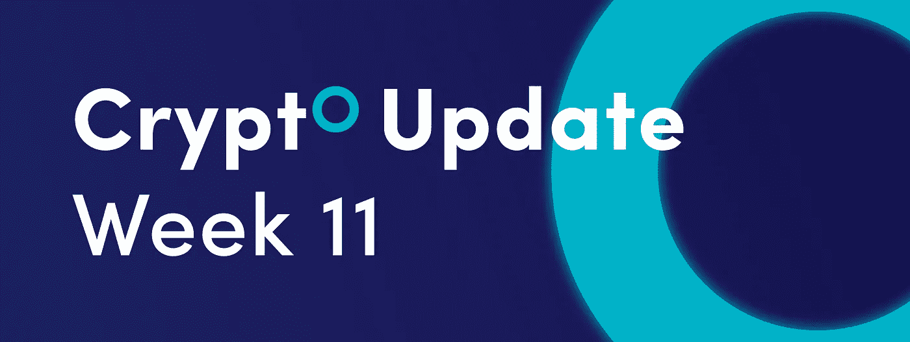
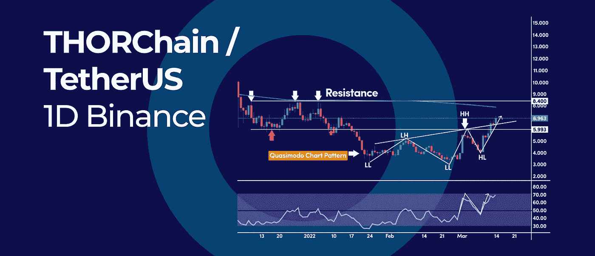
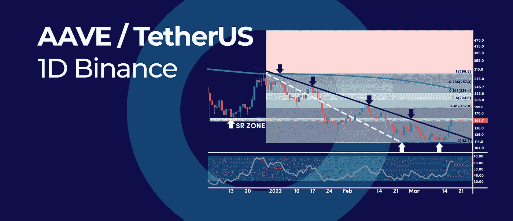
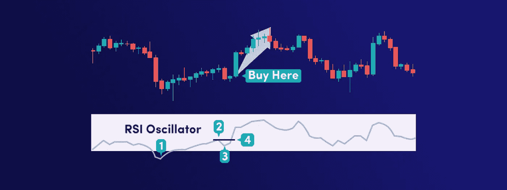

# 你需要知道的强大的 RSI 交易策略

> 原文：<https://medium.com/coinmonks/crypto-update-week-11-by-cryptohopper-ef23279b840a?source=collection_archive---------21----------------------->

*   符文图上的这个未知模式要求牛市反转
*   AAVE 2.5 个月趋势线突破要求反转
*   你需要知道的强大的 RSI 交易策略

# 符文图上的这个未知模式要求牛市反转

This Unknown Pattern on RUNE Chart Calls for a Bullish Reversal

如果这种非常独特的图表模式持续下去，可能会走向牛市反转底部。加密货币 RUNE 也是表现最好的硬币之一，过去一周涨幅超过 21%。大多数交易者都熟悉头肩底模式，但是大多数人不知道同样的 H & S 模式的“弯曲”版本，即卡西莫多图表模式。

# 卡西莫多图表模式

当价格上涨时，符文日线图显示卡西莫多图模式。这两种模式的关键区别在于，卡西莫多的左峰比右峰高得多，并且波谷也不同步。

基本上，价格开始打印更高的高点和更高的低点，这是市场结构的突破，标志着上升趋势的发展。

# RSI 动量

RSI 振荡指标也保持在 50 的中间水平之上，这标志着当前反弹背后的看涨势头。请注意，RSI 在 2 月 28 日首次突破 50 水平，从那以后，我们成功地再次测试了保持的中级水平。价格也随之反弹，证实了强劲的购买活动。

**展望:**短期，突破 6.00 美元水平的关键阻力可以打开再次测试 8.40 美元水平的大门，该水平与 200 天简单移动平均线对齐。

# AAVE 2.5 个月趋势线突破要求反转

AAVE 2.5 Months Trendline Breakout Calls for a Reversal

AAVE 是过去 24 小时表现最好的加密公司，上涨了近 13%。AAVE 的上涨不是巧合，因为它们是经典趋势线突破信号的结果，该信号有可能预示着底部。

# 趋势线突破

这是一个相当值得注意的趋势线，因为它的年龄，因为它连接了 2022 年打印的所有峰值。突破可能标志着市场情绪的重大转变，但多头仍然需要清除围绕 150 美元至 159 美元区域的下一个主要障碍。

# RSI 动量

昨天是一个大反转日，随后 RSI 振荡指标突破 50 中位。在 1 月中旬和 2 月初，我们两次试图突破 RSI 50 水平都失败了。然而，昨日印出的相当大的看涨蜡烛线可能预示着，这一次的结果会有所不同。

**展望未来:**如果多头设法清除 150 美元的大心理数字，这将为可能测试 0.382 斐波纳契回撤水平打开大门，这与 2 月的峰值完全一致。理想情况下，我们希望 RSI 振荡器保持在 50 的中间水平以上，以增加当前反弹延续的机会。

# 你需要知道的强大的 RSI 交易策略

Powerful RSI Trading Strategy You need to Know

相对强弱指数(RSI)是一个多功能的技术指标，可以帮助加密交易者捕捉短期和波动交易机会。在这篇交易指南中，你将通过四个简单的步骤学会一个成熟的加密交易策略。

# 加密交易的 RSI 策略

标准的 RSI 超买/超卖信号和看涨/看跌背离信号被高估了。因此，学习新的交易策略是很重要的，这样可以更有效地发现新趋势何时开始。

在这里，我们回顾捕捉多头 RSI 摆动信号的四个简单步骤:

1.  RSI 振荡指标必须跌破 30 水平的超卖区域。
2.  其次，RSI 振荡器必须反弹到 30 水平以上。
3.  第三，RSI 振荡器需要在不跌破 30 水平的情况下回调。
4.  最后，当 RSI 振荡指标在回调后突破 RSI 峰值时买入。

由于 RSI 振荡器是领先指标，这意味着 RSI 提前突破了基础价格图上相应的高/低波动。

**底线:**RSI 是一个强大的技术指标，在趋势市场条件下运行良好，是寻找摇摆交易机会的绝佳工具。请记住，市场并不完美，所以不要指望每次这些摇摆不定的交易机会来临时都能中大奖。

订阅我们的媒体每周博客和更新。
在推特[上关注我们](https://twitter.com/cryptohopper) | [脸书](https://www.facebook.com/cryptohopper)|[Reddit](https://www.reddit.com/r/CryptoHopper/)|[insta gram](https://www.instagram.com/cryptohopper/?hl=nl)

在 [Cryptohopper](https://www.cryptohopper.com/) 开始交易！

> 加入 Coinmonks [电报频道](https://t.me/coincodecap)和 [Youtube 频道](https://www.youtube.com/c/coinmonks/videos)了解加密交易和投资

# 另外，阅读

*   [支持卡审核](https://coincodecap.com/uphold-card-review) | [信任钱包 vs 元掩码](https://coincodecap.com/trust-wallet-vs-metamask)
*   [Exness 回顾](https://coincodecap.com/exness-review)|[moon xbt Vs bit get Vs Bingbon](https://coincodecap.com/bingbon-vs-bitget-vs-moonxbt)
*   [如何开始用加密贷款赚取被动收入](https://coincodecap.com/passive-income-crypto-lending)
*   [BigONE 交易所评论](/coinmonks/bigone-exchange-review-64705d85a1d4) | [电网交易机器人](https://coincodecap.com/grid-trading)
*   [氹欞侊贸易评论](https://coincodecap.com/anny-trade-review) | [CoinSpot 评论](https://coincodecap.com/coinspot-review)