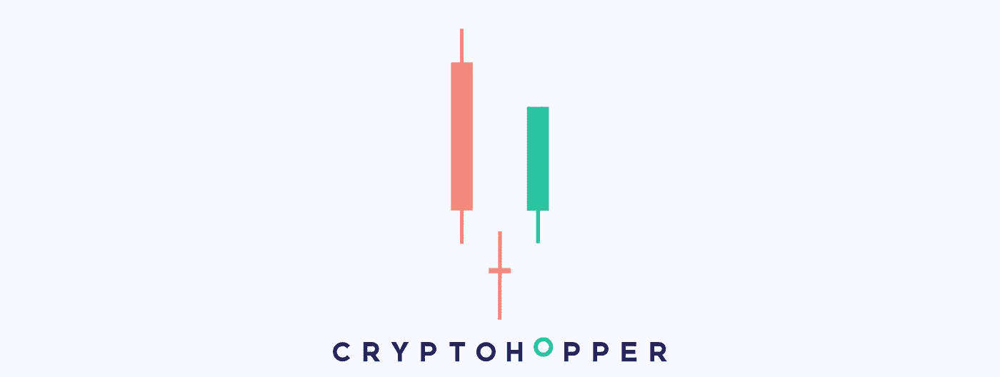

# 如果你是一个完全的初学者，如何阅读密码图表？更多信息请见本周的加密更新。

> 原文：<https://medium.com/coinmonks/crypto-update-week-12-by-cryptohopper-e65389d742ad?source=collection_archive---------58----------------------->

*   你需要看的比特币减半周期新分析
*   新的 ApeCoin 加密分析帮助你理解价格行为
*   如果你是一个完全的初学者，如何阅读密码图表？

# 你需要看的比特币减半周期新分析

A New Analysis of Bitcoin Halving Cycle You Need to See

尽管市场短期波动，但从长期来看，比特币(BTC)仍有望遵循其半周期模型。如果历史是一个指南，每个比特币减半周期可以被分解为 5 个不同的阶段，可以用来解释比特币价格的长期周期性。

# 比特币减半周期

在这个新框架中，比特币减半驱动的周期遵循一个模式，该模式可分为以下 5 个不同阶段:

1.  初始加速阶段达到历史新高(1*)。
2.  朝着 12 个月移动平均线的回调，在这里我们找到了第一个拐点，也就是支撑位(2*)。
3.  从 12 个月的均线反弹(3*)。
4.  反弹是短暂的，比特币价格跌破 12 个月 SMA 支撑线(4*)。
5.  比特币在 48 个月的 SMA 找到了新的底部，这需要 6 到 12 个月的时间来解决(5*)。

今天，2022 年 3 月 19 日，比特币的价格失去了 12 个月 SMA 的支持，这表明我们正处于新的比特币减半周期的第四阶段。随着比特币价格在 12 个月 SMA 下方徘徊，48 个月 SMA 很有可能再次测试，目前为 20，437 美元，标志着一个重要的周期性里程碑。

检查每一个减半事件可以给我们提供关于长期周期的有价值的信息。从长期来看，下一次减半事件将发生在 2024 年，届时我们预计减半周期将再次开始，并将比特币价格推至历史新高。

# 新的 ApeCoin 加密分析帮助你理解价格行为

New ApeCoin Crypto Analysis to Help You Make Sense of the Price Action

ApeCoin (APE)是在以太坊区块链推出的最新加密货币之一，已经跻身市值前 100 名。然而，由于 APE token 仅在 3 月 17 日推出，我们只有有限的历史价格数据来评估市场情绪。

然而，即使是一个较小的历史价格数据样本也可以讲述幕后真正发生的事情。

# 价格整合

在上市当天达到 28.00 美元的历史高点后，APE 的价格有所回落，目前正在 16.50 美元至 9.50 美元的区间内盘整。短期来看，在这次价格盘整中，我们可以看到一些上行压力。

在上市当天达到 28.00 美元的历史高点后，APE 的价格有所回落，目前正在 16.50 美元至 9.50 美元的区间内盘整。短期来看，在这次价格盘整中，我们可以看到一些上行压力。

在日线图上，我们也有发展 3 白兵形态的潜力，这要求继续上行。

展望未来:当 10.00 美元的心理水平站稳脚跟时，多头占了上风。与此同时，16.50 美元上方的明显突破可以为下一个阻力的测试打开大门，即 20.00 美元，随后是 28.00 美元的历史高点。

# 如果你是一个完全的初学者，如何阅读密码图表？

在技术分析中，使用蜡烛图进行交易是必须学习的技能。蜡烛图可以帮助我们确定进场，出场，趋势的方向和强度，反转等等。

蜡烛的结构由四种价格组成(开盘价、最高价、最低价和收盘价)，但最终的烛台形状可以有多种形式。价格走势解读可以帮助我们解读不同形状的烛台。

烛台由三个主要元素组成:

1.  烛台的主体，也就是实心部分，或者说:蜡烛的矩形部分。真实体代表开盘价和收盘价之间的价格区间。
2.  上部灯芯连接到主体的顶部。上灯芯的顶部是最高价。
3.  向下的灯芯连接到主体的底部。向下的灯芯底部是最低价。

身体上下的两条线被称为阴影、灯芯或头发。

# 如何解读烛台

一般来说，我们可以识别三种类型的烛台，即:

*   当收盘价高于开盘价时，在任何给定的时间框架内，价格都是看涨或向上的。
*   相反，当收盘价低于开盘价时，在任何给定的时间范围内，价格都会下跌。
*   最后，当当前收盘价与开盘价相同(或非常接近)时，中性烛台就被确定了。

# 帮助你开始的四个基本模式

# 吞没熊市

吞没熊市是由两根蜡烛代表的熊市反转形态。

第二根蜡烛完全吞没了第一根，并开始向下移动。

在上升趋势或向上运动中，第一根蜡烛线仍在增长，然而，空头积极回应，创造了一根红色蜡烛线，吞没了前一根。由一根长长的下降蜡烛线表示，卖方接管市场，压低价格。

由于供应对价格的压力较大，这种模式通常先于较低的价格。因此，如果在你的自动策略中被选中，它将发出卖出信号。

# 吞没牛市

吞没式看涨是由两根蜡烛代表的看涨反转形态。

第二根蜡烛完全吞没了第一根，并开始向上移动。

在下跌趋势或向下运动中，第一根蜡烛线在减少，然而，多头积极回应，创造了一根绿色蜡烛线，吞没了前一根蜡烛线。以一根长长的增长蜡烛线为代表，买家接管市场，推高价格。

由于供应对价格的压力较大，这种模式通常出现在价格上涨之前。因此，如果在你的自动策略中被选中，它将发出买入信号..

# 多奇明星晨报

早上的多奇之星是由三根蜡烛代表的看涨反转形态。

在下跌趋势中，第一根蜡烛线是一根长蜡烛线，随后是一根多奇，收盘低于前一个低点。第三根蜡烛线是一根增长的长蜡烛线，靠近第一根蜡烛线的中点。

在下跌趋势中，优柔寡断的多奇出现了。这意味着目前的趋势正在失去力量，下一根蜡烛证实了这一点。第三个开始一个看涨的运动，可能会扭转价格方向。

# 多奇明星晚报

晚上的多奇星是由三根蜡烛代表的熊市反转形态。

在上涨趋势中，一根长长的上涨蜡烛线后面跟着一根多奇。第三根蜡烛线变小，有一根长蜡烛线，在第一根蜡烛线的中点以下收盘。

这是交易中非常常用的模式，尤其是用来预测图表中的熊市走势。它通常出现在向上移动的过程中。随后，一根犹豫不定的蜡烛线，多奇，在图形的顶部形成，随后是一根长长的下降的蜡烛线，开始看跌。

晚上的多奇星图案代表了空头和多头在上涨运动中的战斗，这创造了一个多奇。最后，空头用一根长长的红烛接管市场，因此发出卖出信号。

订阅我们的媒体每周博客和更新。
在[推特上关注我们](https://twitter.com/cryptohopper) | [脸书](https://www.facebook.com/cryptohopper)|[Reddit](https://www.reddit.com/r/CryptoHopper/)|[insta gram](https://www.instagram.com/cryptohopper/?hl=nl)

在 [Cryptohopper](https://www.cryptohopper.com/) 开始交易！

> 加入 Coinmonks [电报频道](https://t.me/coincodecap)和 [Youtube 频道](https://www.youtube.com/c/coinmonks/videos)了解加密交易和投资

# 另外，阅读

*   [德国最佳加密交易所](https://coincodecap.com/crypto-exchanges-in-germany) | [Arbitrum:第二层解决方案](https://coincodecap.com/arbitrum)
*   [币安交易机器人](/coinmonks/binance-trading-bots-d0d57bb62c4c) | [OKEx 审查](/coinmonks/okex-review-6b369304110f) | [阿塔尼审查](https://coincodecap.com/atani-review)
*   [最佳加密交易信号电报](/coinmonks/best-crypto-signals-telegram-5785cdbc4b2b) | [MoonXBT 评论](/coinmonks/moonxbt-review-6e4ab26d037)
*   [如何在 Bitbns 上购买柴犬(SHIB)币？](https://coincodecap.com/buy-shiba-bitbns) | [购买 Floki](https://coincodecap.com/buy-floki-inu-token)
*   [CoinFLEX 评论](https://coincodecap.com/coinflex-review) | [AEX 交易所评论](https://coincodecap.com/aex-exchange-review) | [UPbit 评论](https://coincodecap.com/upbit-review)
*   [十大最佳加密货币博客](https://coincodecap.com/best-cryptocurrency-blogs) | [YouHodler 评论](https://coincodecap.com/youhodler-review)