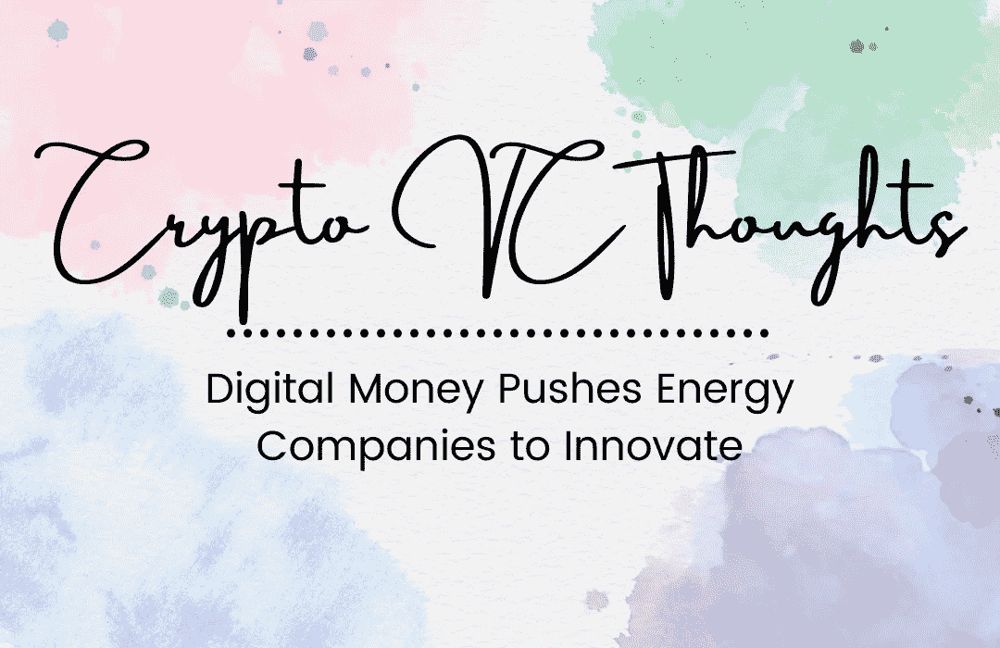

# 加密风险投资的想法:数字货币推动能源公司创新

> 原文：<https://medium.com/coinmonks/crypto-vc-thoughts-digital-money-pushes-energy-companies-to-innovate-707c1c7c95b7?source=collection_archive---------67----------------------->

在过去的几十年里，人们接受了比特币🟡.的想法

他们认为比特币是货币的未来，只是因为他们相信:

👉抵制审查

👉价值储存手段

👉对冲通货膨胀