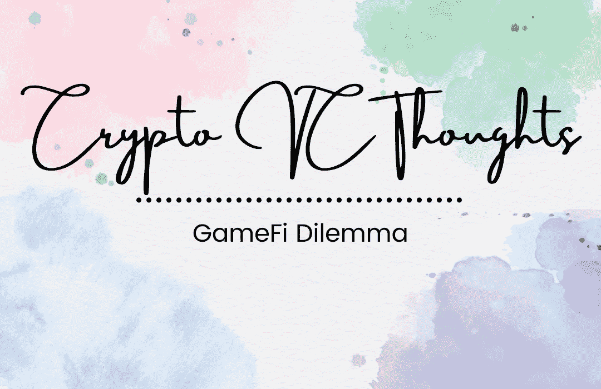

# 加密 VC 思想:GameFi 困境

> 原文：<https://medium.com/coinmonks/crypto-vc-thoughts-gamefi-dilemma-51c9ef211f6e?source=collection_archive---------56----------------------->

目前的先玩后赚模式永远不会像它假装的那样运作🤫。

为什么要去玩一个类似灵魂崩溃的游戏来赚取尽可能少的钱呢🤔？

这种模式强调收入，而不是玩的体验🙄。

设计游戏的主要目的是提供乐趣。没有乐趣的游戏是无聊的工作。