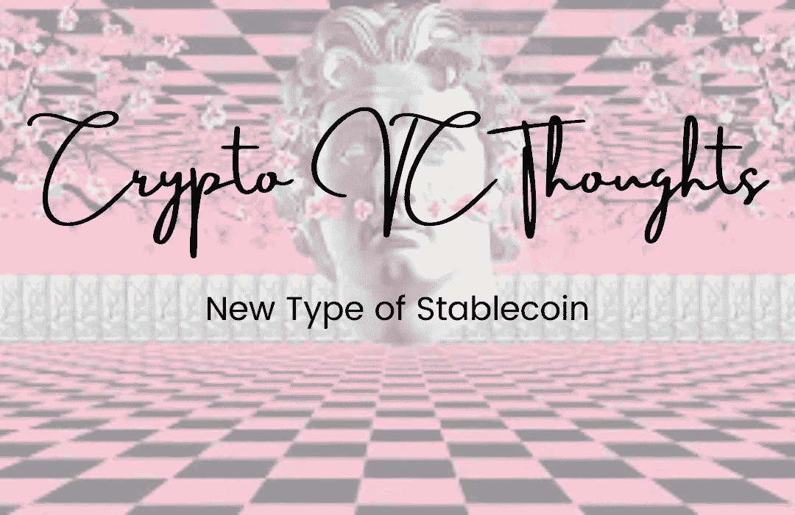

# 加密 VC 思想:新型稳定币

> 原文：<https://medium.com/coinmonks/crypto-vc-thoughts-new-type-of-stablecoin-ba15a8082ae7?source=collection_archive---------61----------------------->

由于最近 Luna 的崩溃，人们想知道我们能做些什么来制作一个更好的稳定币？找个很稳的怎么样？像亚利桑那冰茶☕？看看 [USDTea](https://usdtea.io/) ！

亚利桑那州冰茶自 1992 年以来一直稳定在 99 美分。那么这种茶将来会继续稳定在 99 美分吗？