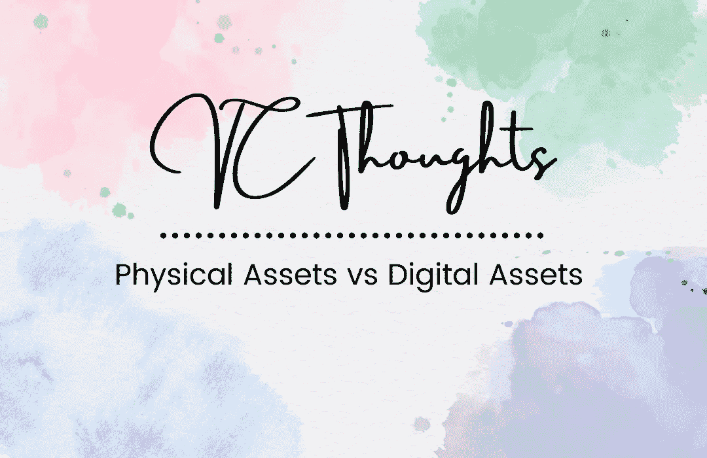

# 加密风险投资思想:实物资产 vs 数字资产

> 原文：<https://medium.com/coinmonks/crypto-vc-thoughts-physical-assets-vs-digital-assets-342e8453b565?source=collection_archive---------23----------------------->

我现在经营自己的秘密风险投资公司。但是我在很多方面都失败了。所以我在写我自己的想法，分享我的失败经历。

有趣的是，我正要深入研究 Terra，它崩溃的速度比我花在研究它的协议上的时间还要快。

是的，很明显，我不擅长 VC。这里只是我对加密货币的思考。