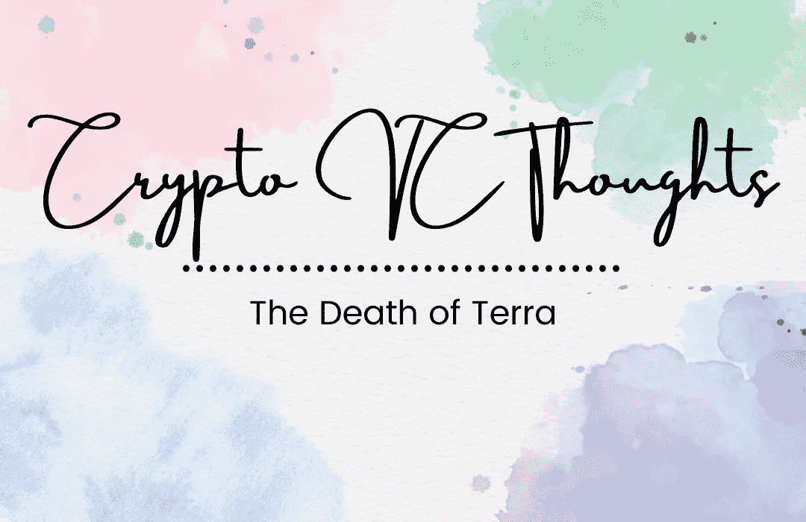

# 隐秘的想法:地球的死亡

> 原文：<https://medium.com/coinmonks/crypto-vc-thoughts-the-death-of-terra-a6b47933185e?source=collection_archive---------41----------------------->

如果你目睹了 Terra 是如何崩溃的，它将和任何 Defi 项目相似。因此，如果你真正深入了解 Defi 项目及其创始人/创造者，就会发现这是不可持续的。

卢娜的所作所为和 2008 年的次贷危机类似。该银行发放了一笔贷款，并将其打包成金融产品的最终解决方案，希望没有人发现并继续产生大量现金…