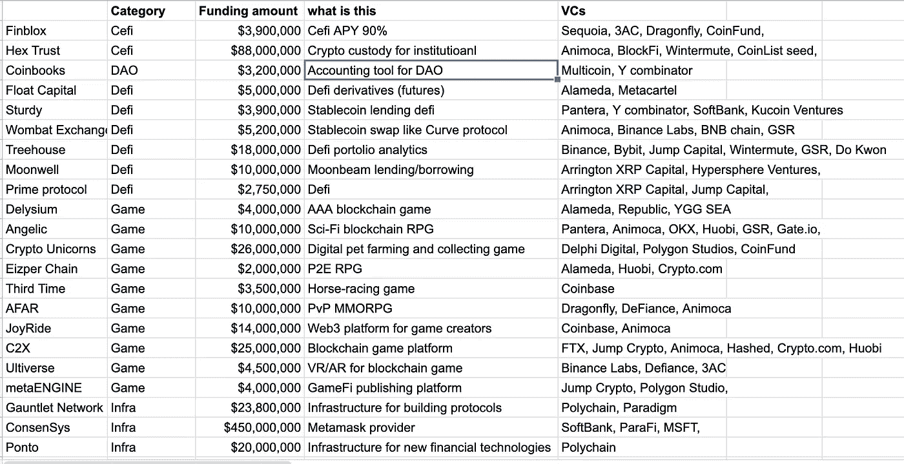
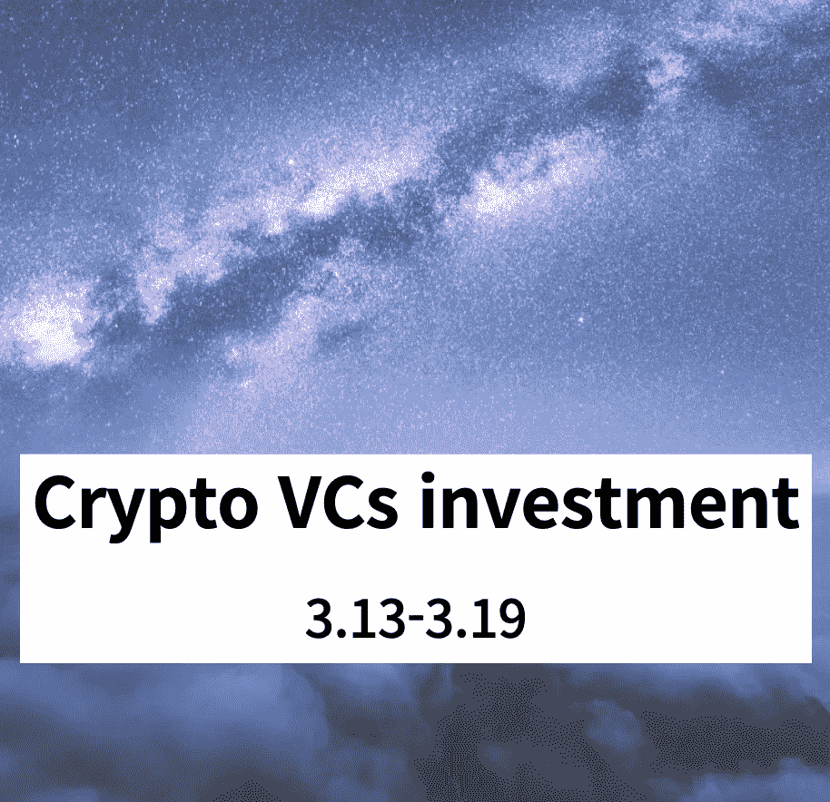

# 加密风投投资，2022 年 3 月的第三周(3.13–3.19)

> 原文：<https://medium.com/coinmonks/crypto-vcs-investment-3rd-week-of-march-2022-3-13-3-19-56aefbb6e918?source=collection_archive---------44----------------------->

我计划每周报道加密风险投资。风险投资覆盖面各不相同，但几乎每个交易所的风险投资都包括在内，顶层/二层风险投资也包括在内。

我主要参考了 [dove metrics](https://www.dovemetrics.com/) ，但也参考了其他来源。我并不涉及每一家风投公司，只涉及我认为足够好的风投公司。

上周好的风投投资了多少项目？27 个项目完成了一轮融资。

这些项目注入了多少资金？$1B。

什么项目得到的钱最多？Consensys 获得 4.5 亿美元

# **上扇区**

我做了 6 个分类，如果有人对分类有更好的想法，请告诉我，我完全准备好了。我将按照资助金额的顺序来写项目。

**Defi**

6 个项目:树屋，月亮井，袋熊，浮动资本，坚固，主要协议

树屋:Defi 投资组合分析平台。由币安、Bybit、Jump Capital、GSR、Wintermute 和 Do Kwon 资助。

Moonwell:基于 Moonbeam 的借贷协议。由阿灵顿 XRP 资本，伍德斯托克基金和 NFR 资助

袋熊:基于 BSC 的稳定硬币互换，具有单一稳定硬币赌注(无 LP 养殖)。由 Animoca，币安实验室，BNB 链，GSR 资助，

浮动资本:分散衍生(期货)协议。由阿拉米达研究公司和 MetaCartel 风险投资公司资助。

健壮:基于 FTM 的无息稳定硬币借贷协议。由潘迪拉资本、Y combinator 和软银投资

主要协议:Defi 投资组合管理协议。由阿灵顿 XRP 资本和跳跃资本资助。

**Cefi**

2 个项目:Hex Trust、Finblox

Hex Trust:一站式托管解决方案。由 Animoca Brands、TERRA、Ripple、BlockFi、CoinList seed 和 Wintermute 共同出资。

Finblox: Cefi 赚取加密收益。由红杉资本、3AC、蜻蜓资本投资。

**NFT**

2 个项目:魔幻伊甸园、LiveArtX

神奇的伊甸园:索拉纳 NFT 市场。由范式、红杉资本和索拉纳资本出资。

LiveArtx:连接 web3 和艺术家的优质 NFT 平台。由 Animoca Brands，KuCoin Labs，Alameda Research，BNB 连锁，OKX 和 Huobi 资助。

**游戏**

10 个项目:Delysium，Angelic，Crypto Unicorns，Eizper Chain，Third Time，AFAR，JoyRide，C2X，Ultiverse，metaENGINE

老实说我不知道如何分析游戏项目。这需要特定的技能，我只想强调风投们正在向游戏领域投入大量资金。

**刀**

1 个项目:硬币簿

coin books:Dao 的会计工具。由 Multicoin Capital 和 Y combinator 投资。

**基础设施**

6 个项目:Consensys、乐观主义、Mina 协议、Gauntlet 网络、Ponto、CoinRoutes

Consensys:区块链基础设施(metamask 和 infura)公司。由微软、软银和 ParaFi 出资。

乐观主义:以太坊 L2 协议。由 Paradigm 和 A16z 资助。

米娜协议:最轻的区块链 L1 使用 ZK 技术，以降低块大小。由 FTX、3AC、Circle 和潘迪拉资本资助。

建立区块链的模拟平台。由 Polychain Capital 和 Paradigm 资助。

Ponto:企业交易基础设施。由 Polychain Capital 资助。

CoinRoutes:加密交易软件提供商。由银河数码和 GSR 资助。

**寓意**

1.  风投疯狂投资游戏行业。
2.  L2 的 ZK 技术是未来
3.  Defi 分析协议

> 加入 Coinmonks [电报频道](https://t.me/coincodecap)和 [Youtube 频道](https://www.youtube.com/c/coinmonks/videos)了解加密交易和投资

# 另外，阅读

*   [瓦济里克斯 NFT 评论](https://coincodecap.com/wazirx-nft-review)|[Bitsgap vs Pionex](https://coincodecap.com/bitsgap-vs-pionex)|[Tangem 评论](https://coincodecap.com/tangem-wallet-review)
*   [如何使用 Solidity 在以太坊上创建 DApp？](https://coincodecap.com/create-a-dapp-on-ethereum-using-solidity)
*   [币安 vs FTX](https://coincodecap.com/binance-vs-ftx) | [最佳(SOL)索拉纳钱包](https://coincodecap.com/solana-wallets)
*   [如何在 Uniswap 上交换加密？](https://coincodecap.com/swap-crypto-on-uniswap) | [A-Ads 评论](https://coincodecap.com/a-ads-review)
*   [加密货币储蓄账户](/coinmonks/cryptocurrency-savings-accounts-be3bc0feffbf) | [YoBit 评论](/coinmonks/yobit-review-175464162c62)
*   [Botsfolio vs nap bots vs Mudrex](/coinmonks/botsfolio-vs-napbots-vs-mudrex-c81344970c02)|[gate . io 交流回顾](/coinmonks/gate-io-exchange-review-61bf87b7078f)