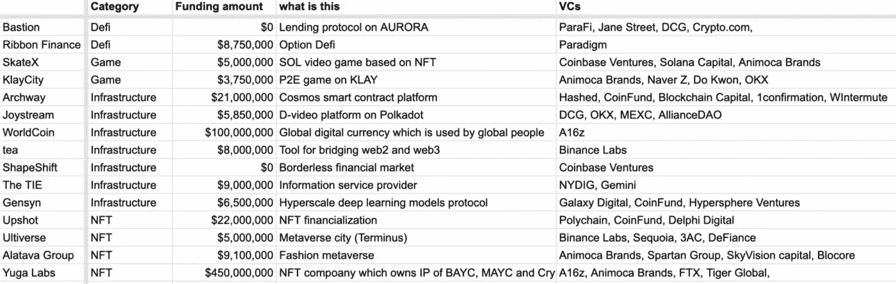
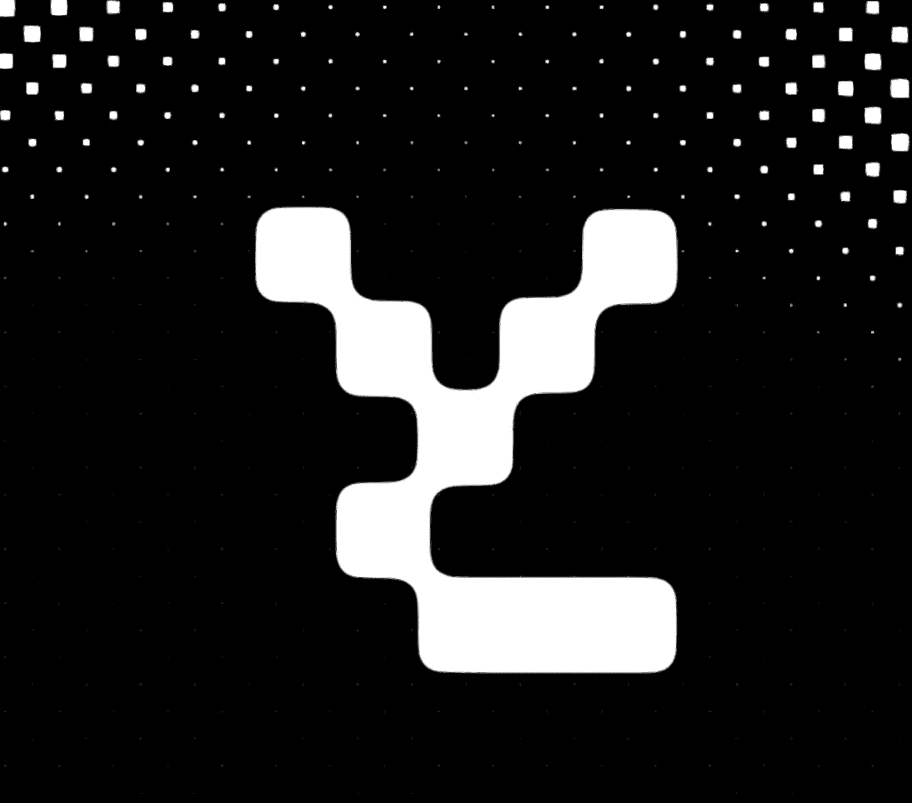
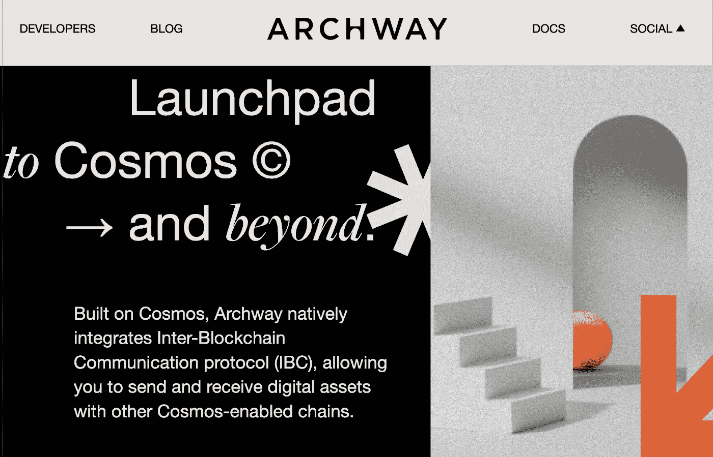

# 加密风投投资，2022 年 3 月的第 4 周(3.20–3.26)

> 原文：<https://medium.com/coinmonks/crypto-vcs-investment-4th-week-of-march-2022-3-20-3-26-706f4894fbd2?source=collection_archive---------34----------------------->

VCs fundraising spreadsheets

风险投资总结

**总资助金额**:6.54 亿美元，15 个项目

获得**最大资助的项目**:宇迦实验室

**Defi**:875 万美元，两个项目

丝带金融:期权定义协议。由 Paradigm 出资 875 万美元

堡垒:极光上的租借协议。由 Crypto.com 数字货币组织 Jane Street 的 ParaFi 资助。资金数额没有披露

Yuga Labs website

NFT:4.64 亿美元，4 个项目

宇迦实验室:NFT 公司，拥有 BAYC，MAYC 和 Cryptopunks 的知识产权。A16z、Tiger Global、Animoca Brands 和 FTX 出资 4.5 亿美元。

结果是:NFT 金融化。Polychain、CoinFund 和 Delphi Digital 出资 2200 万美元。

阿尔塔瓦:时尚元宇宙平台。由 Spartan Group、Animoca Brands、SkyVision Capital 和 Blocore 出资 910 万美元。

终极世界:元宇宙市命名为终点站(你在苹果电视上看到“基金会”了吗？).币安实验室、红杉资本和迪法恩斯资本出资 500 万美元。

游戏:900 万美元，2 个项目

索拉纳视频游戏。500 万美元由比特币基地风险投资、索拉纳资本和 Animoca Brands 投资..

克莱城:P2E 在克莱的游戏。Animoca Brands、Naver Z、OKX 和 Do Kwon 出资 375 万美元。

Archway website

**基础设施**:1.5 亿美元，7 个项目

WorldCoin:全球人民使用的全球数字货币。A16z 出资 1 亿美元。

Archway:宇宙智能合约平台。Hashed、CoinFund、Blockchain Capital、1confirmation 和 Wintermute 出资 2100 万美元。

领带:信息服务提供商。NYDIG 和 Gemini 出资 900 万美元。

tea:连接 web2 和 web3 的工具。币安实验室资助 800 万美元。

Gensyn:超大规模深度学习模型协议。由 Galaxy Digital、CoinFund 和 Hypersphere Ventures 投资 650 万美元。

JoyStream:Polkadot 上的分散式视频平台。由数字货币集团、OKX、MEXC 和 Alliance DAO 出资 585 万美元。

ShapeShift:支付无国界的金融市场。由比特币基地投资公司资助。资金数额没有披露。

> 加入 Coinmonks [电报频道](https://t.me/coincodecap)和 [Youtube 频道](https://www.youtube.com/c/coinmonks/videos)了解加密交易和投资

# 另外，阅读

*   [火币加密交易信号](https://coincodecap.com/huobi-crypto-trading-signals) | [HitBTC 审核](/coinmonks/hitbtc-review-c5143c5d53c2)
*   [如何在 FTX 交易所交易期货](https://coincodecap.com/ftx-futures-trading) | [OKEx vs 币安](https://coincodecap.com/okex-vs-binance)
*   [OKEx vs KuCoin](https://coincodecap.com/okex-kucoin) | [摄氏替代度](https://coincodecap.com/celsius-alternatives) | [如何购买 VeChain](https://coincodecap.com/buy-vechain)
*   [ProfitFarmers 回顾](https://coincodecap.com/profitfarmers-review) | [如何使用 Cornix 交易机器人](https://coincodecap.com/cornix-trading-bot)
*   [如何匿名购买比特币](https://coincodecap.com/buy-bitcoin-anonymously) | [比特币现金钱包](https://coincodecap.com/bitcoin-cash-wallets)