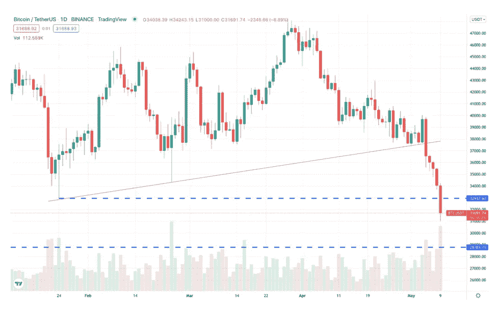

# Crypto:等等！

> 原文：<https://medium.com/coinmonks/crypto-wait-for-it-ee4fba40e2bc?source=collection_archive---------77----------------------->

pixabay

自从开始你意想不到的加密之旅后，你是否一直在自责？月神号和地球探测仪的深潜让你朝出口跑了吗？你是不是改变主意了，一起爬出兔子洞了？如果你有，这是一个不错的策略；然而，你可能想保持一只眼睛专注于未来；原因如下。

比特币作为一种新的数字货币形式在 2009 年引起了轰动。投资者看到了潜力，开始买进。2013 年 11 月 29 日，每枚硬币的价格飙升至 1200 美元以上，最终跌至 340 美元。在 2017 年 3 月达到 1290 美元之前，它在 350 美元的范围内保持了大约三年。今年 5 月，它突破了 2000 美元大关，并在 4 个月内攀升至 5000 美元以上。到 2017 年 12 月中旬，它突破了 20，000 美元大关，然后损失了三分之一的价值，至 13，800 美元。

随着硬币暴跌 76%至 3300 美元，事情在 2018 年变得有趣起来。当然，这是比特币和整个“加密货币”的末日！但显然不是。2019 年以轻微至中等涨幅为主。2020 年初，这枚硬币短暂飙升至 1 万美元，然后下跌 50%至 5000 美元。在全球疫情中，比特币在年底突破了 19000 美元。

比特币经历了更多的创纪录高点(64，974 美元)和大约 50%的大幅下跌。2022 年 5 月的这一天，比特币在 3 万美元以下。这枚硬币的起伏比主题公园的过山车还要多。但是等等，人们坐过山车是因为乘坐的刺激。然而，与从头到尾被绑在一起的过山车不同，你可以随时跳下这个(比特币)过山车——没有人会责怪你这么做。投资关乎风险，风险关乎承受。

如果你仍然被绑在(比特币)上，如果乘坐的刺激让你恶心，那么考虑一下关于你不可思议的乘坐的四件事。

有一个既定的模式。

在比特币 13 年的历史中，已经出现了六次重大(甚至是巨大的)价格下跌。下滑的原因有很多，但关键是可以看到一个可预测的模式。

研究仍然是投资的关键，理解这一点同样重要。尽管这种情况发生时不会让人们的胃安定下来，但以往的记录表明，这种情况会以可预见的结果发生。

**自 2009 年推出以来，比特币价格一直在上涨。**

13 年前，一个想法变成了现实，几乎没有任何代价。尽管跌宕起伏，13 年后，这个想法的交易价格接近 3 万美元。简单来说，这是 30，000%的投资回报。你还能在哪里找到这样的回报？

投资是关于冒险的。成功的投资包括买入和套现的舒适策略。当价格下跌时，FOMO(害怕错过)当然会敲门。你在思考，“我知道有一个清晰的模式，但是‘如果’这次不是那样呢？”这是测试你舒适度的地方。谁在套现，谁在留守？必须考虑。在比特币的例子中，大美元保持不变，这是一个指标，也许你也应该这样做。

每次价格下跌都会导致价格大幅上涨。

如果这种模式只显示深度跳水和小幅回升，情况就不同了。但事实并非如此。

这可能是比特币历史上最令人兴奋的元素。当交易多头进场时，价格会上涨 1000%、2000%或更多。哇！这是获取利润的地方，也是冷静、平静、容易填饱肚子的地方。

比特币(就像天美时手表一样——如果你年纪够大还记得的话)需要舔一下，然后继续滴答作响。

超过 10，000 枚硬币和代币跟随加密货币开始了这一切。不是所有的都会持续，但比特币锻造的道路是不可否认的。如果你的投资是另类硬币(我的一些投资也是如此)，结果可能会有所不同，但另一种模式已经确立——加密货币将会继续存在。

> 加入 Coinmonks [电报频道](https://t.me/coincodecap)和 [Youtube 频道](https://www.youtube.com/c/coinmonks/videos)了解加密交易和投资

# 另外，阅读

*   [如何在加拿大购买加密货币？](https://coincodecap.com/how-to-buy-cryptocurrency-in-canada)
*   [无聊猿游艇俱乐部(BAYC)回顾](https://coincodecap.com/bored-ape-yacht-club-bayc-review) | [拜比特 vs 比特币基地](https://coincodecap.com/bybit-vs-coinbase)
*   [5 款最佳加密交易终端](https://coincodecap.com/crypto-trading-terminals) | [最佳 DeFi 应用](https://coincodecap.com/best-defi-apps)
*   [比特币基地 vs 瓦济克斯](https://coincodecap.com/coinbase-vs-wazirx) | [比特鲁点评](https://coincodecap.com/bitrue-review) | [波洛涅克斯 vs 比特鲁](https://coincodecap.com/poloniex-vs-bittrex)
*   [德国最佳加密交易所](https://coincodecap.com/crypto-exchanges-in-germany) | [Arbitrum:第二层解决方案](https://coincodecap.com/arbitrum)
*   [币安交易机器人](/coinmonks/binance-trading-bots-d0d57bb62c4c) | [OKEx 评论](/coinmonks/okex-review-6b369304110f) | [阿塔尼评论](https://coincodecap.com/atani-review)
*   [最佳加密交易信号电报](/coinmonks/best-crypto-signals-telegram-5785cdbc4b2b) | [MoonXBT 评论](/coinmonks/moonxbt-review-6e4ab26d037)