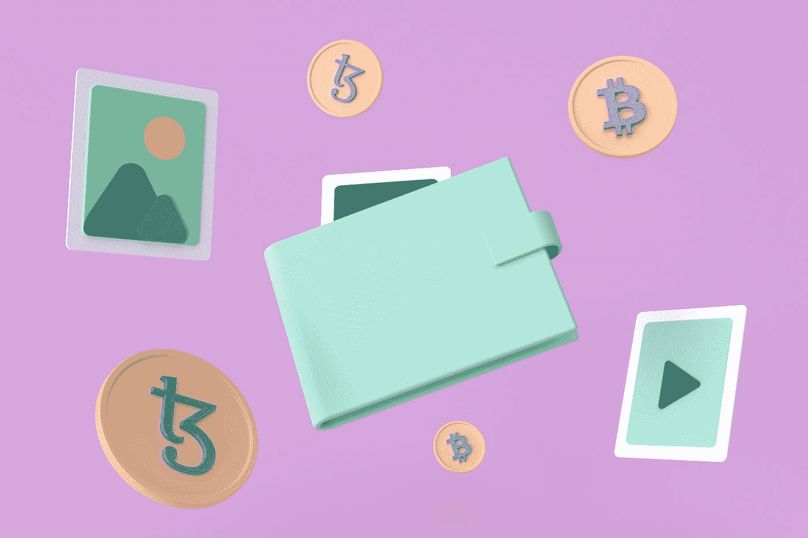

# 加密钱包 101:你需要知道的一切

> 原文：<https://medium.com/coinmonks/crypto-wallet-101-all-you-need-to-know-f6520ec91ba3?source=collection_archive---------15----------------------->

“加密”、“加密货币”和“比特币”等词汇不再是陌生的术语。你经常会看到广告、社交媒体帖子、博客帖子和传统媒体谈论它。加密货币市场是数百万个人、投资者和大公司投资的趋势之一。根据[2021 年发表的一份报告](https://www.marketsandmarkets.com/Market-Reports/cryptocurrency-market-158061641.html)，加密货币市场预计约为 22 亿美元。

Photo by [Tezos](https://unsplash.com/@tezos?utm_source=medium&utm_medium=referral) on [Unsplash](https://unsplash.com?utm_source=medium&utm_medium=referral)

加密货币在全球范围内被广泛采用。然而，大多数密码领域的初学者很难理解一些概念，比如密码钱包。这篇文章讨论了加密钱包的基础知识，并回答了常见问题。

**什么是加密钱包？**

顾名思义，加密钱包可以帮助你交易和存储加密货币。加密钱包可以是一个物理设备或软件程序，允许您发送、接收和存储加密。

我来帮你简化一下吧！加密钱包类似于网上银行账户，你可以在那里交易和存储数字货币。加密钱包与典型的网上银行账户的不同之处在于，它是在一个分散的领域进行交易，而不像银行业那样在一个集中的环境中运作。这意味着对等金融网络使用特定的安全协议、软件和连接来有效地使用加密钱包。

为什么不应该将加密钱包与普通钱包进行比较？一个典型的钱包允许你存钱，但它不能保护你的钱(哦！可以保护它不被雨淋)。相反，加密钱包使用私钥，每个用户都有自己的私钥，允许他们进行交易。

**注意**:从技术上来说，加密钱包不会存储你的加密资产。通常，加密资产保存在区块链(一个跨网络存在的数字分布式和分散式数据系统。它维护交易的安全和分散的记录)。通常，您需要一个私钥来通过区块链上的加密钱包访问您的加密资产。因此，这意味着如果您完全丢失了您的私钥，您将无法访问您的加密资产。

**加密钱包有哪些类型？**

首先，让我们区分加密钱包的两个类别，即保管型和非保管型钱包。

**非保管加密钱包**让您完全访问钱包中的所有加密资产。这类钱包的例子有 ChangeNow、Trust Wallet、Exolix、SimpleSwap、Wasabi、Electrum 和 Exodus。

另一方面，**保管加密钱包**不提供对你的加密资产的完全控制，钱包提供商也可以访问你的私钥。简而言之，私钥由第三方持有。保管钱包的例子包括币安、比特币基地和 Bitmex。

现在，让我们进入两种类型的加密钱包，即热钱包和冷钱包。

**热门钱包**

这些是连接到互联网的钱包，你可以随时使用它们来支付和获得新的加密资产。从某种意义上说，它们是方便的，你可以方便快捷地使用、交易或消费密码。热门钱包的例子有网络钱包、移动钱包和桌面钱包。

**冷钱包**

冷钱包是一种物理钱包，例如使您的加密资产保持离线的设备。这种钱包很安全，但不太方便，因为你需要它们的物理访问。冷钱包的例子有纸质钱包和硬件钱包(比如 u 盘和二级离线电脑)

每种类型的加密钱包都有其优点和缺点。

**你为什么需要加密钱包？**

大量的密码交换机在交换机内的钱包中提供密码存储。这就是所谓的保管钱包。你为什么会考虑这种钱包呢？假设你完全是加密货币市场的初学者。在这种情况下，这是一个合理的选择，因为您学习和了解了私钥、公钥和加密钱包的类型，以及加密市场中其他与安全相关的方面。

你听过密码专家和爱好者说“不是你的密钥，不是你的密码”吗？如果你是这种说法的坚定信徒，并且你了解加密市场，非保管钱包可能是你的加密钱包的选择。这意味着你将有一个私钥，你可以用它作为你的加密钱包的密码。然而，保持密钥的机密性是至关重要的。

那么，为什么加密钱包很重要呢？加密钱包存储您的私钥，保证您的加密安全。此外，私钥允许轻松访问您在区块链上的加密资产。

**底线**

随着加密市场的持续增长，越来越多的玩家加入了这个游戏。同样，理解加密是当今世界的一个重要方面。如果你想交易或存储你获得的加密资产，你需要一个加密钱包。此外，在选择适合你的加密钱包之前，了解各种加密钱包的优缺点是值得的。

> 加入 Coinmonks [电报频道](https://t.me/coincodecap)和 [Youtube 频道](https://www.youtube.com/c/coinmonks/videos)了解加密交易和投资

## 另外，阅读

*   [WazirX vs coin dcx vs bit bns](/coinmonks/wazirx-vs-coindcx-vs-bitbns-149f4f19a2f1)|[block fi vs coin loan vs Nexo](/coinmonks/blockfi-vs-coinloan-vs-nexo-cb624635230d)
*   [比斯勒评论](https://coincodecap.com/bitsler-review)|[WazirX vs coin switch vs coin dcx](https://coincodecap.com/wazirx-vs-coinswitch-vs-coindcx)
*   [7 大副本交易平台](https://coincodecap.com/copy-trading-platforms) | [BuyCoins 点评](https://coincodecap.com/buycoins-review)
*   [XT.COM 评论](https://coincodecap.com/profittradingapp-for-binance)币安评论 |
*   [SmithBot 评论](https://coincodecap.com/smithbot-review) | [4 款最佳免费开源交易机器人](https://coincodecap.com/free-open-source-trading-bots)
*   [杠杆代币](/coinmonks/leveraged-token-3f5257808b22) | [最佳密码交易所](/coinmonks/crypto-exchange-dd2f9d6f3769) | [Paxful 点评](/coinmonks/paxful-review-4daf2354ab70)
*   [加密套利](/coinmonks/crypto-arbitrage-guide-how-to-make-money-as-a-beginner-62bfe5c868f6)指南| [如何做空比特币](/coinmonks/how-to-short-bitcoin-568a2d0b4ae5)
*   [币安期货交易](https://coincodecap.com/binance-futures-trading)|[3 commas vs Mudrex vs eToro](https://coincodecap.com/mudrex-3commas-etoro)
*   [如何购买 Monero](https://coincodecap.com/buy-monero) | [IDEX 评论](https://coincodecap.com/idex-review) | [BitKan 交易机器人](https://coincodecap.com/bitkan-trading-bot)
*   [尤霍德勒 vs 考尼洛 vs 霍德诺特](/coinmonks/youhodler-vs-coinloan-vs-hodlnaut-b1050acde55a) | [Cryptohopper vs 哈斯博特](https://coincodecap.com/cryptohopper-vs-haasbot)
*   [顶级付费加密货币和区块链课程](https://coincodecap.com/blockchain-courses)
*   [MXC 交易所评论](/coinmonks/mxc-exchange-review-3af0ec1cba8c) | [Pionex vs 币安](https://coincodecap.com/pionex-vs-binance) | [Pionex 套利机器人](https://coincodecap.com/pionex-arbitrage-bot)