# 2022 密码冬天——会有多冷？

> 原文：<https://medium.com/coinmonks/crypto-winter-2022-how-cold-would-it-be-bc1be042ff24?source=collection_archive---------33----------------------->

## 这个秘密熊市会有多可怕？已经见底了吗？

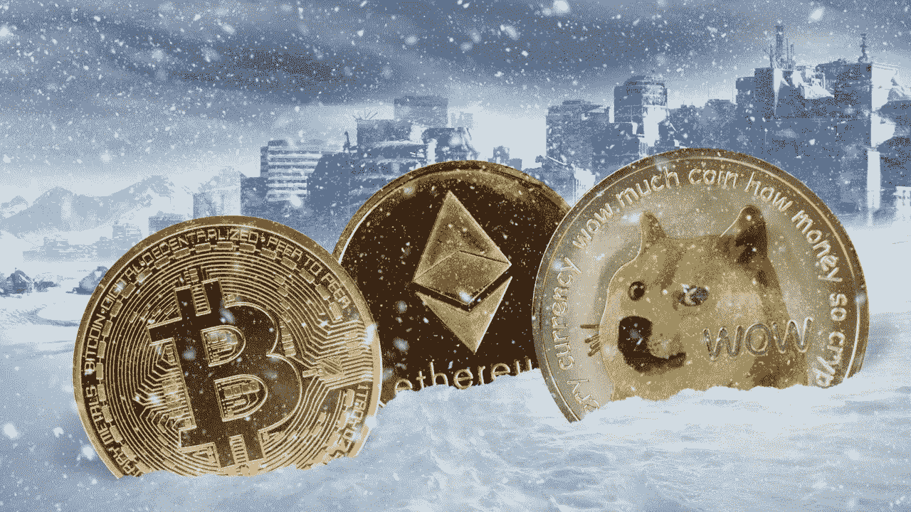

*Cover photo credit: bitcoinist*

自 4 月以来，市场持续下跌。仅在两个月内，BTC/美元从 46674 美元跌至 18084 美元，而联邦医疗保险/美元从 3517 美元跌至 921 美元。

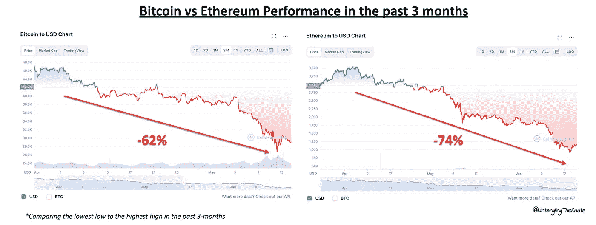

*Source: coinmarketcap*

[在长时间内(通常在 2 个月内)连续下跌超过 20%，这无疑是一个熊市。](https://www.investopedia.com/terms/b/bearmarket.asp)

在这个被许多人戏称为“T2 密码冬天”的熊市中，我们看到了臭名昭著的 Terra 崩溃到 Terra 2.0 的重建，Celcius 的流动性或破产问题的冻结和投机，以及最近最大的密码风险投资之一，三箭资本 *(3AC)* 可能的破产。

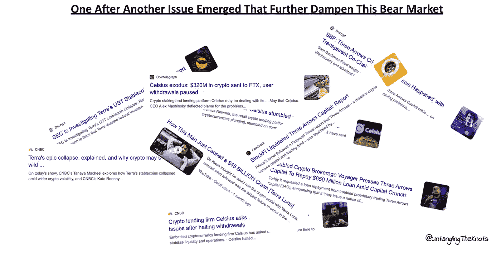

如果您没有听说过 Terra、Celcius 和 3AC 发生的事情，这里有一些可供您参考的资料。

*   阅读关于 Terra Luna 崩溃的文章[这里](https://www.coindesk.com/learn/the-fall-of-terra-a-timeline-of-the-meteoric-rise-and-crash-of-ust-and-luna/)&Terra Luna 2.0 的重建[这里](https://cointelegraph.com/news/terra-2-0-a-crypto-project-built-on-the-ruins-of-40-billion-in-investors-money)
*   阅读有关 Celcius 暂停提款的内容，这可能会导致 Celcius 面临流动性问题[的假设，此处为](https://fortune.com/2022/06/13/celsius-suspends-withdrawals-crypto-lender-market/#:~:text=%E2%80%9CDue%20to%20extreme%20market%20conditions,a%20statement%20on%20its%20website.)
*   阅读三箭资本，一家秘密对冲基金公司，未能偿还几笔贷款，预计将处于破产边缘[此处](https://decrypt.co/103659/three-arrows-exposed-voyager-digital-slashes-daily-withdrawal-limit)

然而，这并不是第一次*(也绝对不是最后一次)*市场出现熊市。事实上，市场在多次熊市中幸存下来，最近一次发生在 2018 年，2020 年和 2021 年是温和的。

> 交易新手？试试[密码交易机器人](/coinmonks/crypto-trading-bot-c2ffce8acb2a)或者[拷贝交易](/coinmonks/top-10-crypto-copy-trading-platforms-for-beginners-d0c37c7d698c)

## 密码熊市的历史趋势

从历史上看，自 2009 年比特币推出以来，我们已经看到了加密领域的多次熊市。一些是较温和的版本，而一些是更严酷的熊市，如 2013-2015 年发生的**“加密冬天”熊市**和 2018 年的**“比特币崩溃或大加密崩溃”熊市**。自 2018 年熊市以来，[一词**隐冬**开始流行，通常用于描述更长期的熊市。](https://www.forbes.com/advisor/investing/cryptocurrency/what-is-crypto-winter/#:~:text=Crypto.com's%20Website-,What%20Is%20Crypto%20Winter%3F,of%20Westeros%20at%20any%20time.)

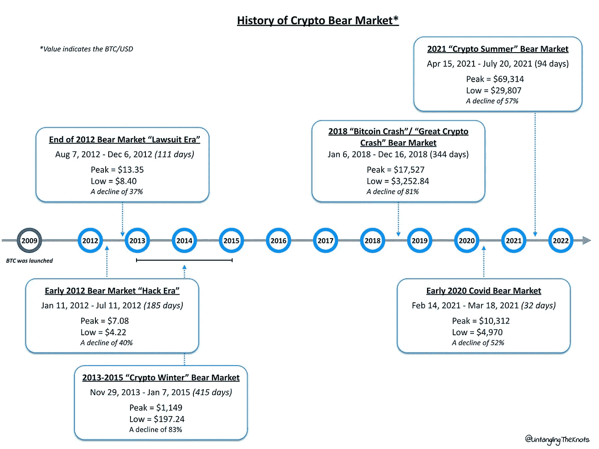

Partly in reference to [Mosaic Network](/mosaic-network-blog/a-brief-history-of-bitcoin-bear-markets-1eeac2d646e5)

有趣的是，每次熊市期间的最低低点*(BTC 价格)*会取代之前的低点，有些甚至会超过之前的高点。

很多人将当前的熊市等同于 2018 年的熊市。然而，值得注意的是，这与 2020 年的熊市有一些相似之处，即两者都发生在冠状病毒期间。

将这三次熊市并列，将更容易比较 2022 年熊市与 2020 年熊市甚至 2018 年熊市有何不同。

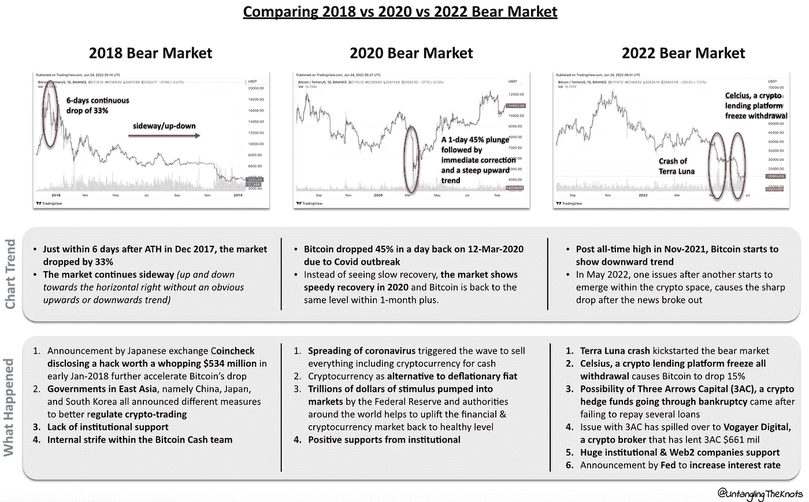

A quick recap on what has happened in 2018, 2020, and 2022 bear market

这里有一个简化的 TLDR，比较了一些重要的关键因素，这些因素可能会使 2022 年以后的加密技术变得更加主流和容易获得。

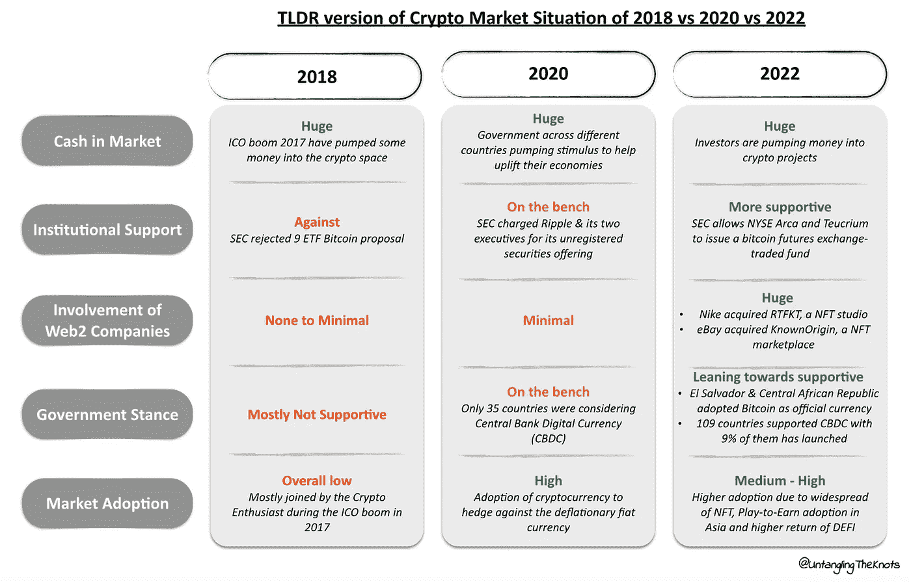

## 预测未来？

过去几个月，加密代币或硬币的价格下跌了 50%以上，这种不确定性让许多人不知所措。围绕价格预测的文章、民意调查、讨论和话题，以及关于这场熊市将持续多久的问题，开始成为抑制由此产生的不确定性的一种方式。

**随着我们看到看似稳定的公司、项目和加密令牌失败，我们的信任和金钱也随之消失，波动性成为关键主题**。像比特币基地、双子座和 BlockFi 这样的公司之间的工作交叉也没有帮助，事实上，它放大了它。

**在经济低迷时期，悲观情绪变得更加严重**类似于乐观情绪在一切都是绿色的时候似乎被过度提振。

具有讽刺意味的是，每当熊市发生时，新闻头条和人们警告加密崩溃，好像现在是加密时代的终结，这是相当有趣的。**市场调整本身是一个健康的迹象，尽管这是一个痛苦的迹象**，以便淘汰任何过于臃肿的项目或没有真正问题需要解决的项目。

虽然我们没有办法预测未来，但我们可以得到的最接近的方法是以历史趋势为参考，将概率或统计框架注入当前趋势。

最常用的概率框架之一就是 ***正态分布。*** 如果这还不起作用，那么也许下面的视觉会引起一些共鸣。

Cobie 在他的[概率思维文章](https://cobie.substack.com/p/probabilistic-thinking)中，谈到了在 2021 年 5 月至 2021 年 7 月的短暂熊市期间，未来几个月(或几年)可能趋势的 4 种情况，从历史高点 *(ATH)* 到历史低点 *(ATL)下跌了 49%。*

下面的视频简洁地总结了他文章中提到的所有要点，但展示了过去几年的真实案例:

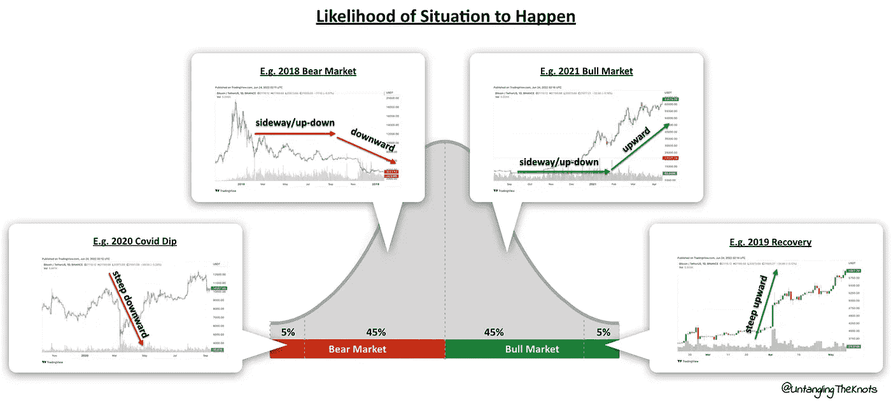

*Assigning the top 4 most possible case scenario to the current situation to better evaluate what would*

因此，这是一个使用情况发生概率概念的宽泛观点，没有考虑可能改变一种情况发生概率的各种不可预见情况。

这种概率思维对于**屏蔽噪音并使情绪影响最小**很重要。

## 在此之前，让我们后退一步

将 2018 年与当前的熊市进行并列比较，随着悲观情绪的出现，我们将自己定位于迎接更严峻的熊市。

这是从大局的角度来看的。

密码社区呢？他们还在太空中吗？或者他们已经跑去别的地方寻找安全的藏身之处了？

1.  **活跃的加密钱包**是查看用户是否仍在加密空间的最佳指示器

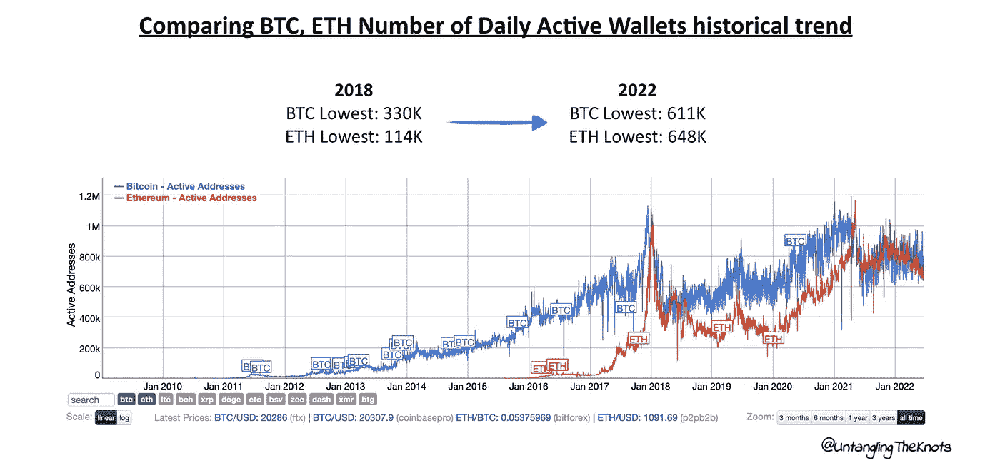

Credit: BitInfoCharts (Data as of June 22, 2022)

今年活跃钱包的最低数量 *(2022)* 超过了 2018 年的数字很多，活跃以太坊钱包的数量是 2018 年数字的 6 倍，活跃比特币钱包的数量是 2 倍。

这表明用户仍在加密领域&事实上，与 2018 年相比，现在的用户更多了。

**2。dapp***(分散应用的简称)的数量是该空间正在发生的事情的另一个指标，但从建筑商的角度来看。*

*尽管 2018 年是疯狂的熊市年，但事实证明，这是 DApps 出现的最佳时机。事实证明，熊市是建筑商在幕后悄悄施工的最佳时机。*

*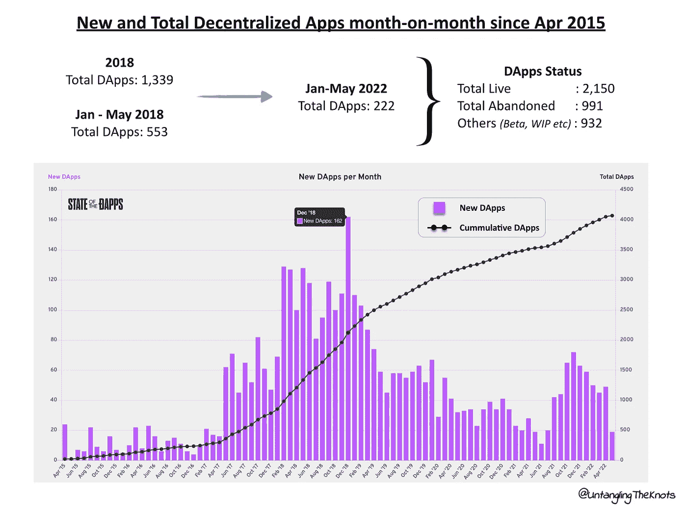*

*据报道，最近的新闻做出了一个假设，即随着 2024 年*(大约 2024 年 5 月 24 日)比特币减半的临近，熊市可能会持续两年。**

## *等一下，比特币减半是什么意思？*

*比特币减半是指每四年授予矿工的**比特币数量减半，直到比特币供应耗尽，因为比特币的供应量有限。随着每一半的发生，比特币的有限供应和对比特币的相同或更高需求将推动比特币价格上涨。***

*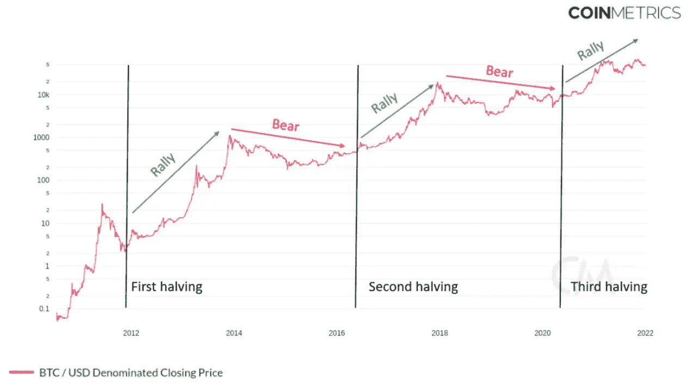*

*总共有 64 次减半，现在我们处于第三次减半，很少有参考文献指出减半会使比特币甚至加密市场的价格上涨。理论上，这是因为:*

**

*实际上，事情要比这复杂得多。*

1.  ***比特币减半反映在当前定价中*(有效市场假说——EMH)****

*这应该像供求关系一样，比特币减半可能会对价格产生积极影响。然而，比特币没有 EMH 所源自的其他金融工具成熟，因此比特币减半不太可能反映在当前的定价中*

***2。比特币减半在当前定价中没有体现*(混沌理论)****

*如果比特币减半尚未反映在当前定价中，我们可以缩小以确定最有可能影响比特币定价的几个关键方。*

*   ***霍德勒**——长期信徒，他们会在高点持有或卖出，在低点积累*
*   *机会主义者——热衷于涉足这个领域，被上涨趋势所吸引，但在下跌时卖出的新来者*
*   ***矿工** —从采矿工作中积累的比特币和出售其持有的比特币将影响价格走势。*

## *熊市和比特币减半有什么关系？*

*新闻说，这一轮熊市可能比 2018 年的熊市更严峻，他们预测，这一次，熊市可能会持续到 2024 年，因为当比特币减半时，假设加密市场将向上反弹，从而结束熊市。*

*然而，我们没有办法预测和知道市场的走向和持续时间。*

*对将要发生的事件的概率有一个了解，并对任何将要发生的变化保持警惕，这将有助于对正在发生的事情有一个更清晰的了解。*

## *正在形成的熊市*

*当然，看到你所持股份的估值减半，或者看到 Web3 项目/初创公司一个接一个地失败，这种感觉永远不会好。*

*来自 Terra & 3AC 的**涟漪效应尚未完全显现，但多米诺骨牌效应已经开始**，因为 Terra 问题会溢出到 3AC，进而影响与这两家公司有关联的公司，即 Celcius & Voyager Digital。*

*也许一线希望在于熊市有助于区分解决真正问题的秘密项目和其他项目。*

> *Raphael Schoen 在 [The Pomp Letters substack](https://pomp.substack.com/p/who-will-survive-when-the-everything) 中写道:“密码市场的毁灭实际上可能是好事，就像互联网公司的终结并不是网络公司的终结一样。”*

*作为一个建设者，这是建立和证明你有能力发展你的公司或项目的最佳时机。*

*作为一个非建设者，没有比熊市更好的时间来学习，用必要的技能或知识武装自己，当然，对于那些热衷于以更低的价格积累代币的人，你可能想了解**美元成本平均 *(DCA)*** 和**价值平均 *(VA)*** 是如何工作的。*

*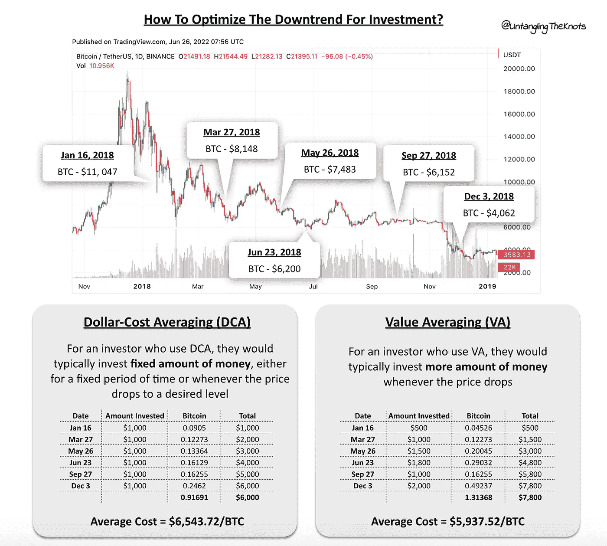*

> *“当你处于熊市时，你是在为牛市做准备。当你处于牛市时，你要为熊市做准备”*

## *TLDR*

*当前的市场相当不稳定，因为我们看到加密货币的价格下跌了 50%以上，各种问题接二连三地出现 *(Terra Luna 崩溃，Celcius 停止提款，3AC 破产的可能性，以及比特币基地和双子座等加密公司裁员)。**

*官方宣布为熊市，这导致对 NFT 的兴趣下降，整体市场情绪低落。*

*通货膨胀的宏观经济因素和美联储加息加剧了这种可怕的局面。*

*价格可能会下降。*

*公司可能会倒闭。*

*人们可能会失望。*

*然而，科技永远不会。*

**免责声明:这不是财务或投资建议，请自行研究&投资前评估自己的风险偏好。**

*如果你喜欢我的文章，请鼓掌并关注我，了解更多类似的内容:*

*[Linkedin](https://www.linkedin.com/in/siawhui)|[Twitter](https://twitter.com/siawhui_)|[Medium](/@siawhui)|[Substack](https://untanglingtheknots.substack.com/)*

> *加入 Coinmonks [电报频道](https://t.me/coincodecap)和 [Youtube 频道](https://www.youtube.com/c/coinmonks/videos)了解加密交易和投资*

# *另外，阅读*

*   *[如何在加拿大购买加密货币？](https://coincodecap.com/how-to-buy-cryptocurrency-in-canada)*
*   *[无聊猿游艇俱乐部(BAYC)回顾](https://coincodecap.com/bored-ape-yacht-club-bayc-review) | [拜比特 vs 比特币基地](https://coincodecap.com/bybit-vs-coinbase)*
*   *[5 款最佳加密交易终端](https://coincodecap.com/crypto-trading-terminals) | [最佳 DeFi 应用](https://coincodecap.com/best-defi-apps)*
*   *[比特币基地 vs 瓦济克斯](https://coincodecap.com/coinbase-vs-wazirx) | [比特鲁点评](https://coincodecap.com/bitrue-review) | [波洛涅克斯 vs 比特鲁](https://coincodecap.com/poloniex-vs-bittrex)*
*   *[德国最佳加密交易所](https://coincodecap.com/crypto-exchanges-in-germany) | [Arbitrum:第二层解决方案](https://coincodecap.com/arbitrum)*