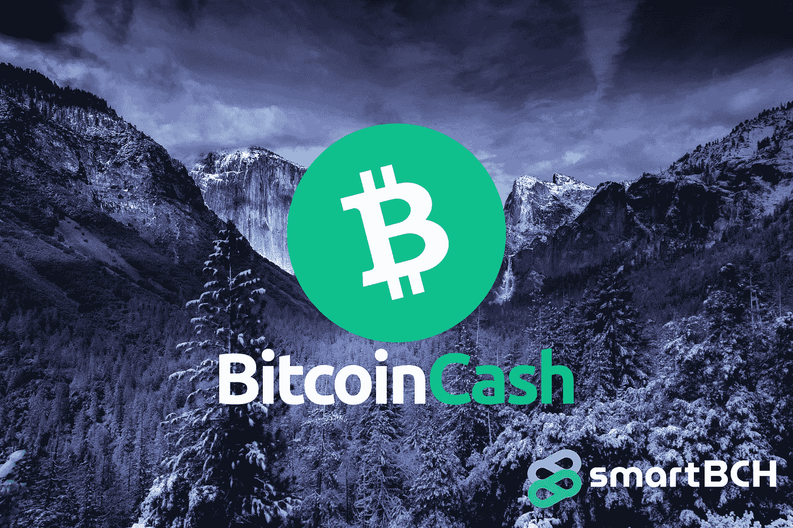
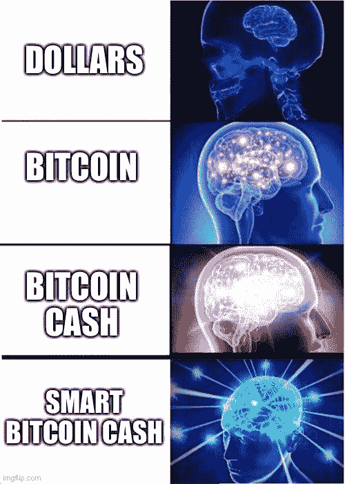
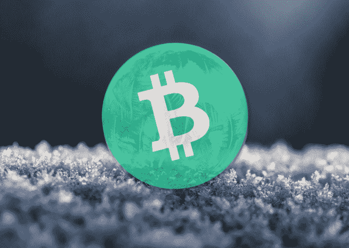

# 加密冬天和比特币现金的机会

> 原文：<https://medium.com/coinmonks/crypto-winter-and-opportunities-for-bitcoin-cash-a2f16737e2e6?source=collection_archive---------10----------------------->

我们将很快读到关于 crypto 已死和旧闻的文章和评论，这一切只是一场狂热，我们都(再次)陷入了泡沫。

厌恶加密的人什么都不懂，只关心价格和市值。将会是那些有意再次拖累市场的人，或许他们的目标是以更低的价格买入。

我们还将继续阅读比特币(BTC 币)是唯一值得我们花费时间的加密货币，以及其他一切都是“狗屎币”的原因。

这就是 BTC 最大化策略，这是中小 BTC 投资者的一种崇拜，它代表了遵循激进策略的 BTC 鲸鱼的利益。

将会有抱怨、恐慌性抛售和大量错误信息继续拖累市场。

我们可能正在进入熊市，但这肯定不是加密的终结。

熊市是机会稀缺的时候，但对于那些留下来并继续发展的人来说，机会仍然会出现。

这是一个重建的时候，让下一波的采用变得更简单，并教育剩下的用户群和投资者。

## 我们教育和重建的时候了

对每个人来说都很残酷。开发者支付了密码，就失去了大部分购买力。投资者赔钱，许多人厌恶地退出 crypto。

有影响力的人也会逃离，转向不同的机会。由于观看人数大幅下降，许多受欢迎的 YouTubers 减少了他们的活动或干脆停止创作内容。

隐秘的熊市类似于实体经济的衰退。广告、讨论、会议和对加密的兴趣都减少到了最基本的程度，但是网络不会简单地停止。拥有强大用户基础的分散式区块链网络仍在运行，未受影响。

像往常一样，大多数散户都买了顶。2017 年进入 crypto 的人，在 2018–2019 年期间吃了大亏。对于一些投资者来说，2017 年的利润在 2018 年几乎全部蒸发。大约需要这个时间(一年)达到新的底部，新一轮投资兴趣开始。

如今的比特币(BTC)远没有达到过去的主导地位。它在 2019 年设法复苏，但这是因为最大化主义者的长期宣传和更好的网络(营销，与华尔街的联系，公关)。

## 比特币现金

在 2020 年至 2021 年期间，比特币现金没有接触到大量涌入的投资者。这是一次失败吗？也许是营销上的失败，因为比特币现金不像一些初创公司那样吸引了绝大多数新人的注意力。

或许 Vitalik 认为只有投资者这一方面是成功的，但这一切仅仅是价格的问题吗？

比特币现金以最有意义的方式成功了。

它确立了自己作为基本面加密货币的地位。它的用户规模增加了，甚至在三个月内从 BTC 获得了更高的交易量。一项不应被忽视的成就。

比特币现金不断发展，增强了它的货币功能，它的社区不断支持世界各地的各种倡议，推广它，并接触商业世界。如今，许多地方的商户采用率都有所提高，其中一些热点地区包括委内瑞拉、尼日利亚、斯洛文尼亚和加勒比海地区。

比特币现金的一个重大事件是 smartBCH 侧链的发布。一个由知名投资者支持的智能合约网络，已经被成千上万的用户接受，以一种经济高效的方式提供以太坊智能合约功能(NFTs、Dapps、DeFi)。

这一成功将对比特币现金产生长期影响，因为它保留并将继续吸引更多用户。

它没有成功地吸引顶级资金，但成功地创造了一个令其他加密社区羡慕的用户群。

我以前多次写过我对比特币现金的看法。我们都希望被采用，但这也需要采取一些措施，让比特币现金再次成为热门话题。([卡尔达诺可以为比特币现金营销树立榜样](https://read.cash/@Pantera/cardano-can-set-an-example-for-bitcoin-cash-marketing-f5c10608))。

每个人都可以很容易地观察到反 BCH 的宣传，但只需要一个重要的人(即马斯克)同意一条推文，就可以找到更好的机会。特定的策略和漫长的公众教育过程取消了宣传。这是一个战场，我们将不得不带比石头和棍子更好的武器。

加密正慢慢成为主流。需要某些机制，并且应该审查每一种方法。比特币现金需要在所有方面、任何可能的地方被激活，以最大化其机会并发挥其真正的潜力。

对公众有更好的曝光度也为主要零售商采用支付方式创造了更好的机会。一个最先进的区块链网络，如比特币现金，需要这种关注。

比特币现金理应如此，尽管时机同样重要。在“熊市”期间分配巨额资本可能不会带来预期的结果。

这也与 BTC 的繁荣和萧条周期有关，因为正如历史数据所显示的那样，BTC 经常推动市场进入螺旋式下降和漫长的熊市。然而，随着区块链网络中的创新蓬勃发展，BTC 作为市场方向的决定性因素的重要性正在下降。

## 最后

([*source*](https://unsplash.com/photos/RgTI2KaQ5N4))

虽然牛市在 2021 年 5 月崩盘后复苏，但比特币现金没有再次达到 2021 年 5 月的高点，而是继续在加密深渊中下沉。

如今，资金正在向相反的方向流动，因为一些 BTC 鲸鱼似乎已经厌倦了，在交易所的帮助下，正在大举“倾销”，对所有加密货币的价格产生负面影响。

与 BTC 对挂钩的算法做出反应，大量出售所有加密货币。这是一种支持 BTC 的机制，但不会像过去那样产生同样的效果。

最糟糕的是，我们无法想象价格会跌到多低。可悲的是，这是许多加密业内人士已经决定某个投资组合的时候，也是比特币现金可能进入更好条款的重要时刻。

无论加密的冬天变得多么艰难，比特币现金都会复苏。

然而，我不能对 BTC 说同样的话，因为 LN 被认为是为 BTC 创造大规模收养浪潮的工具，但即使在萨尔瓦多政府实施独裁统治时也悲惨地失败了。

比特币现金被自愿采用，因为它提供了比法定货币或大多数加密货币更好的条款。

采用和附带发展最终将成为推动其价格上涨和摆脱 BTC 趋势和挂钩的因素。

比特币现金是当今的终极加密货币，smartBCH 进一步增强了其在数字金融领域的地位。

这是一个发展、教育、规划、建设和制定更具竞争力的战略的时期。

Writing at the following websites: ● [ReadCash](https://read.cash/@Pantera) ● [NoiseCash](https://noise.cash/u/Pantera99) ● [Medium](/@panterabch) ● [Hive](https://hive.blog/@pantera1) ● [Steemit](https://steemit.com/@pantera1) ●[Vocal](https://vocal.media/authors/pantera) ● [Minds](https://www.minds.com/pantera99/) ● [Twitter](https://twitter.com/Panterabch) ● [LinkedIn](https://www.linkedin.com/in/panterabch/) ● [Reddit](https://www.reddit.com/user/coinflip1211) ● [email](https://read.cash/@Pantera/localcryptos-p2p-exchange-is-now-offering-bitcoin-cash-trading-06637230#bad-link)

> **免责声明**:本内容中发布的所有材料均用于娱乐和教育目的，并且**遵守公平使用准则**。无意侵犯版权。如果您是或代表本文所用材料的版权所有者，并且对所述材料的使用有疑问，请发送[电子邮件](https://read.cash/@Pantera/cryptouknowns-battlegrounds-the-crypto-battle-royal-part-i-0ca762da#bad-link)。

***如果你喜欢这篇文章，别忘了订阅并点赞！***

*原发布于*[*https://read . cash*](https://read.cash/@Pantera/crypto-winter-and-opportunities-for-bitcoin-cash-459c458f)*。*

> 加入 Coinmonks [电报频道](https://t.me/coincodecap)和 [Youtube 频道](https://www.youtube.com/c/coinmonks/videos)了解加密交易和投资

## 另外，阅读

*   [印度的秘密税](https://blog.coincodecap.com/crypto-tax-india) | [altFINS 审查](https://blog.coincodecap.com/altfins-review) | [Prokey 审查](/coinmonks/prokey-review-26611173c13c)
*   [区块链 vs 比特币基地](https://blog.coincodecap.com/blockfi-vs-coinbase) | [比特坎评论](https://blog.coincodecap.com/bitkan-review) | [币安评论](/coinmonks/binance-review-ee10d3bf3b6e)
*   [Coldcard 评论](https://blog.coincodecap.com/coldcard-review) | [BOXtradEX 评论](https://blog.coincodecap.com/boxtradex-review)|[uni swap 指南](https://blog.coincodecap.com/uniswap)
*   [阿联酋 5 大最佳加密交易所](https://blog.coincodecap.com/best-crypto-exchanges-in-uae) | [SimpleSwap 评论](https://blog.coincodecap.com/simpleswap-review)
*   [7 大副本交易平台](https://blog.coincodecap.com/copy-trading-platforms) | [BuyCoins 点评](https://blog.coincodecap.com/buycoins-review)
*   [XT.COM 评论](https://blog.coincodecap.com/profittradingapp-for-binance)币安评论 |
*   [SmithBot 评论](https://blog.coincodecap.com/smithbot-review) | [4 款最佳免费开源交易机器人](https://blog.coincodecap.com/free-open-source-trading-bots)
*   [光宗耀祖 vs 比特币基地](https://blog.coincodecap.com/uphold-vs-coinbase) | [坎加交易所点评](https://blog.coincodecap.com/kanga-exchange-review)
*   [比诺莫评论](https://blog.coincodecap.com/binomo-review) | [斯多葛派 vs 3Commas vs TradeSanta](https://blog.coincodecap.com/stoic-vs-3commas-vs-tradesanta)
*   [Capital.com 评论](https://blog.coincodecap.com/capital-com-review) | [香港的加密借贷平台](https://blog.coincodecap.com/crypto-lending-hong-kong)
*   [最佳加密 RSS 源](https://blog.coincodecap.com/crypto-rss-feeds) | [最佳 eToro 替代品](https://blog.coincodecap.com/etoro-alternative)
*   [红狗赌场评论](https://blog.coincodecap.com/red-dog-casino-review) | [Swyftx 评论](https://blog.coincodecap.com/swyftx-review) | [CoinGate 评论](https://blog.coincodecap.com/coingate-review)