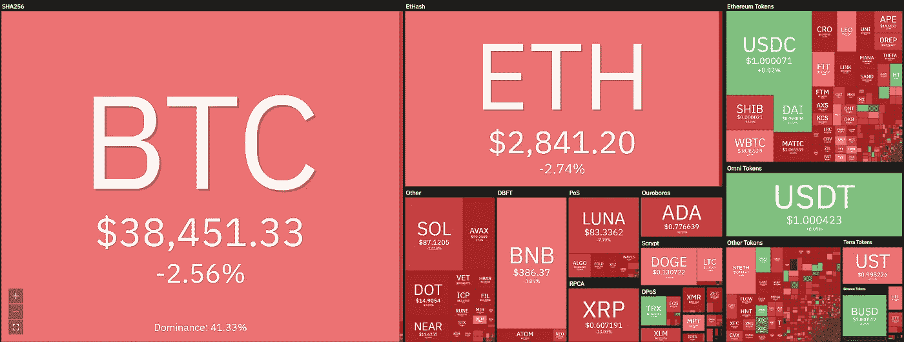
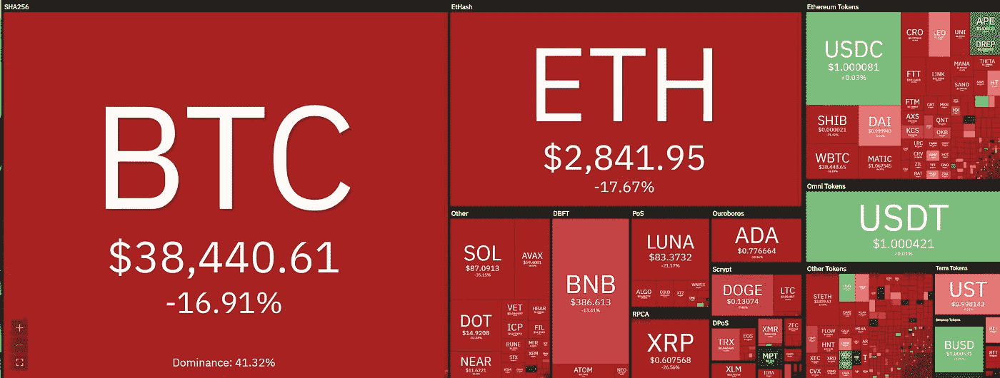
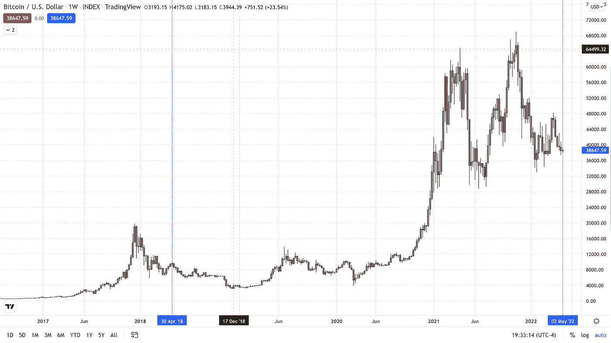
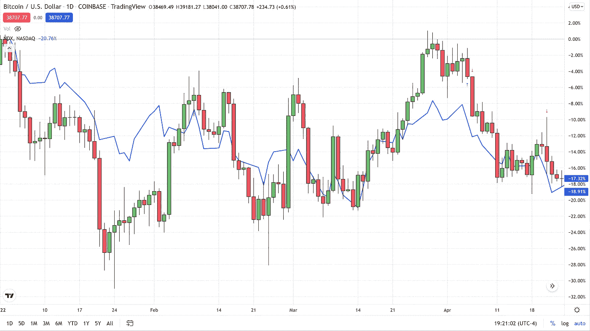

# 加密冬天即将来临？

> 原文：<https://medium.com/coinmonks/crypto-winter-on-the-way-cd827999a870?source=collection_archive---------55----------------------->

虽然我们今天确实看到比特币和其他加密货币升值，但整个行业的整体趋势是下行的。比特币当日交易量上涨约 1.5%，但较一周前下跌 2.5%，较一个月前下跌近 17%。

众所周知，比特币和几乎所有其他加密技术都处于一个明确的熊市，但我认为大多数人认为我们将很快看到转机。但我会解释为什么我认为 BTC 在很长一段时间内可能不会出现大规模的反弹。回到减半周期，我们刚刚到达这个四年周期的中点，让我们比较一下四年前 BTC 的交易情况。

【2018 年 5 月 1 日

2018 年 5 月 1 日，比特币从五个月前的 2017 年 12 月近 20，000 美元的历史高点下跌后，交易价格约为 9，200 美元。BTC 花了一年多时间才重新回到 9000 美元的价位。那五个月很痛苦。实际上免费的比特币从 ATH 跌至 6000 美元，之后略有回升，至 5 月 1 日的 9200 美元，五个月内价格下跌了 50%，而且注定会继续下跌。

**2022 年 5 月 1 日**

昨天是 5 月 1 日，正好是四年前，自创下 70，000 美元左右的历史新高以来，我们已经损失了 50%的价值。这种下跌是一种基本的自由落体式下跌，在继续走低之前确实有所回升，就像四年前一样。

**冬天来了？**

自 2022 年初以来，比特币和纳斯达克综合指数几乎同步上涨。事实上，从年初开始，它们都显示出大约 17%-19%的下降。宏观形势和更大的基本面不利于科技股指数的好转。相反，他们支持进一步下跌。为了简化我的想法，我会说，我们将看到纳斯达克和比特币的停滞或进一步下降。纳斯达克相关性有可能将天气变成寒冷甚至漫长的秘密冬天。

对于任何有兴趣查看更多关于比特币的文章的人，只需点击这个[链接](https://www.thegoldforecast.com/bitcoin)。

> 加入 Coinmonks [电报频道](https://t.me/coincodecap)和 [Youtube 频道](https://www.youtube.com/c/coinmonks/videos)了解加密交易和投资

# 另外，阅读

*   [如何在 FTX 交易所交易期货](https://coincodecap.com/ftx-futures-trading) | [OKEx vs 币安](https://coincodecap.com/okex-vs-binance)
*   [CoinLoan 评论](https://coincodecap.com/coinloan-review) | [YouHodler 评论](/coinmonks/youhodler-4-easy-ways-to-make-money-98969b9689f2) | [BlockFi 评论](https://coincodecap.com/blockfi-review)
*   [XT.COM 评论](https://coincodecap.com/profittradingapp-for-binance) | [币安评论](https://coincodecap.com/xt-com-review)
*   [SmithBot 评论](https://coincodecap.com/smithbot-review) | [4 款最佳免费开源交易机器人](https://coincodecap.com/free-open-source-trading-bots)
*   [比特币基地僵尸工具](/coinmonks/coinbase-bots-ac6359e897f3) | [AscendEX 审查](/coinmonks/ascendex-review-53e829cf75fa) | [OKEx 交易僵尸工具](/coinmonks/okex-trading-bots-234920f61e60)