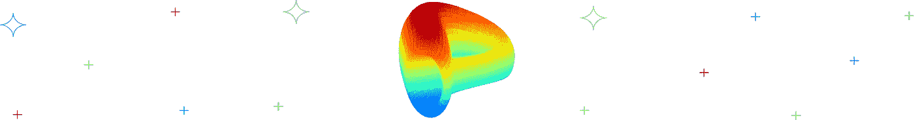

# Crypto 产量农业:6 个种植 Crypto 的最佳项目

> 原文：<https://medium.com/coinmonks/crypto-yield-farming-6-best-projects-to-farm-crypto-b618fc08c2b9?source=collection_archive---------18----------------------->

自 2009 年第一个区块链项目诞生以来，由加密货币热潮引发的几个金融产品已经席卷了金融界。其中一个源自 DeFi world(另一个由此产生的区块链科技产品)的计划是收益率农业(Yield Farming)，这是一个针对锁定基金的奖励计划，它同样耗费谦逊的新手的宝贵资本，并为精明的投资者创造复利财富。

在这篇文章中，你会学到所有关于高产农业的知识。此外， [Swapzone](https://swapzone.io/) 团队将回答与高产农业相关的问题，例如什么是高产农业，如何选择一个好的高产农场，以及高产农业是如何工作的。

# 什么是产量农业？

收益农业是一个允许数字资产和加密货币持有者将其持有的资产存入流动性池的过程，以便他们可以从中赚取利息或回报。根据您选择使用的不同加密场产品，存款资产的利息可能是可变的，也可能是固定的。

更简单地说，yield farming 允许任何人通过在去中心化的平台上存放数字资金来获得被动收入。尽管存在一些问题，如非永久性损失，但高产农业是 DeFi 概念之一，因其高产和可持续结构而持续获得大量市场吸引力。

# 产量农业是如何运作的？

收益农业需要用户(通常称为流动性提供者)和流动性池(包含集合资金的分散智能合约)。一旦满足了这一要求，用户就可以开始向流动性池添加资金，流动性池是向其他用户进行交易和借贷的来源。

作为存入资金的回报，用户根据潜在的 DeFi 协议规则定期获得贡献奖励。为了产生贡献的复利，用户可以进一步将奖励的代币再投资到流动性池中，以产生更高的收益。最重要的是，注意奖励是由存款金额决定的，所以更高的资本转化为更高的奖励。

*   用户将资金存入流动性池。
*   您的奖励或回报基于您的存款金额。以及您选择使用的 DeFi 协议的规则和预设 APY。
*   您可以通过将您的奖励再投资到同一个流动性池或选择将其转移到另一个利息收益率更高的流动性池来创造复利。

**进一步阅读:** [**我该种地还是该入股？可能都是？**](https://swapzone.io/blog/crypto-staking-vs-farming)

# 如何选择一个产量好的农场？

高产农业仍然是一项高风险、高回报的工作，对于追求利益的投资者来说可能值得一试。然而，只要进行了必要的研究和尽职调查，收益可能会回报投资者复合财富。

因此，选择最佳产量的养殖将取决于你想要使用多少资本，你计划投资多长时间，以及你愿意承担多大的风险。您还应该考虑某些因素，包括:绩效跟踪、费率、实施难易程度、年收益率(APY)、短期/长期回报、交易/天然气费用、更大的资本收益可用性以及非永久性损失政策。

# 高产农业项目

为了让你更容易理解，我们已经编制了一个加密产量农业项目和平台的列表，这些项目和平台在所有上述指标上都表现良好，便于你阅读。

# Nexo 加密

[Nexo](https://platform.nexo.io/register?_gl=1*1220vdo*_ga*MjUwNjc1MzYzLjE2NDc0MjM0MjQ.*_ga_9PLS786W8X*MTY0NzQ1OTMzNy4yLjAuMTY0NzQ1OTMzNy42MA..) 于 2018 年推出，自那以来，一直致力于为数字资产领域提供专业的金融服务。如今，Nexo crypto Yield Farms 为 350 多万用户管理资产，并支持 40 多个存款场。Nexo Crypto Yield Farming 使用户能够获得各种加密货币的利息，包括比特币、以太坊、EOS、稳定币等。使用 Nexo crypto 进行产量农业的一些好处包括:

*   **高收益:**用户可以在加密货币上获得高达 8%的年利率，在稳定货币上获得 12%的年利率。
*   **透明度:**用户可以使用 Nexo 储备审计功能实时监控其资产的表现。
*   **安全性:**向 Nexo 的 crypto yield farming 提供的所有资产和流动性都有保险，由顶级托管人提供高达 3 . 75 亿美元的保险。
*   **灵活取款:**用户可以随时提取存款，但每月最多只能免费加密取款五次。

# 摄氏密码

于 2107 年推出的 [Celsius](https://allaboutcelsius.com/) 已经成为领先的加密平台之一，让用户从他们的加密储蓄中赚取利息。今天，Celsius crypto farm 的总投资额约为 82 亿美元，其各种加密金融产品的平均年利率在 2%至 18%之间。选择摄氏温度进行高产农业的一些独特优势包括:

*   **自动化:**Celsius crypto 界面用户友好，允许用户通过几个步骤将资金存入流动性池。
*   **零手续费:**摄氏不收存取款手续费。另外，Celsius 提供一些年利率为 0%的贷款。
*   **灵活性:** Celsius 允许用户以 39 种不同的货币进行借贷，并允许用户随意使用这些资金。用户可以随时在 cryptos 之间交换，也可以在池中再投资，以增加他们的收益。

# Aave

从 2017 年 ETHL 结束开始， [Aave](https://aave.com/) DeFi 协议是一个开源和非托管的流动性协议，用于赚取存款和借贷资产的利息。Aave DeFi 协议于 2020 年在以太坊区块链上线，并在其流动性协议中积累了高达 185 亿美元的资金。除了 Aave Yield Farming 之外，Aave DeFi 协议还提供了更多的 DeFi 服务，包括超短期限和无抵押快速贷款，所有这些都为用户提供了 Aave 加密令牌。Aave 的一些产量农业优势包括:

*   **安全模块:** Aave DeFi 协议和 Yield Farming 由安全模块(SM)保护，这是一种针对 Aave 代币的赌注机制，作为对短缺事件的保险。用户获得 AAVE 作为安全奖励(SI)以及一定比例的协议费。
*   **治理:**Aave 加密协议的治理是完全开源的，所有关于协议未来的事宜都是通过对 Aave 改进提案(AIPs)的投票来决定的。
*   **折扣费用:**将 Aave DeFi 代币作为抵押品进行存款的用户可获得费用折扣。以及提高贷款金额的上限。

# 渗透

由 Sunny Agrawal 和 Josh Lee 创建的 Osmosis 是一个自治的自动化做市商协议，用于 DeFi 生态系统上的替代 IBC 兼容网络。[渗透](https://app.osmosis.zone/pools)允许其用户通过替代和交叉链硬币(如 ATOM、XPRT、OSMO、ION、AKT 等)在产量农业上获得奖励。此外，Osmosis 的用户界面可供初学者使用，其兼收并蓄的产量养殖选项为用户提供了多种不同 apy 的流动性池选择。渗透的一些好处包括:

*   **24 小时付款:**您将在 OSMO——渗透生态系统的原生象征——中获得奖励和 APY 利益，如果您愿意，这些奖励可以按日支付。
*   **绑定:**渗透允许用户选择通过锁定 LP 令牌 24 小时、7 天或 14 天来绑定他们的 LP 令牌，以赚取更高的 APY。
*   **IBC 兼容:**渗透设计为跨链和 IBC 兼容。未来，开发人员计划通过 Althea gravity bridge 和自定义挂钩扩展到不支持 IBC 的链，如以太坊、比特币和其他智能合约平台。

# 复合密码

[Compound Crypto](https://compound.finance/markets) 于 2018 年推出，是一个基于以太坊的 DeFi 协议，允许用户将资金集中在一个流动性池中以赚取利息。目前，Compound crypto 向 DeFi 市场提供约 102 亿美元的流动性，并持有超过 36 亿美元的贷款组合。用户将获得 Compound 的原生 cToken。复合产量农业的一些独特优势包括:

*   **治理:**复合加密协议的重大决策由协议的分散社区做出。
*   **巨大的流动性:**由于复合加密流动性池在 DeFi Yield 农业领域拥有最大的市场资本，用户可以放心使用他们的资金
*   **DeFi 比特币:**Compound 的一个独特之处在于它能够将比特币集成到 DeFi 环境中。这是通过引入包装比特币(WBTC)实现的，这是锁定比特币的 ERC-20 衍生产品。

# 曲线金融

[由 Micheal Egorov 于 2020 年推出的 Curve Finance](https://curve.fi/) 是一种自动化做市商协议，允许用户兑换加密货币并从锁定的资金中赚取回报。曲线融资协议中的资金池存款总额上升到近 190 亿美元，平均每日交易量为 3.339 亿美元。Curve finance 网站提供 90 年代的复古显示，列出了用户可用的所有收益率曲线融资流动性池及其相应的 apy，因此用户可以轻松浏览并做出选择。曲线融资的一些独特优势包括:

*   **支持令牌化的比特币:** Curve 是市场上最好的 DeFi 协议之一，允许用户交换和存放不同令牌化版本的比特币，如 renBTC、sBTC 和 WBTC。
*   **大型流动性池:**根据 DeFi pulse 的数据，Curve finance 流动性池是第二大以太坊指数，仅次于广受欢迎的指数 Uniswap。
*   **提供 StableSwap:** Curve Finance 是一家完全自主的做市商，以最小的滑点提供稳定的硬币。这意味着，对于愿意将资金存入稳定账户而没有风险的用户来说，它可以有效地充当平面储蓄账户。

**进一步阅读:**[**2022 年 5 个 Cryptos 要入股:索拉纳、特拉、阿尔格兰德、波尔卡多特、利斯克**、](https://swapzone.io/blog/5-cryptos-to-stake-in-2022)

> *加入 Coinmonks* [*电报频道*](https://t.me/coincodecap) *和* [*Youtube 频道*](https://www.youtube.com/c/coinmonks/videos) *了解加密交易和投资*

# 另外，阅读

*   [Bookmap 评论](https://coincodecap.com/bookmap-review-2021-best-trading-software) | [美国 5 大最佳加密交易所](https://coincodecap.com/crypto-exchange-usa)
*   最佳加密[硬件钱包](/coinmonks/hardware-wallets-dfa1211730c6) | [Bitbns 评论](/coinmonks/bitbns-review-38256a07e161)
*   [新加坡十大最佳加密交易所](https://coincodecap.com/crypto-exchange-in-singapore) | [购买 AXS](https://coincodecap.com/buy-axs-token)
*   [红狗赌场评论](https://coincodecap.com/red-dog-casino-review) | [Swyftx 评论](https://coincodecap.com/swyftx-review) | [CoinGate 评论](https://coincodecap.com/coingate-review)
*   [投资印度的最佳密码](https://coincodecap.com/best-crypto-to-invest-in-india-in-2021)|[WazirX P2P](https://coincodecap.com/wazirx-p2p)|[Hi Dollar Review](https://coincodecap.com/hi-dollar-review)