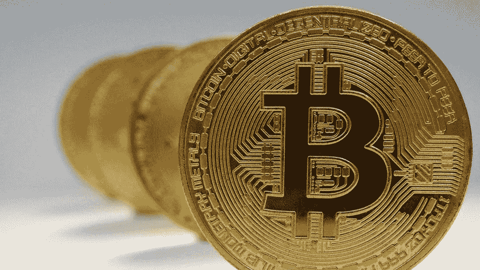

# 加密货币 101

> 原文：<https://medium.com/coinmonks/cryptocurrencies-101-4a7f6266a77d?source=collection_archive---------35----------------------->

# 什么是加密货币？

最简单地说，加密货币是一种非政府或央行发行的去中心化数字货币。每次你看到比特币升值或以太坊世界的故事，你都会看到加密货币在起作用。加密货币存储在数字钱包中，可以用来从任何愿意接受它的供应商那里购买商品和服务——但与传统银行的支票账户不同，它不以物理形式存在，也不受任何政府的支持。

你最有可能听说过的三种加密货币是比特币(最初的)、以太坊(新来的)和 Ripple(大银行喜欢的那种)。每种方法的性质略有不同，但本质上都服务于相同的目的:将支付数字化，这样就可以在不使用法定货币和不依赖央行的情况下进行支付。他们通过区块链技术实现这一点，加密数据存储在计算机网络中，并定期更新新的交易，从而创建所有先前活动的不断增长的历史记录。

# 加密货币的历史

关于加密货币，首先要知道的一件事是，它是由一个叫中本聪的人发明的——或者可能是一群人；没有人确切知道。他的发明是比特币，从那以后，许多其他硬币被创造出来。

第一批硬币是用高性能计算机挖掘出来的。加密货币和区块链技术背后的想法是，所有交易都由社区跟踪和验证，而不是由银行或政府等任何中央机构跟踪和验证。加密货币在另一个重要方面也不同于常规货币:它们是通货紧缩的。基本上，这意味着可供开采的货币是有限的，不像传统货币，政府可以印刷越来越多的货币。

# 什么是分布式分类账？

这意味着数据库分布在计算机网络中，这就是我们所说的分布式分类账的一个例子。分布式账本非常适合记录事件、财产、交易——简而言之，任何可以用数字描述的东西。这使得它在金融、房地产和航运等各种领域具有难以置信的价值。一个原因:验证。因为这么多人在看，数据不可能被任何人破坏；没有黑客可以破坏的原版拷贝。它是分散的，不可改变的；这意味着没有一个实体拥有这些信息(就像你拥有个人电脑一样)，或者未经网络中所有其他参与者的许可就可以更改这些信息(这几乎是不可能的)。

# 区块链技术和加密货币彻底改变了我们对金融的思考方式。

区块链技术和加密货币很可能是金融的未来。然而，事实证明，区块链技术还有其他应用——包括我们日常接触的每个行业，从艺术到收藏品到社交媒体。

事实上，许多人已经预测了区块链在去中心化应用程序和智能合同(即基于预设标准自动执行的合同)的未来中的作用。在自动执行合同的情况下，可以与中立的第三方建立托管账户，该第三方将根据合同条款是否得到满足来释放资金。智能合同不需要任何中介方来处理交易，可以节省时间和金钱。这种类型的合同可能会改变房地产和娱乐法律等行业，因为它们可以省去中间人，同时增强整个过程中每一步的安全性。

更多关于区块链和加密货币的文章即将发布。等等他们！

> 加入 Coinmonks [电报频道](https://t.me/coincodecap)和 [Youtube 频道](https://www.youtube.com/c/coinmonks/videos)了解加密交易和投资

# 另外，阅读

*   [7 大顶级副本交易平台](https://coincodecap.com/copy-trading-platforms) | [BuyCoins 审核](https://coincodecap.com/buycoins-review)
*   [MyConstant Review](https://coincodecap.com/myconstant-review) | [8 款最佳摇摆交易机器人](https://coincodecap.com/best-swing-trading-bots)
*   [Godex.io 审核](/coinmonks/godex-io-review-7366086519fb) | [邀请审核](/coinmonks/invity-review-70f3030c0502) | [BitForex 审核](https://coincodecap.com/bitforex-review)
*   [10 本关于加密的最佳书籍](https://coincodecap.com/best-crypto-books) | [英国 5 个最佳加密机器人](https://coincodecap.com/uk-trading-bots)
*   [ko only 回顾](https://coincodecap.com/koinly-review) | [Binaryx 回顾](https://coincodecap.com/binaryx-review)|[Hodlnaut vs CakeDefi](https://coincodecap.com/hodlnaut-vs-cakedefi-vs-celsius)