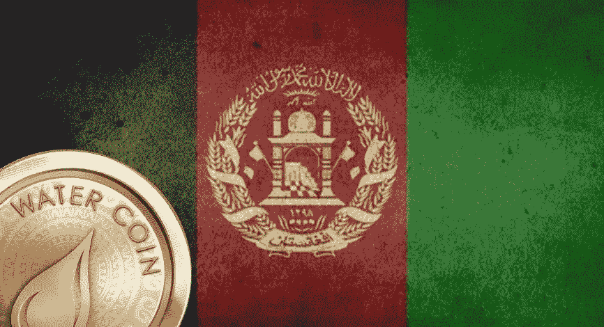

# 加密货币，危机中的阿富汗松了一口气

> 原文：<https://medium.com/coinmonks/cryptocurrencies-a-relief-for-afghanistan-in-the-midst-of-crisis-c087690e5f3e?source=collection_archive---------74----------------------->

免受国际制裁的数字货币让一些年轻的阿富汗人避免了经济困难。

在阿富汗西部的一个集市上，Arezo Akrimi 拿起他的手机，在屏幕上敲了几下，用一些加密货币兑换了一叠钞票。

数字货币及其不受国际制裁影响的去中心化架构，让一些年轻的阿富汗人避免了最严重的危机。

“得知这可以在阿富汗使用，这非常令人惊讶，”Arezo 告诉法新社。“这非常有帮助，”他补充道。

Code to Inspire 成立的目的是向赫拉特的妇女教授计算机编程，但它的技术方法现在允许其学生在这个贫困的国家获得资助。

目前，为了避免资金落入伊斯兰原教旨主义者手中，几乎不可能向阿富汗进行银行转账。

而且银行里有钱的人很难提取:个人每周只能提取相当于 200 美元的现金，企业每周只能提取 2000 美元。客户必须为这些交易排队数小时。

加密货币转移使非政府组织能够绕过这些障碍，并确保每一笔捐款都到达最需要的人手中，其创始人 Fereshteh Forough 告诉法新社。

“加密货币是一种克服各种政治和经济制裁的令人难以置信的方式，也是一种可以改变专制政权下人们生活的工具，”这位美国人解释道，他的父母在上世纪 80 年代逃离了阿富汗。

菲律宾武装部队；法新社；甲胎蛋白；金融理财师证书

*最初发表于*[*【https://www.reddit.com】*](https://www.reddit.com/user/watercoinacua/comments/tjqsc8/cryptocurrencies_a_relief_for_afghanistan_in_the/)*。*

> 加入 Coinmonks [电报频道](https://t.me/coincodecap)和 [Youtube 频道](https://www.youtube.com/c/coinmonks/videos)了解加密交易和投资

# 另外，阅读

*   [如何匿名购买比特币](https://coincodecap.com/buy-bitcoin-anonymously) | [比特币现金钱包](https://coincodecap.com/bitcoin-cash-wallets)
*   [币安 vs FTX](https://coincodecap.com/binance-vs-ftx) | [最佳(SOL)索拉纳钱包](https://coincodecap.com/solana-wallets)
*   [比诺莫评论](https://coincodecap.com/binomo-review) | [斯多葛派 vs 3Commas vs TradeSanta](https://coincodecap.com/stoic-vs-3commas-vs-tradesanta)
*   【Capital.com】|[港加密借贷平台](https://coincodecap.com/crypto-lending-hong-kong)
*   [如何在 Uniswap 上交换加密？](https://coincodecap.com/swap-crypto-on-uniswap) | [A-Ads 评论](https://coincodecap.com/a-ads-review)