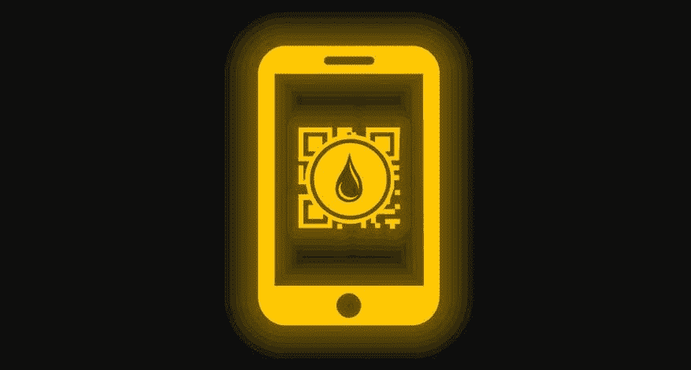

# 加密货币:对投资新手来说安全吗？

> 原文：<https://medium.com/coinmonks/cryptocurrencies-are-they-safe-for-the-novice-investor-acce2272d426?source=collection_archive---------63----------------------->

谁在 2020 年投资了比特币，可能会有不错的提议。当时，加密货币的收费为 8000 欧元(按当前汇率约合 8650 美元)。到 2022 年 3 月底，它的价值超过 4 万欧元。

谁在 2020 年投资了比特币，可能会有不错的提议。当时，加密货币的收费为 8000 欧元(按当前汇率约合 8650 美元)。到 2022 年 3 月底，它的价值超过 4 万欧元。

关于这种巨大利润机会的故事吸引了投资者进入加密货币市场。在地面上，他们投资于先驱比特币，以及以太坊、Cardano 或 Dogecoin 等其他比特币。

加密货币是一种数字支付方式。它们通过互联网上分散且安全的支付系统进行管理和销售，不受银行控制。

根据 Crypto.com 平台的估计，到 2021 年底，有 3 亿人拥有这种数字货币。而且估计投资人数还会继续增长。

“很多人都害怕失去什么。德国路德维希港大学的金融经济学家哈特穆特·瓦尔兹说。

与此同时，购买加密货币变得越来越容易。在线金融代理需要很长时间才能提供购买加密货币的可能性。一些柜员甚至希望他们的客户通过他们的支票账户来完成。

交易所门户网站 Emden Research 的加密货币专家 Timo Emden 表示，人们的兴趣明显增加了。

“加密货币已经进入了经典金融领域，这一资产类别已经站稳了脚跟。因此，有必要意识到传统银行也采取了这一步骤”。

根据 Emden 的说法，许多投资者想要投资，但仍然不使用它们，因为购买和管理它们很复杂。

现在，想要投资比特币和其他加密货币的人不得不通过商业平台购买这些数字货币，并将其转移到自己的钱包中，这是一种数字钱包。

主人必须保管或使用这些钱包，称为“私人钥匙”，或更安全的可能。我需要时间和耐心去理解和配置它。

在网上经纪人那里，过去要容易得多，因为只需点击或刷卡，或者投资者，你就可以获得一些比特币或以太币，它们也存储在网上钱包里。

最容易的准入也将允许现在不一定属于任何群体的投资者进入那个世界，例如对技术不狂热的老年人或小投资者。

“加密货币是一种具有潜力的新型投资，特别是在其他领域使用这项技术时，”埃姆登说。专家强调说，如果你越过它，你将能够看到存在的价格机会。

哈尔穆特·瓦尔兹认为，“获得数字货币正变得越来越容易，这是一个致命的迹象”。“Isso 对我们阿尔沃组织的看法是错误的，”他警告说。

《经济学人》警告说，关于这类资产的经验仍然很少。E quem quer invest，highlights，unconfirms 很多加密货币早已不复存在。因此，许多投资者看不到收购加密货币的风险。

*最初发表于*[*【https://www.reddit.com】*](https://www.reddit.com/user/watercoinacua/comments/u7jysn/cryptocurrencies_are_they_safe_for_the_novice/)*。*

> 加入 Coinmonks [电报频道](https://t.me/coincodecap)和 [Youtube 频道](https://www.youtube.com/c/coinmonks/videos)了解加密交易和投资

# 另外，阅读

*   [Bookmap 评论](https://coincodecap.com/bookmap-review-2021-best-trading-software) | [美国 5 大最佳加密交易所](https://coincodecap.com/crypto-exchange-usa)
*   最佳加密[硬件钱包](/coinmonks/hardware-wallets-dfa1211730c6) | [Bitbns 评论](/coinmonks/bitbns-review-38256a07e161)
*   [新加坡十大最佳加密交易所](https://coincodecap.com/crypto-exchange-in-singapore) | [购买 AXS](https://coincodecap.com/buy-axs-token)
*   [红狗赌场评论](https://coincodecap.com/red-dog-casino-review) | [Swyftx 评论](https://coincodecap.com/swyftx-review) | [CoinGate 评论](https://coincodecap.com/coingate-review)
*   [投资印度的最佳密码](https://coincodecap.com/best-crypto-to-invest-in-india-in-2021)|[WazirX P2P](https://coincodecap.com/wazirx-p2p)|[Hi Dollar Review](https://coincodecap.com/hi-dollar-review)