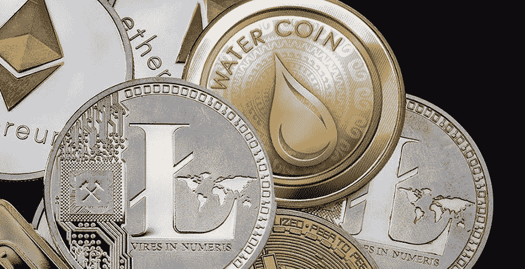

# 加密货币已经成为一种新的战争工具

> 原文：<https://medium.com/coinmonks/cryptocurrencies-have-become-a-new-tool-of-war-4aaa86606a24?source=collection_archive---------97----------------------->

在当前的战争中，俄罗斯和乌克兰都使用了密码来实施制裁，伤害对手并获得必要的资源。《跨边界管理法》是一部重要的法律。

在侵略乌克兰期间，俄罗斯与加密货币的艰难关系变得更加复杂。从 2022 年开始，俄罗斯提出了一项禁止在该国使用加密货币的提案。然而，在二月份，它的态度来了个 180 度的大转弯，暗示其监管可能是比完全禁止它们更好的选择。该国对加密货币的犹豫态度表明，这种新技术如何加强和威胁政府的普遍利益。根据最近的调查，尽管加密货币在俄罗斯投资者中几乎像黄金一样受欢迎，但俄罗斯人对投资数字货币的偏好也给克里姆林宫不愿容忍的金融系统带来了风险。

然而，最近的事件可能是在俄罗斯政治事务中使用加密货币的最令人信服的案例:作为常规战争中的一种新工具。自 2 月 24 日周四入侵乌克兰开始以来，无视数十年的国际主权规范，加密货币对冲突双方，甚至对那些没有参与的人都发挥了重要作用。虽然战争主要是通过常规技术(坦克、导弹和地面部队)进行的，但加密货币在战争中扮演了越来越重要的非暴力角色。加密货币已经成为乌克兰国防的新手段；作为俄罗斯的退路，同时应对铺天盖地的西方制裁；或者甚至成为那些没有卷入战争的人在冲突中支持乌克兰的工具。但是金钱和战争之间的这些新的互动很可能是暂时的。

一方面，加密货币为俄罗斯提供了新的方式来避免全球对其攻击的主要回应:制裁。许多评论人士认为，自入侵克里米亚以来，俄罗斯很可能一直在发展这一战略。被制裁的个人和公司可以通过加密网络转移资金，这让政府更难监控和控制，尤其是跨境转移。然而，值得注意的是，这个看似简单的策略仍然困难重重。事实上，如果俄罗斯继续努力发展绕过 SWIFT(用于实施制裁的全球银行间金融网络)的替代金融网络，它的情况可能会好得多。但鉴于俄罗斯以加密货币形式持有的大量财富，数字货币很可能在未来对该国的制裁中发挥重要作用。

此外，加密货币为乌克兰国防反击俄罗斯提供了新的攻击载体。认识到俄罗斯人通过加密货币逃避制裁的可能性，乌克兰当局公开要求获得俄罗斯政客加密货币钱包的信息，以监控、披露并可能拦截这些试图避免非暴力西方干预的行为。武装冲突开始两天后，副总理费多罗夫发了一条推特，悬赏任何信息。这一努力不仅反映了乌克兰“IT 军队”令人印象深刻的能力(这支军队还在继续壮大)，也反映了俄罗斯在利用这一技术作为逃避全球对其非法行为惩罚的途径时所面临的脆弱性。

然而，乌克兰的加密货币防御战略并没有停止对黑客的战斗。该国还要求主要加密货币交易所冻结与俄罗斯用户相关的所有钱包。费多罗夫甚至表示，至关重要的是“不仅要冻结与俄罗斯和白俄罗斯政客相关的地址，还要破坏普通用户，”这一建议引起了加密货币网站用户的不同反应。在当前的战争中，加密货币交易所运营商在数字货币的角色上处于强势地位。虽然这些交易所中的许多已经开始冻结其网络上的俄罗斯加密货币钱包，但一些交易所并不情愿，将其努力限制在遵守制裁所必需的最低限度。这一发展可能是围绕加密货币在战争中的使用的最重要的不确定点之一，因为它凸显了数字货币市场极其年轻和不受监管的性质，以及这些情况赋予少数大型企业家的巨大权力。

最后，数字货币也为武装冲突之外的人支持乌克兰提供了新的途径。在战争初期，加密货币社区的小团体开始组织发送数字货币捐款，以支持乌克兰的国防。自从该国总统公开从一个公开的钱包地址征集“秘密捐款”以来，在几天的时间里，筹款活动已经为国防筹集了超过 2200 万美元的财政支持。尽管这些数字与乌克兰数十亿美元的国防预算和俄罗斯可支配的资金规模相比微不足道，但国防财政支持的快速积累为加密货币作为非暴力手段的角色提供了令人信服的用例。非直接参与者对常规战争的干预。

尽管加密货币在当前冲突中对双方都有帮助，但乌克兰国防无疑比俄罗斯从数字货币在战争中的新角色中获益更多，至少目前如此。这些发展归因于两个独特的原因，这两个原因形成了我们可以从今天的例子中吸取的教训。一方面，加密货币的独特技术为数字货币在国家间冲突中的这些新的和创造性的应用铺平了道路，特别是支付的快速结算，这些都是政府更难以监测和控制的。另一方面，这些事件中的大多数是由于加密货币市场的极端早期性质。数字货币的技术承诺现在才受到关注，因为关于货币如何通过加密货币网络流动，特别是如何跨境流动，几乎没有任何有约束力的规则。

*最初发表于*[*【https://www.reddit.com】*](https://www.reddit.com/user/watercoinacua/comments/tf5ns3/cryptocurrencies_have_become_a_new_tool_of_war/)*。*

> *加入 Coinmonks* [*电报频道*](https://t.me/coincodecap) *和* [*Youtube 频道*](https://www.youtube.com/c/coinmonks/videos) *了解加密交易和投资*

# 另外，阅读

*   [Bookmap 评论](https://coincodecap.com/bookmap-review-2021-best-trading-software) | [美国 5 大最佳加密交易所](https://coincodecap.com/crypto-exchange-usa)
*   最佳加密[硬件钱包](/coinmonks/hardware-wallets-dfa1211730c6) | [Bitbns 评论](/coinmonks/bitbns-review-38256a07e161)
*   [新加坡十大最佳加密交易所](https://coincodecap.com/crypto-exchange-in-singapore) | [购买 AXS](https://coincodecap.com/buy-axs-token)
*   [红狗赌场评论](https://coincodecap.com/red-dog-casino-review) | [Swyftx 评论](https://coincodecap.com/swyftx-review) | [CoinGate 评论](https://coincodecap.com/coingate-review)
*   [投资印度的最佳密码](https://coincodecap.com/best-crypto-to-invest-in-india-in-2021)|[WazirX P2P](https://coincodecap.com/wazirx-p2p)|[Hi Dollar Review](https://coincodecap.com/hi-dollar-review)
*   [加拿大最佳加密交易机器人](https://coincodecap.com/5-best-crypto-trading-bots-in-canada) | [KuCoin 评论](https://coincodecap.com/kucoin-review)