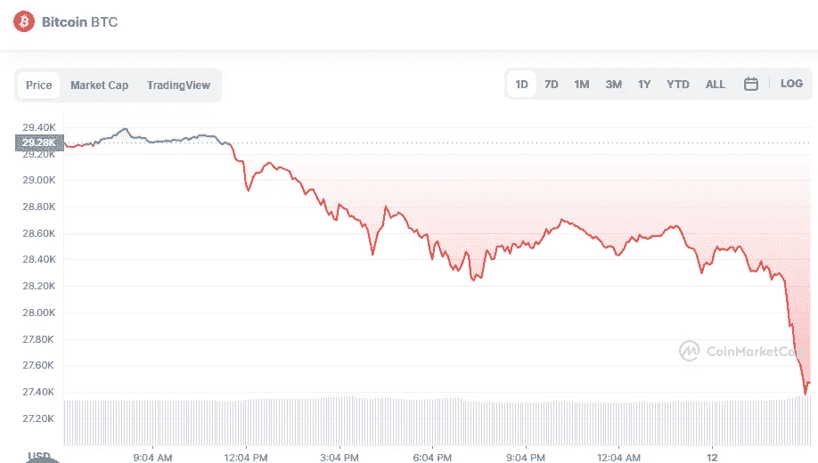

# 加密货币市场一片红色。BTC、瑞士联邦理工学院、BNB 和阿达的价格发生了什么变化…

> 原文：<https://medium.com/coinmonks/cryptocurrencies-market-is-red-what-happened-with-price-for-btc-eth-bnb-ada-28e5b1bf3665?source=collection_archive---------31----------------------->

# 1.比特币(-5.76%)

Source photo [Bitcoin price today, BTC to USD live, marketcap and chart | CoinMarketCap](https://coinmarketcap.com/currencies/bitcoin/)

# 市值 5246 亿美元

比特币目前的价格为 27.74136 美元，24 小时交易量为 304.5 亿美元。在过去的 24 小时里，比特币的使用量下降了 5.76%。目前在受欢迎程度上排名第一。