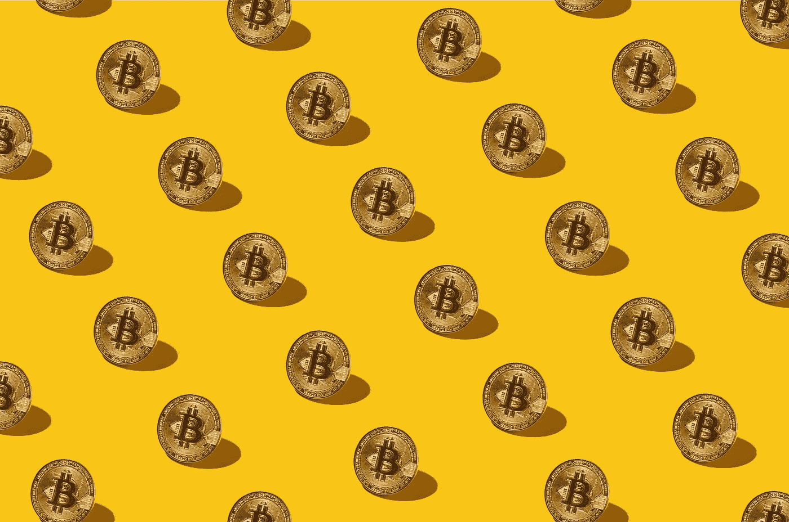

# 加密货币——它们是什么？

> 原文：<https://medium.com/coinmonks/cryptocurrencies-what-are-they-40cf3e29169f?source=collection_archive---------50----------------------->

## 在之前的文章中，我们已经解释了什么是比特币([点击此处](https://cryptoside.medium.com/bitcoin-where-it-all-started-1acfe0ef2f71))并解释了区块链([点击此处](https://cryptoside.medium.com/the-blockchain-arrived-to-stay-7737eff27866))，但我们没有详细探讨什么是加密货币以及加密货币和代币之间的区别。这是因为我们想要详细解释它，在本文中，我们从解释什么是加密货币开始。

## **首先:什么是加密货币？**

比特币、以太币或 Crypto.com 币 CRO。最近几年，你可能已经听说了太多的硬币(另一种定义加密的方式)，以至于你可能不再理解任何东西，在这种情况下，很容易混淆事物。首先，我们指定之前文章中解释的区块链是加密货币诞生的基础，这是为了继续重申加密货币不是区块链。

如果我们想做一个简单的比较，我们可以使用一个汽车电路。汽车赛道是汽车行驶的道路，在这里，对于这个世界来说，汽车在赛道上就像加密货币在区块链一样。

既然我们已经重申了这一点，让我们进入它的核心。加密货币是独立工作的数字货币，除了保证其安全性的软件之外，没有任何控制，使其无法以有利于政府的方式进行管理。

## 如果没有银行，我该把钱放在哪里？

这里我们接触一个新术语，钱包。如上所述，加密货币是数字货币，所以你不能把它们藏在床垫下，或者放在公文包里带到银行，为此你需要可以从你的设备(PC、智能手机、平板电脑等)访问的数字软件。告诉你有多少钱并让你想什么时候付钱的保险箱。

然而，有钱包并不意味着你的钱就在那里，因为万一你不得不更换你的电脑，没有更多的钱，但它只是区块链上的一个小窗口。由于您的交易记录在区块链上以保持安全，当您进行加密货币交易时，它会记录在区块链上，钱包负责计算您在网络中进行的所有交易的总和，然后取出余额。如果你正确理解了区块链，那么理解这一步就不难了。

例如，如果你从 0 个比特币开始，买了 10 个，那么就会有一笔 10 个比特币的交易与你在区块链的钱包相关联。如果用同一个钱包，你用 2 个比特币购买商品，然后进行交易，从钱包中取出 2 个比特币给另一个人，这笔交易也会被记录在区块链上。此时，你的钱包，显示你的钱，检查区块链的交易，然后做 0+10–2，所以它给你 8 个比特币。

啊，记住，你的钱包是私人的，唯一的，匿名的；因此，网络会知道你钱包里的交易，但是，如果你不说出来，没人会知道那个钱包是你的。此外，没有人可以偷你的钱，除非你给访问你的钱包，区块链(其副本在世界各地)将阻止交易。

## 它们是做什么用的？

这是一个典型的问题，我们认为这也是最重要的问题之一。世界上没有一样东西没有自己的功能；所以，就算是加密货币也要有它才会这么受欢迎。的确如此。

作为货币，加密货币被设计成允许在线交易，从而购买商品和服务。今天根本不要用比特币或类似的东西买面包，因为这是一项年轻的技术，它的价值仍然太不稳定。然而，随着时间的推移，越来越多的企业开始自愿接受加密货币作为货币，这是因为未来会朝着这个方向发展。

一个普遍的疑问是，这与波动性有关。因为这些硬币被设计成不由决定其价格的银行或政府管理，所以它们的价值根据交易所而变化(说得难听点，比特币交易所越多，比特币的价值增加越多)。这使得加密货币即使在几个小时内也会发生很高的价值变化，并使它们很难作为货币采用。我们对此没有答案，因为我们正在谈论一个仍在建设中的未来世界，但真正的原因是，现在我们将加密货币视为美元或欧元；因此，如果我们用 1 个比特币购买，我们会查看它在法定货币中的价值，如果我们用 1 个比特币购买，然后用 1 个比特币转售，我们不会关心它在法定货币中的价值，因为 1 个比特币总是有价值的。

## **我如何获得加密货币？**

拥有加密货币有三种方式，有些困难，有些昂贵，但每个人都可以拥有自己的加密货币。

## **第一条路:采矿**

拥有加密货币有三种方式，有些困难，有些昂贵，但每个人都可以拥有自己的加密货币。

采矿，意思是开采(是的，就像在矿井里)，是一个代表硬币制造方式的术语。因为，与银行不同，使用这种方法，数字硬币是由计算器(计算机)通过解决数学难题找到硬币并将其添加到系统中来创造的。如果你想用这个系统找到硬币，你必须买一台电脑(越强大越好)，安装专用软件，然后等待。但是要小心，因为要用这种方法赚钱，你必须在许多电脑上花很多钱，还要用很多电。

## **第二种方式:购买。**

这是一个简单的方法，你只需要有一张信用卡，去一个卖加密货币的网站，把你信用卡里的钱转换成数字货币。比如说比特币基地。

## **第三种方法:接受加密货币进行销售**

接受数字硬币作为支付方式，您的客户将能够通过支付数字硬币购买您的商品和/或服务，然后将它们存入您的钱包。

## **结论**

好吧，希望我们很清楚，我们解释了什么是加密货币，它们是如何创建的，它们在哪里持有，它们用于什么以及它们是如何获得的。下一篇文章将是最难的一篇，将讨论令牌。同时，请记住，加密货币是区块链的货币，您将在下一篇文章中用到它。

> 加入 Coinmonks [电报频道](https://t.me/coincodecap)和 [Youtube 频道](https://www.youtube.com/c/coinmonks/videos)了解加密交易和投资

# 另外，阅读

*   [有哪些交易信号？](https://coincodecap.com/trading-signal) | [Bitstamp vs 比特币基地](https://coincodecap.com/bitstamp-coinbase) | [买索拉纳](https://coincodecap.com/buy-solana)
*   [ProfitFarmers 点评](https://coincodecap.com/profitfarmers-review) | [如何使用 Cornix Trading Bot](https://coincodecap.com/cornix-trading-bot)
*   [西班牙 5 大最佳文案交易平台](https://coincodecap.com/copy-trading-spain)
*   [Pionex 双重投资](https://coincodecap.com/pionex-dual-investment) | [AdvCash 审查](https://coincodecap.com/advcash-review) | [支持审查](https://coincodecap.com/uphold-review)
*   [面向开发者的 8 个最佳加密货币 APIs】](https://coincodecap.com/best-cryptocurrency-apis)
*   [十大最佳加密货币博客](https://coincodecap.com/best-cryptocurrency-blogs) | [YouHodler 评论](https://coincodecap.com/youhodler-review)