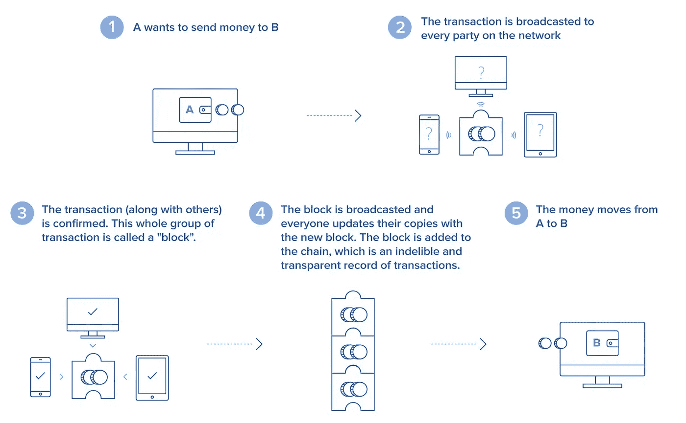

# 加密货币:骗局还是未来

> 原文：<https://medium.com/coinmonks/cryptocurrency-a-scam-or-future-b3b1a76f497f?source=collection_archive---------47----------------------->

根据 Coingecko 的数据，2022 年加密货币的市值约为 2.06 万亿美元，并且仍在上升。但有趣的事实是，你甚至不能用它来买一杯咖啡。不烦吗？让我们深入研究一下。

作为世界上第一种去中心化货币，*比特币*于 2009 年首次出现，是第一种加密货币；截至目前，大约有 5000 种不同的加密货币。它背后的主要想法是创造一种安全和匿名的方式将钱从一个人转移到另一个人，从那时起，它的价值飙升，并在其用户中被称为*“数字黄金”*。

# 什么是加密货币，为什么要使用加密货币？

许多加密货币是分散的网络，由独立运行的计算机网络执行，并由区块链支持，这是一种分布式数字账本，以块为单位记录每笔交易或数据，然后存储在计算机网络的多个地方。这种分散的结构使它们能够在政府和中央当局的控制之外存在。

加密货币可以从加密货币交易所开采或购买。大多数矿池位于中国，占比特币总开采量的[70%以上](https://www.buybitcoinworldwide.com/mining/china/)。在大范围内，加密货币在加密交换平台上被引入和交易，用户直接从银行购买。

世界经济论坛估计，到 2027 年， [*全球 GDP 的 10%*](http://www3.weforum.org/docs/WEF_GAC15_Technological_Tipping_Points_report_2015.pdf)将储存在区块链技术上。这种巨大的潜力吸引了数百万投资者，称之为“金钱的未来”，而批评者称之为“海市蜃楼”。专家认为，区块链和相关技术将颠覆许多行业，包括金融和法律。

# 加密货币的利与弊:

在这一点上，加密货币的使用在很大程度上仅限于投资和交易目的，就规模而言，全球约有 1000 万比特币持有者，其中约一半纯粹出于投资目的持有比特币。此外，加密货币不是必要的，因为政府支持的货币足以发挥作用，但对于大多数采用者来说，加密货币的优势是理论上的。因此，只有当使用加密货币有显著的实质性好处时，主流才会采用。*那么使用它们有什么好处呢？*

**优点:**

货币和资金可以在双方之间匿名转移，而不需要像银行和信用卡公司这样的第三方参与。这些分散的交易由公钥和私钥以及其他激励系统保护，使得它们对于重大欺诈来说是不可改变的。

国际交易比传统机构更容易、更快捷，交易费用很少甚至没有，这使得加密货币成为转移资金的理想手段。

投资加密货币获利。贸易和投资的趋势在这十年里飙升，从 2018 年的 3288 亿美元，到 2022 年成为 2.08 万亿美元的市场。与此同时，NFT 和可收藏代币的后续趋势增加了其兑换价值，证明其在投资者中具有很高的利润。

世界经济正在测试加密货币最突出的用例。目前，加密货币作为中间货币来简化跨境资金转移。因此，法定货币被转换为比特币(或另一种加密货币)，转移到目的地，然后转换为所需的法定货币。这种方法简化了转账流程，成本更低。

**缺点:**

加密货币已成为洗钱、恐怖主义融资和非法贸易等犯罪分子的常用工具。黑暗网络市场主要依靠加密货币运行，使其成为罪犯和毒贩的避风港。黑客还使用加密货币来接收赎金和匿名转账。

虽然加密货币声称可以进行匿名交易，但它们仍然会留下数字痕迹，从而暴露了政府机构或黑客追踪的漏洞。

挖掘加密货币需要大量的能源，如果小规模操作，矿工可能会遭受损失，挖掘的不可预测性可能会降低利润。伊朗国家通讯社 IRNA 在一份声明中表示，在伊朗，非法加密货币开采将导致“今年冬天至少 10%的电力中断”。

它仍然容易受到价格高度波动的影响，价格大幅飙升和暴跌，令长期投资者望而却步。

虽然加密货币区块链本身是高度安全的，但其他存储库，如交易平台和钱包，可能会被黑客攻击，并容易受到欺诈。

# **加密货币是骗局还是货币的未来？**

尽管加密货币自问世以来一直在不断进步，但它同时引发了批评和赞赏。公众缺乏信心是适应主流化的主要挑战，充分发挥现有技术的潜力可能会改变公众的看法。

此外，批评者并不完全错误。围绕这个市场有太多的炒作。比特币的价值取决于没有现实支持的预期，毫无疑问，所有加密货币都是高度不稳定的，一种货币可能随时盖过另一种货币，损害其他加密货币的价值和人们的一生积蓄。

随着加密货币钱包被盗事件的增加，最新的进步也带来了新的风险，欺诈继续给该行业带来不可靠的阴影。承诺和威胁之间的紧张关系造就了这个全新的金钱世界，这是我们从未经历过的。

尽管如此，加密货币可能是真正的创新，完全改变了货币和资金交换的典型方法。这项新技术可以给世界各地的社会带来重大变化。像现在这样，银行等第三方监管我们如何使用我们的钱。但如果没有这种干扰，钱可以在人与人之间，或者人与企业之间顺利转移。在我们进行货币交易的方式上，这是一个巨大的飞跃，一些人参与其中，另一些人则采取更加谨慎的态度。

# 结论:

无论人们站在硬币的哪一边，有一点是肯定的，加密货币不会有任何发展。这是一个新的前沿，不是每个人都了解，但每个人都感到好奇和兴奋。纽约联合国总部的阿米特亚诺和耶马克教授倾向于同意比特币和加密经济的未来是光明的，它能给我们的社会带来的变化将是非凡的。

> 正如维珍集团(Virgin group)创始人理查德·布兰森(Richard Branson)所言,“我不确定是否有人确切知道新兴支付技术将如何在长期内永远改变世界——我当然不知道。但我确信他们将产生巨大的积极影响，我对踏上旅程感到兴奋。”

> 加入 Coinmonks [电报频道](https://t.me/coincodecap)和 [Youtube 频道](https://www.youtube.com/c/coinmonks/videos)了解加密交易和投资

# 另外，阅读

*   [最好的卡达诺钱包](https://coincodecap.com/best-cardano-wallets) | [Bingbon 副本交易](https://coincodecap.com/bingbon-copy-trading)
*   [印度最佳 P2P 加密交易所](https://coincodecap.com/p2p-crypto-exchanges-in-india) | [柴犬钱包](https://coincodecap.com/baby-shiba-inu-wallets)
*   [八大加密附属计划](https://coincodecap.com/crypto-affiliate-programs) | [eToro vs 比特币基地](https://coincodecap.com/etoro-vs-coinbase)
*   [最佳以太坊钱包](https://coincodecap.com/best-ethereum-wallets) | [电报上的加密货币机器人](https://coincodecap.com/telegram-crypto-bots)
*   [交易杠杆代币的最佳交易所](https://coincodecap.com/leveraged-token-exchanges) | [购买 Floki](https://coincodecap.com/buy-floki-inu-token)
*   [3 commas vs . Pionex vs . crypto hopper](https://coincodecap.com/3commas-vs-pionex-vs-cryptohopper)|[Bingbon Review](https://coincodecap.com/bingbon-review)
*   [加密复制交易平台](/coinmonks/top-10-crypto-copy-trading-platforms-for-beginners-d0c37c7d698c) | [如何在 WazirX 上购买比特币](/coinmonks/buy-bitcoin-on-wazirx-2d12b7989af1)