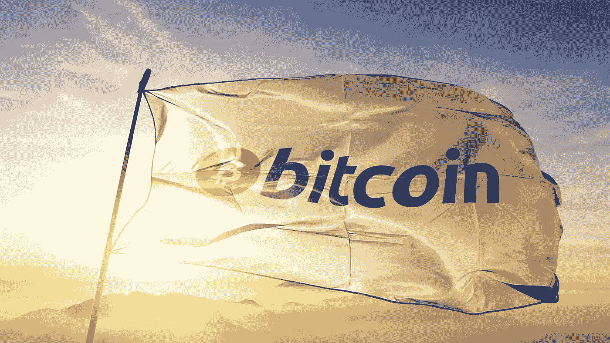

# 加密货币通向金融自由

> 原文：<https://medium.com/coinmonks/cryptocurrency-a-way-to-financial-freedom-362b84f2676e?source=collection_archive---------37----------------------->

几年过去了，当我们回顾加密资产(加密货币)成为全球经济一部分的轨迹时，我们可能会认为这是一个重大的转折点。

第一，出现了前所未有的情况，被曝遭到袭击的乌克兰政府用世界各地的捐款众筹资金进行武器采购。这不仅显示了加密资产在全球范围内进行点对点汇款的力量，也显示了自治分散组织(Dao)和其他加密社区快速动员的分散行动的力量。

与此同时，每个国家的 swift 决定将俄罗斯银行从国际货币转账和支付系统 SWIFT(国际银行间通信协会)中剔除，这是当前国际金融系统的管理方式，加密资产即将取代该系统。

这也是一个教训，让我在短时间内明白了自己在做什么。更重要的是，人们被迫思考加密资产的价值主张，以及接受它们意味着什么。

加密货币需要财务自由。它一直以自由为中心。但是现在艰难的时期帮助人们理解了这一点。人们不仅会认识到加密资产改变既定范式的力量，而且他们还将能够以更开放的思维看待加密资产对现有优先级和假设构成的挑战。我希望。

不违背自由原则的交换

随着北海巨妖和币安等加密货币交易所拒绝乌克兰提出的停止向所有俄罗斯账户无差别汇款的要求，这些问题成为人们关注的焦点。

美国前国务卿希拉里·克林顿对“所谓的加密资产交易所”“因自由主义或其他一些原则而拒绝暂停与俄罗斯的交易”感到“失望”。".这种说法听起来似乎有理。很明显，在这场战争中，两国谁错了。那么，如果捐赠继续流入乌克兰的比特币(BTC)和以太网(以太网)地址，而与俄罗斯的交易停止了，会怎么样？这有什么错呢？问题是，仅仅冻结俄罗斯央行的资产和没收支持受到制裁的普京的寡头游艇是不够的。

俄罗斯加密账户的全面暂停意味着消除数百万平民，其中许多人现在因制裁而恐慌，现金从自动取款机中消失，卢布价值暴跌。在里面，他拼命地寻求金钱。帐号被暂停的人，没办法分辨谁赞成这场战争。

听到的很多证词都是俄罗斯的反战在俄罗斯根深蒂固，还有成千上万因为参加莫斯科反战示威而被捕的勇敢的平民。鉴于俄罗斯当局对比特币态度冷淡，俄罗斯总统弗拉基米尔·普京的随行人员不太可能是一个狂热的加密资产用户。

与此同时，正如区块链工业协会的杰克·切尔文斯基(Jake Chervinsky)等人指出的那样，俄罗斯政府正在有目的地利用加密资产来规避制裁。有很多理由认为这几乎是不可能的。加密货币之所以存在，是因为它将是一种人们可以不受外界干扰自由使用的价值存储和交换手段。

不管是什么原因，被打断的那一刻，更高维度的意义就失去了。事实上，当比特币用户将资金从自我保管人的钱包转移到北海巨妖和币安等集中保管交易所买卖法定货币时，加密资产自由的精神是基础。

你会放弃你的自主权。然而，最成功的加密货币交易所是可信的。因为他们重视自由的精神，所以他们在价值观、财务和作为受托人方面都与相信这种精神的客户一致。应该认识到并支持交易所(当他们偏离它时会受到严厉的批评)对用户有一致的、基于原则的态度。

**贸易自由是一切权利的源泉**

顺便说一下，我对加密资产的支持并不是基于希拉里·克林顿所说的“自由主义或某种原则”。正如匿名的 Web 3 意识形态领袖 6259 所说，它植根于这样一个现实:“没有贸易自由，其他宪法权利实际上就无法实现。”

说政府支持言论自由没问题，但如果它阻止人们筹集或寄钱来支付电脑和互联网连接，那本质上就是言论。意思和不承认自由权一样。

被广泛引用的 6529 推特帖子，包括前述声明，是对加拿大政府迫使交易所限制向示威者转移加密资产的行动的回应。很难想象乌克兰的灾难会带来什么积极的东西。但如果有这样的东西，那就是认识到俄罗斯的卑鄙行径必须重新获得并捍卫我们在西方国家享有的自由激情。它可能已经诞生了。

我们希望将会产生一种促进和保护金融自由的必要性的新意识。

> 加入 Coinmonks [电报频道](https://t.me/coincodecap)和 [Youtube 频道](https://www.youtube.com/c/coinmonks/videos)了解加密交易和投资

# 另外，阅读

*   [比特币基地僵尸程序](/coinmonks/coinbase-bots-ac6359e897f3) | [AscendEX 审查](/coinmonks/ascendex-review-53e829cf75fa) | [OKEx 交易僵尸程序](/coinmonks/okex-trading-bots-234920f61e60)
*   [如何在印度购买比特币？](/coinmonks/buy-bitcoin-in-india-feb50ddfef94) | [WazirX 审查](/coinmonks/wazirx-review-5c811b074f5b)
*   [CryptoHopper 替代品](/coinmonks/cryptohopper-alternatives-d67287b16d27) | [HitBTC 审查](/coinmonks/hitbtc-review-c5143c5d53c2)
*   [CBET 评论](https://coincodecap.com/cbet-casino-review) | [库科恩 vs 比特币基地](https://coincodecap.com/kucoin-vs-coinbase)
*   [折叠 App 审核](https://coincodecap.com/fold-app-review) | [Kucoin 交易机器人](/coinmonks/kucoin-trading-bot-automate-your-trades-8cf0ca2138e0) | [Probit 审核](https://coincodecap.com/probit-review)
*   [如何匿名购买比特币](https://coincodecap.com/buy-bitcoin-anonymously) | [比特币现金钱包](https://coincodecap.com/bitcoin-cash-wallets)