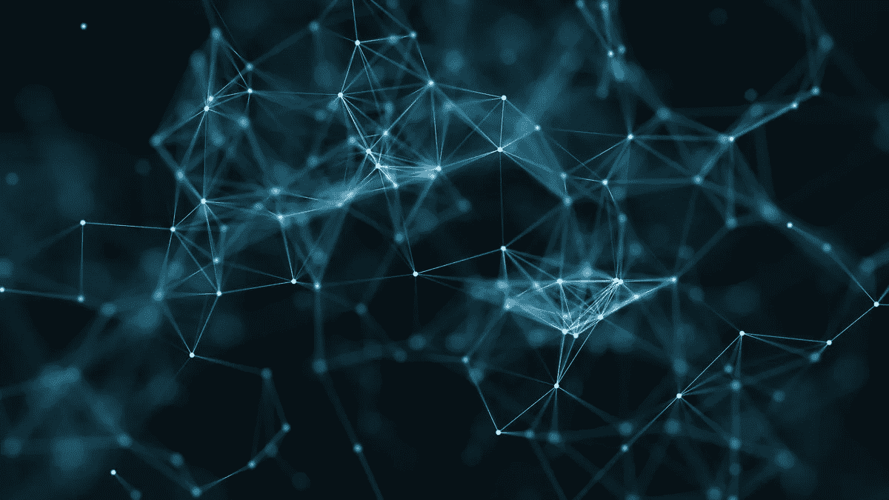

# 乌克兰战争后的加密货币、NFT 和未来。

> 原文：<https://medium.com/coinmonks/cryptocurrency-and-nfts-after-the-russia-invasion-of-ukraine-4d3b4991b412?source=collection_archive---------56----------------------->

几十年来，富人一直将艺术品作为通胀对冲工具，作为一种比黄金更安全的财富储存方式，艺术品的稀有性和独特性可以让一件艺术品的价值超过几十块金条。在那个任期内，人们使用 NFTs，现在有一些服务可以让你拥有一个价值很小的艺术品投资组合。这是从加密和区块链世界走向的方式之一。自 2019 年以来，世界一直在以前所未有的速度转变和变化，后 Covid19 after effect 和现在的俄罗斯-乌克兰局势将加速变化，对其他人来说，领域将完全成为一个转折点，引领一个新的方向，这就是加密货币和完整数字资产领域的情况，看起来比特币和其他加密的日子已经注定，但愚蠢的是， 乌克兰的不公正和野蛮的战争扭转了局势，为大少数民族带来了一个新的机会，但背景和场景并不存在。这只是许多梦想家心中的一个梦想，但这只是一个永远不会成为完全现实的梦想，而只是过去十年的一个趋势，但有些事情发生了，俄罗斯发生了！

许多人认为俄罗斯将使用加密货币来规避制裁，但我们中的许多人知道情况并非如此，即使他们尝试，这也不够，因为加密货币是可追踪的，最重要的是，它是为零售交易而创造的，而不是为国家大额交易创造的，比特币本质上是一个无政府项目，国家在其中发挥了很小的作用。

我们看到，对于促进自由和民主的有组织的多边机构来说，利用经济、贸易和外交手段对付弱小的流氓国家，而不是用野蛮的手段强加他们的生活方式，是多么重要。在基本上切断了俄罗斯作为 21 世纪实体与世界的联系后，西方让思想在一小撮金融精英的头脑中蓬勃发展，以理解现在的加密、NFT 和区块链世界如何适应这个新的勇敢的世界，并远离它所运作的反乌托邦地下影子世界。

现在，一个充满无限机遇的分支开始实施各种模式，为资本市场、全球贸易和有约束力的协议创造新的交易渠道。

现在，数字资产(代币)可以展示如何让世界成为一个更加开放的自由社会，合作和协作将成为新的附加值

前方的未来将共享一个巨大的管道网络，用于支付、结算、交易、所有权和协议，比今天的世界更复杂，在今天的世界里，世界将有更多的制衡，所以每个人都会表现得很好，而走上与自己的人民或邻居为敌的道路的国家将付出沉重的代价。

**从这里走向胜利。**