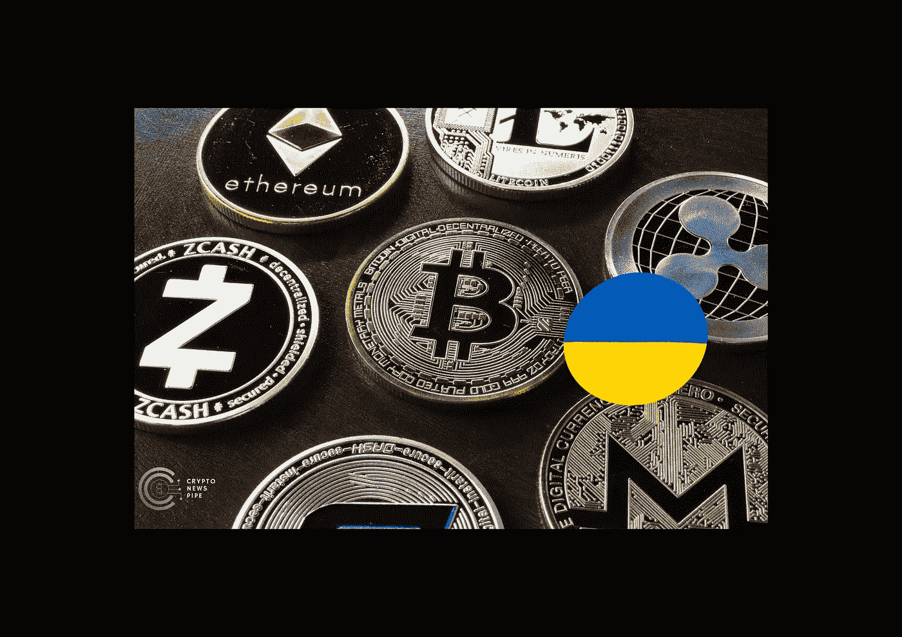

# 加密货币和乌克兰战争

> 原文：<https://medium.com/coinmonks/cryptocurrency-and-the-war-in-ukraine-cc906fdae216?source=collection_archive---------33----------------------->

[Cryptocurrency and the war in Ukraine](https://cryptonewspipe.com/cryptocurrency-and-the-war-in-ukraine/)

据专家称，2 月 24 日俄罗斯入侵乌克兰增加了加密货币市场的波动性。

根据专家的说法，这就是为什么大多数[投资者应该坚持主要的两种加密货币,](https://cryptonewspipe.com/xrp-sinks-below-ltc-again-after-new-lawsuit-from-major-investor/)[比特币](https://cryptonewspipe.com/category/bitcoin/)和[以太坊](https://cryptonewspipe.com/category/altcoins-news/ethereum-news/)，并且只投资他们愿意损失的部分，或者不到他们整体投资组合的 5%。