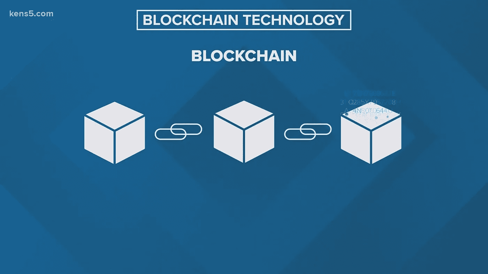
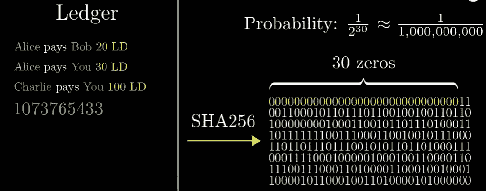
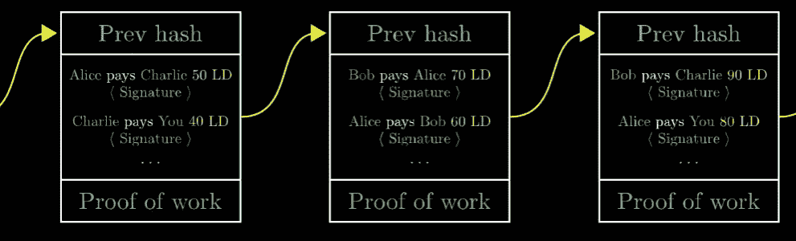
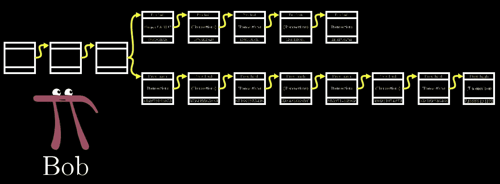

# 加密货币和区块链(第 2 部分，共 2 部分)

> 原文：<https://medium.com/coinmonks/cryptocurrency-blockchain-part-2-of-2-67e6705ccbc2?source=collection_archive---------15----------------------->

## *[***“有什么大惊小怪的？”***](/@Soham_Barui/list/whats-the-fuss-all-about-s01-0e0ab875874b)*

**

*Pic credit: kens5.com*

*如果你没看过上一集，[点这里。](/@soham.barui1234/whats-all-the-fuss-about-5198e127e565) **回顾:**我们讨论了为什么您想要加入 Cryptos 的行列。区块链是这一切的幕后推手，我们通过了解不对称密码术、公共账本的重要性以及我们如何着手制作更安全的可验证数字签名，开始挖掘其工作的本质。*

*我们试图通过学习其他相关概念来回答上一集提出的问题。*

> *我们已经学到的和将要学到的概念将最终联手解释区块链。*

# ***哈希函数***

*哈希函数将任何消息作为输入，并将其转换为 0 和 1 的固定数字。*

*例如，SHA256 是一个流行的散列函数，它将任何消息转换为一个包含 0 和 1 的 256 位字符串，称为散列值。*

*现在哈希值可能看起来是随机的，但它不是。稍微修改一下消息就会改变计划的哈希值。*

*加密哈希函数是那些您无法从哈希值中找到消息的哈希函数。您无法通过查看输出来找到输入。没有固定的解码模式。SHA256 是一个加密哈希函数。*

# ***在总账上使用哈希函数&工作证明***

*假设一张纸(分类账)上已经写满了集团内完成的交易。我们希望将其放在一个安全的文件夹中，并继续在新的分类账中记录交易。但是在我们这样做之前，我们需要确保被填充的页面被安全地存储，没有被篡改的机会，但是它也应该在需要时可以被访问。*

*假设一旦分类帐被填充，当通过 SHA256 传递页面时，它仅在安全文件夹中被接受，将给出前 30 位为零的散列。但这不会永远发生。*

*为了确保满足条件，我们在页面的末尾写了一个“幻数”,这样当它被散列时，它这次满足要求。*

*但是因为 SHA256 是加密的，你不能只是猜测数字。你将不得不手动猜测一个数字，直到你达到条件。这显然需要时间。但这就是我们如何确保计算工作已经完成，以证明真实性。欺诈者将没有动力去欺骗系统，因为他们必须找到这个“幻数”。*

*这个系统的真实性被称为工作证明。*

*但是找到这个数字有多难呢？*

*为了解释这一点，让我们用以前的条件。找到前 30 位数为零的数字的概率是 1/2 ⁰.*

> *因此，计算机在找到这个神奇的数字之前，必须经历几乎 10 亿个数字。*

**

*Pic credits: 3Blue1Brown on YouTube*

*为了验证幻数是否正确，我们必须将分类账和幻数放入 SHA256，看它是否给出 30 个零。这使得查找号码的过程变得困难，但是使得验证它变得非常容易，网络上的任何计算机都可以做到这一点。*

*如果有人改变了分类账中提到的交易，那么分类账生成的哈希值也会改变。我们将不得不再次经历寻找这个神奇数字的麻烦。*

*让我们把这个神奇的数字看作是工作的证明。*

*就像单笔交易只有在有签名的情况下才有效一样，总账(一个区块)只有在有工作证明的情况下才有效。*

*为了确保这些块在安全文件夹(区块链)中按照出现的顺序排列，将生成的前一个块的哈希值放在当前块的顶部，如此循环往复。这形成了一个链，我们可以按顺序追溯这些块。这就产生了区块链。*

**

*Pic credit: 3Blue1Brown on YouTube*

# *综合所有这些来理解 finally‼*

*我们的网络上有特殊的计算机，它们监听网络上发生的所有交易，并将它们放在一个块上，一旦这个块被这些交易填满，它们就会找到幻数。然后，他们将该块广播给每个人，这样网络上的每个人都可以将其添加到自己的区块链副本中，甚至可以验证幻数。*

*这些特殊的计算机被称为**矿工。***

*但是为什么矿工会在没有任何激励的情况下做这些事情呢？他们的动机是，一旦找到这个神奇的数字，他们就会得到额外的代币奖励。没有人赞助这些代币/货币。*

> *额外的代币是凭空为矿工创造的，没有人为此付费。*

*上述整个过程被称为**开采**。*

*这些矿工竞相寻找这个神奇的数字。谁先找到它，谁就赢得这些额外的代币。*

# ***我如何解决冲突？***

*如果你想解决个人矛盾，你可能想去别的地方看看:)*

*但是冲突可以通过一系列协议在区块链解决。*

*什么是冲突事务？假设 A 只有 100 个代币，它给了 B，但同时也给了 C。这两笔交易中只有一笔是合法的。如果发现幻数的矿工在其区块中包括 A & B 之间的交易，则 A & C 之间完成的交易被丢弃。*

*假设两个不同的矿工同时找到幻数到两个不同的区块，这两个区块有冲突的交易(一个区块有 A & B 之间的交易，另一个有 A & C 之间的交易)，在这种情况下，会有一个分叉，矿工会不断向任何一边添加，而较长的链被认为是真的。较短的链将被丢弃。*

> *但是这个系统怎么值得信任呢？*

*让我们假设 Alice 付给 Bob 100 个代币，巧合的是她设法找到了这个神奇的数字，但是她决定只向 Bob 广播这个块，欺骗他相信他已经得到了报酬，而其他人认为 Alice 没有付给 Bob。Bob 现在将块添加到他的链副本中。*

*当这种情况发生时，其他人会找到一个块并广播给每个人，包括 Bob。但是现在，Bob 有两个包含相同的先前哈希值的块。这就产生了冲突。*

*Bob 将因此创建一个 fork 并等待监听更多的块。这个想法是爱丽丝只是一个人，是少数；在最好的情况下，她可能会比其他人更快地找到随后的 1 或 2 个区块的幻数。但是其他人会赶上来，因为他们的计算速度加起来要快得多，而她会倒霉。*

*因此，过了一段时间后，Bob 会发现 Alice 的叉子较短，因此会丢弃它。*

**

*Pic credit: 3Blue1Brown on YouTube*

> *区块链的工作原理是“信任大多数”，因为几乎不可能有超过 50%的计算机是恶意的。*

*假设区块链公共网络中有一百万台计算机。你怎么可能让超过 50 万台计算机同时运行相同的恶意代码呢？*

*我们还没有谈到区块链的私人网络。您可能被允许控制那里的所有计算机。这里我们只讨论所有加密交易发生的公共网络。*

*因此，我们通过 ***信任更长的分叉来确保在公共区块链上没有恶意活动的空间。****

# ***紧跟技术进步***

> *久而久之，计算机变得更快了，他们将能够更快地解决这个神奇的数字。我们如何防止拥有更快机器的人拥有不公平的优势？*

*区块链网络记录计算每个区块所需的时间；然后，它会找到所需的平均时间。如果平均时间低于 10 分钟，网络会自动强化寻找幻数所需的条件。*

*如果条件最初是散列值前面应该有 30 个零，并且平均时间已经下降，那么通过将要求增加到 32 个零，条件变得更加复杂。随着计算机越来越快，这使得这个过程更具挑战性。*

# ***通缩还是通胀？***

*现在，我们已经了解了加密货币的一般工作原理，在大量的加密货币之间发生了一些根本性的变化。虽然一些密码致力于工作证明，一些致力于利益证明，一些也致力于历史证明。*

*但作为想使用代币的人，他们更关心的是代币是通货紧缩还是通货膨胀。*

*例如，比特币是一种通缩货币，这意味着可以供应的代币数量是有限的。*

*矿工的工作会得到新的代币奖励，但这种奖励几乎每四年减少一半。由于奖励矿工是增加供给的唯一方式，在某些时候，将不会有供给的代币注入。*

*对于比特币来说，这一点将在 2040 年之后出现，届时整个供应量将为 2100 万个比特币。*

> ***PS:想象一下，当我们使用区块链的概念不仅验证正在分发的代币/密码，还验证艺术品销售(NFT)、地契和医疗记录以确保它们不被篡改时，会发生什么。***

*这些只是众多区块链应用中的一小部分，因为它是一个不断增长的空间。区块链开启了一个全新的可能性世界，并最终形成了 Web3.0 的基础。*

*直到下一集，再见:)*

**如果你对此感兴趣，并希望了解更多其他话题，请考虑**[***关注我***](/@Soham_Barui) *和* ***订阅邮件列表。*****

*****查看我的其他文章，*** [***点击这里。***](/@Soham_Barui) *建设性的批评总是令人感激的，请让我知道如何才能做得更好。***

> **加入 Coinmonks [电报频道](https://t.me/coincodecap)和 [Youtube 频道](https://www.youtube.com/c/coinmonks/videos)了解加密交易和投资**

# **另外，阅读**

*   **[我的加密副本交易经历](/coinmonks/my-experience-with-crypto-copy-trading-d6feb2ce3ac5) | [AAX 交易所评论](/coinmonks/aax-exchange-review-2021-67c5ea09330c)**
*   **[Bybit 融资融券交易](/coinmonks/bybit-margin-trading-e5071676244e) | [币安融资融券交易](/coinmonks/binance-margin-trading-c9eb5e9d2116) | [Overbit 审核](/coinmonks/overbit-review-9446ed4f2188)**
*   **[有哪些交易信号？](https://coincodecap.com/trading-signal) | [比特斯坦普 vs 比特币基地](https://coincodecap.com/bitstamp-coinbase)**
*   **[10 本最佳加密书籍](https://coincodecap.com/best-crypto-books) | [英国 5 个最佳加密机器人](https://coincodecap.com/uk-trading-bots)**
*   **[Koinly 回顾](https://coincodecap.com/koinly-review) | [Binaryx 回顾](https://coincodecap.com/binaryx-review) | [Hodlnaut vs CakeDefi](https://coincodecap.com/hodlnaut-vs-cakedefi-vs-celsius)**
*   **[40 个最佳电报频道](https://coincodecap.com/best-telegram-channels) | [1xBit 回顾](https://coincodecap.com/1xbit-review) | [Keevo 钱包回顾](https://coincodecap.com/keevo-wallet-review)**
*   **[如何在印度购买以太坊？](https://coincodecap.com/buy-ethereum-in-india) | [如何在币安购买比特币](https://coincodecap.com/buy-bitcoin-binance)**