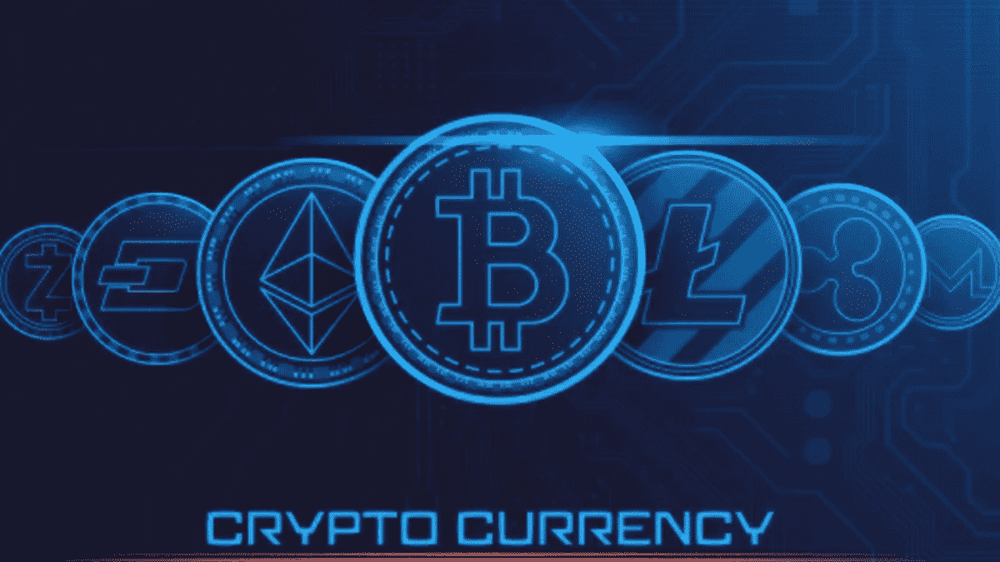

# 加密货币类别

> 原文：<https://medium.com/coinmonks/cryptocurrency-categories-9d5a13b7901?source=collection_archive---------27----------------------->

“加密货币是一种受密码学保护的数字/虚拟货币”(有助于安全通信，仅允许消息的发送者和接收者查看其内容)，使其几乎不可能复制或伪造。加密货币在分散的基础上运行，这意味着没有中央机构控制它。加密货币在区块链上运行，这是一个“在计算机网络上运行的分布式账本”。比特币是有史以来发明的第一种加密货币，今天，存在成千上万种不同的加密货币。重要的是，个人要明白，并非所有的加密货币都与比特币相似。

有数百种不同的加密货币类别，投资者需要在投资之前了解特定加密货币属于哪个类别。尽管有数百个类别，但大多数加密货币都属于 15 个主要类别。它们包括:

1.  [*——**——**——*](/coinmonks/cryptotypes-non-fungible-tokens-xcc-nft-567816c5dbd2)
2.  *[*分权自治组织*(道)——**——**——](https://xumitcapital.medium.com/cryptotypes-decentralized-autonomous-organization-xcc-dao-85c557b8ae83)*
3.  *[*分散交易所&集贸市场*——**XCC-DXM**](/coinmonks/cryptotypes-decentralized-exchanges-and-marketplaces-xcc-dxm-1020ea090188)*
4.  *[*分散财政*e(DeFi)——**XCC——DFI**](/coinmonks/cryptotypes-decentralized-finance-xcc-dfi-8eb460fe95b2)*
5.  *[*球迷代币，博彩&体育*——**XCC-FGS**](https://xumitcapital.medium.com/cryptotypes-fan-tokens-gaming-and-sports-xcc-fgs-9e7692f86990)*
6.  *[*基础设施&物联网*(IoT)——**XCC-IOT**](https://xumitcapital.medium.com/cryptotypes-infrastructure-iot-xcc-iot-91328b957b38)*
7.  *[*媒体，* *Memecoins &移动—***XCC—MMM**](https://xumitcapital.medium.com/cryptotypes-media-memecoins-mobile-xcc-mmm-ba98119483c0)*
8.  *[*交换媒介&价值储存——***XCC-梅夫**](/coinmonks/cryptotypes-medium-of-exchange-store-of-value-xcc-mev-c3e8c1069b23)*
9.  *[*网络，跑马圈地，&缩放*——**XCC——NSS**](https://xumitcapital.medium.com/cryptotypes-network-scaling-staking-xcc-nss-3d4c5d2de14e)*
10.  *[*站台*—**XCC—PTF**](/xumitcapital/cryptotypes-platforms-xcc-ptf-35ffa6db6d15)*
11.  *[*隐私&协议*——**XCC-PRP**](https://xumitcapital.medium.com/cryptotypes-privacy-protocol-xcc-prp-159380f2eb6e)*
12.  *[*智能合约*——**XCC-SMC**](https://xumitcapital.medium.com/cryptotypes-smart-contracts-xcc-smc-e663e86b1c4)*
13.  *[*stable coins*—**XCC-STC**](https://xumitcapital.medium.com/cryptotypes-stablecoins-xcc-stc-c20f5a748387)*
14.  *[*钱包*——**XCC-沃尔玛**](https://xumitcapital.medium.com/cryptotypes-wallets-xcc-wal-8512554b43a2)*
15.  *[*Web3 &元宇宙*——**XCC-W3M**](/coinmonks/cryptotypes-web3-and-metaverse-xcc-w3m-5641bdee793e)*

****【不可替代令牌】****

*“不可替换令牌(NFT)是加密的独特令牌，与数字内容(有时是物理内容)相关联，作为所有权的证明。NFT 可用于多种用途，包括艺术品、数字收藏品、音乐和视频游戏中的物品。NFT 是加密行业中发展最快的领域之一。NFT 地区几个最大的代币包括 Theta Network、ApeCoin、Axie Infinity 和 Flow。*

****分权自治组织*(道)***

*分散自治组织(DAO)是没有中央领导的成员所有的社区。它是一个“由编码为透明的计算机程序的规则所代表的组织”，由其成员管理，不受中央政府的影响。DAO 领域的一些令牌包括法令、以太坊名称服务、阿拉贡和獾道。*

****分散交易市场****

*“分散交易所(或 DEX)是一个点对点的市场”，在这里密码交易员可以直接相互交易。dex 提供了 crypto 最基本的功能之一:它们有助于促进没有银行、经纪人或其他第三方参与的金融交易。DEX 领域的一些知名代币包括币安币(BNB)、Uniswap、Stellar 和 THORChain。*

****分散财务* e (DeFi)***

*分散金融(DeFi)是一种基于安全分布式分类账的新金融技术，类似于加密货币所使用的技术。DeFi 对“银行和机构的货币、金融产品和金融服务”没有任何中央权力。DeFi 领域的几种已知代币包括 Terra、Avalanche、包装比特币和 FTX 代币。*

****【粉丝代币】****

*通过一个名为 Socios 的网站,“粉丝令牌是一种在区块链上创建的数字资产，允许其所有者访问体育组织向其粉丝提供的服务”。为了与他们最喜欢的球队互动，球迷们可以在社交网站上参与投票。粉丝代币、游戏和体育领域的几个最大的代币包括 Operon Origins、Gala 和 Chiliz。*

****基础设施和物联网*(物联网)***

*物联网(IoT)是指一个由联网设备和服务组成的庞大生态系统，这些设备和服务收集、交换和处理数据，以便动态适应周围环境。物联网与信息物理系统密不可分，通过提高它们提供的服务质量，成为智能基础设施的关键推动者。基础设施和物联网领域的一些著名标志包括 Helium、IoTeX 和 Powerledger。*

*****媒体、Media 币和移动*****

**“迷因币是一种源于互联网迷因的加密货币”或具有其他有趣的功能。两个最著名的迷因币是 Dogecoin 和 Shiba Inu。媒体硬币是与媒体行业相关的代币。媒体领域的几个最大的标志包括 Hive 和 MovieBloc。**

*****价值的交换和储存媒介*****

**交换媒介是一种促进交易双方之间商品买卖或交易的系统。要使某样东西发挥交换媒介的功能，它必须代表一种所有各方都必须接受的价值标准。“价值储存是指通常在未来保持购买力的任何商品或物品，并且是资产的功能，可以在以后被保存、检索和交换，并且在检索时可以预见是有用的”。这一类别中最大和最知名的代币包括比特币、Ripple、莱特币和 Monero。**

*****网络、标桩和缩放*****

**展望未来，赌注被定义为“在加密货币钱包中持有资金，以支持区块链网络的安全和运营”。简单来说，就是“锁定加密货币的行为”来获取激励。“在区块链，扩展是指修改区块链网络的工作方式，以适应区块链不断增长的节点和交易数量”。区块链上的交易越快越顺畅，用户的体验就越好”。这一类别中的几个著名的令牌包括 Convex Finance、Kusama、Mina 和 Amp。**

*****平台*****

**“区块链平台允许开发基于区块链的应用程序。它们可以是有权限的，也可以是无权限的”。借贷平台“允许用户以收取费用或利息的方式借贷加密货币”，这“可能是通过 DeFi 借贷应用程序或加密货币交易所”。平台类别中几个最大的令牌包括 Cardano、Tron、Ethereum Classic 和互联网计算机。**

*****隐私和协议*****

**“隐私币是一种数字货币，通过掩盖用户网络中的资金流动来保护用户的隐私”。它们让你几乎不可能知道谁给谁送了什么——这是一个关键特征，尤其是如果你不想让任何人窥探你的财务状况的话。隐私和协议领域的一些流行标志包括 Algorand、埃尔隆德、Zcash 和 The Graph。**

*****智能合约*****

**“智能合同是一种自动执行的合同，其中买方-卖方协议的条件直接写入代码行”。该守则以及其中包含的协议“通过一个分散的区块链网络分发”。代码控制执行，交易是可追踪的，不可能逆转。智能合约类别中几个最大和最著名的令牌包括以太坊和 Polkadot。**

*****稳定点*****

**此外，稳定币是一种加密货币，顾名思义，旨在提供价格稳定，并由储备资产支持。稳定的货币往往“与美元等货币或黄金等大宗商品的价格挂钩”。stablecoin 类别中几个突出的代币包括 Tether、USD 硬币、币安 USD 和 TerraUSD。**

*****钱包*****

**“加密钱包通过存储您的私钥来保证它们的安全和可访问性。它们允许你发送、接收和消费加密货币”。它们有多种形式，从实体的硬件钱包到数字的移动应用。一些最大的加密货币钱包包括 Voyager token、Coin98 和 SafePal。**

*****Web3 和*** 元宇宙**

**Web3 是基于区块链技术的新版本万维网的概念，结合了诸如去中心化和基于令牌的经济学等概念“元宇宙是一个专注于社交联系的 3D 虚拟世界网络，被定义为互联网的可能迭代，作为一个单一的、通用的虚拟世界，由虚拟和增强现实耳机的使用来辅助”。Web3 和元宇宙类别中最显著的标志包括分散土地和沙盒。**

**有必要认识到，有数百种不同的加密货币类别，但这是 15 种主要的类别，大多数已知的代币都属于这些类别。如前所述，投资者认识到加密货币属于哪一类以及它发挥什么作用非常重要，这样他们就可以更好地了解特定加密货币的用途以及投资它的好处，就像他们在购买股票、ETF 或共同基金之前一样。**

**由阿尔汗·帕里克(【arhan.parikh@xumitcapital.com】T2)撰写**

**— — — — — — — — — — — — — — — — — — — — — — — — — — — — — -**

****资源:****

**弗兰肯菲尔德，J. (2022 年 3 月 2 日)。*什么是加密货币？* Investopedia。检索于 2022 年 4 月 13 日，来自[https://www.investopedia.com/terms/c/cryptocurrency.asp](https://www.investopedia.com/terms/c/cryptocurrency.asp)**

**梅勒妮·克莱默(2022 年 1 月 18 日)。*nfts 初学者指南:什么是不可替换的令牌？*解密。检索于 2022 年 4 月 13 日，来自[https://decrypt . co/resources/non-repoible-tokens-nfts-explained-guide-learn-区块链](https://decrypt.co/resources/non-fungible-tokens-nfts-explained-guide-learn-blockchain)**

***分权自治组织*。ethereum.org。(未注明)。检索于 2022 年 4 月 13 日，来自[https://ethereum.org/en/dao/](https://ethereum.org/en/dao/)**

**维基媒体基金会。(2022 年 3 月 31 日)。*分权自治组织*。维基百科。检索于 2022 年 4 月 13 日，来自[https://en . Wikipedia . org/wiki/Decentralized _ autonomous _ organization](https://en.wikipedia.org/wiki/Decentralized_autonomous_organization)**

**比特币基地。(未注明)。什么是 Dex？比特币基地。2022 年 4 月 13 日检索，来自[https://www . coin base . com/learn/crypto-basics/what-is-A-dex #:~:text = A % 20 decentralized % 20 exchange % 20(or % 20 dex，brokers % 2C % 20 or % 20 any % 20 other % 20 intermediary](https://www.coinbase.com/learn/crypto-basics/what-is-a-dex#:~:text=A%20decentralized%20exchange%20(or%20DEX,brokers%2C%20or%20any%20other%20intermediary)。**

**夏尔马河(2022 年 3 月 24 日)。*分权财政*。Investopedia。检索于 2022 年 4 月 13 日，来自[https://www . investopedia . com/Decentralized-finance-DeFi-5113835 #:~:text = Decentralized % 20 finance % 20(DeFi)% 20 is % 20an，financial % 20 products % 2C % 20 和%20financial%20services。](https://www.investopedia.com/decentralized-finance-defi-5113835#:~:text=Decentralized%20finance%20(DeFi)%20is%20an,financial%20products%2C%20and%20financial%20services.)**

**马卡。(2022 年 2 月 22 日)。体育运动中的球迷代币:不仅仅是足球。马卡。2022 年 4 月 13 日检索，来自[https://www . Marca . com/en/technology/fan-tokens/2022/02/22/6214 ef 34 ca 47416d 558 b45 a 3 . html](https://www.marca.com/en/technology/fan-tokens/2022/02/22/6214ef34ca47416d558b45a3.html)**

***IOT 和智能基础设施*。伊妮莎。(2021 年 8 月 26 日)。检索于 2022 年 4 月 13 日，来自[https://www . enisa . Europa . eu/topics/IOT-and-smart-infra structures](https://www.enisa.europa.eu/topics/iot-and-smart-infrastructures)**

**维基媒体基金会。(2022 年 4 月 5 日)。*迷因币*。维基百科。检索于 2022 年 4 月 13 日，来自[https://en.wikipedia.org/wiki/Meme_coin](https://en.wikipedia.org/wiki/Meme_coin)**

**，l .“a . w .，，S. W .，，O. A .，，L. D .，，A. R .(未注明)。*媒体币*。隐板岩。于 2022 年 4 月 13 日从[https://cryptoslate.com/cryptos/media/](https://cryptoslate.com/cryptos/media/)检索**

**陈，J. (2021 年 10 月 23 日)。*交易媒介定义*。Investopedia。于 2022 年 4 月 13 日从[https://www.investopedia.com/terms/m/mediumofexchange.asp](https://www.investopedia.com/terms/m/mediumofexchange.asp)检索**

**维基媒体基金会。(2022 年 3 月 28 日)。*储值*。维基百科。检索于 2022 年 4 月 13 日，来自[https://en . Wikipedia . org/wiki/Store _ of _ value #:~:text = Cryptocurrency 的%20role%20as%20a%20store，comparated % 20 by % 20 advocates % 20 to % 20 gold](https://en.wikipedia.org/wiki/Store_of_value#:~:text=Cryptocurrency's%20role%20as%20a%20store,compared%20by%20advocates%20to%20gold)**

**币安学院。(2022 年 3 月 16 日)。*什么是赌注？*币安学院。于 2022 年 4 月 13 日从[https://academy.binance.com/en/articles/what-is-staking](https://academy.binance.com/en/articles/what-is-staking)检索**

***解释:为什么区块链的大小和可扩展性很重要*。cnbctv18.com。(2022 年 1 月 20 日)。检索于 2022 年 4 月 13 日，来自[https://www . cnbctv 18 . com/cryptocurrency/explained-why-a-区块链-size-and-scalability-matter-12174272 . htm](https://www.cnbctv18.com/cryptocurrency/explained-why-a-blockchains-size-and-scalability-matter-12174272.htm)**

**币安学院。(2022 年 3 月 2 日)。*什么是加密贷款，它是如何工作的？*币安学院。检索于 2022 年 4 月 13 日，来自[https://academy . binance . com/en/articles/what-is-crypto-lending-and-how-it-work](https://academy.binance.com/en/articles/what-is-crypto-lending-and-how-does-it-work)**

***2022 年区块链应用区块链平台排行榜*。李维赫兹。(2022 年 3 月 8 日)。检索于 2022 年 4 月 13 日，来自[https://www . leewayhertz . com/区块链-platforms-for-top-区块链-companies/#:~:text = block chain % 20 platforms % 20 allow % 20 the % 20 development，host % 20 applications % 20 on % 20 the % 20 block chain](https://www.leewayhertz.com/blockchain-platforms-for-top-blockchain-companies/#:~:text=Blockchain%20platforms%20allow%20the%20development,host%20applications%20on%20the%20blockchain)。**

**史蒂文斯河(2022 年 1 月 10 日)。*什么是隐私币，合法吗？* CoinDesk 最新头条 RSS。检索于 2022 年 4 月 13 日，来自[https://www . coin desk . com/learn/what-are-privacy-coins-and-are-they-legal/](https://www.coindesk.com/learn/what-are-privacy-coins-and-are-they-legal/)**

**弗兰肯菲尔德，J. (2022 年 3 月 24 日)。智能合约:你需要知道的。Investopedia。于 2022 年 4 月 13 日从[https://www.investopedia.com/terms/s/smart-contracts.asp](https://www.investopedia.com/terms/s/smart-contracts.asp)检索**

**海耶斯，A. (2022 年 3 月 18 日)。*什么是稳定币？* Investopedia。检索于 2022 年 4 月 13 日，发自 https://www.investopedia.com/terms/s/stablecoin.asp**

**比特币基地。(未注明)。*加密基础——什么是加密钱包？*比特币基地。检索于 2022 年 4 月 13 日，来自[https://www . coin base . com/learn/crypto-basics/what-is-a-crypto-wallet](https://www.coinbase.com/learn/crypto-basics/what-is-a-crypto-wallet)**

**维基媒体基金会。(2022 年 4 月 8 日)。 *WEB3* 。维基百科。检索于 2022 年 4 月 13 日，来自[https://en . Wikipedia . org/wiki/web 3 #:~:text = web 3% 20(也称% 20known % 20as % 20Web，decentralization % 20 和% 20 token % 2d based % 20 economics](https://en.wikipedia.org/wiki/Web3#:~:text=Web3%20(also%20known%20as%20Web,decentralization%20and%20token%2Dbased%20economics)。**

**维基媒体基金会。(2022 年 4 月 8 日)。*元宇宙*维基百科。检索于 2022 年 4 月 13 日，来自[https://en.wikipedia.org/wiki/Metaverse](https://en.wikipedia.org/wiki/Metaverse)**

> ***加入 Coinmonks* [*电报频道*](https://t.me/coincodecap) *和* [*Youtube 频道*](https://www.youtube.com/c/coinmonks/videos) *了解加密交易和投资***

# **另外，阅读**

*   **[3 商业评论](/coinmonks/3commas-review-an-excellent-crypto-trading-bot-2020-1313a58bec92) | [Pionex 评论](https://coincodecap.com/pionex-review-exchange-with-crypto-trading-bot) | [Coinrule 评论](/coinmonks/coinrule-review-2021-a-beginner-friendly-crypto-trading-bot-daf0504848ba)**
*   **[莱杰 vs n rave](/coinmonks/ledger-vs-ngrave-zero-7e40f0c1d694)|[莱杰 nano s vs x](/coinmonks/ledger-nano-s-vs-x-battery-hardware-price-storage-59a6663fe3b0) | [币安评论](/coinmonks/binance-review-ee10d3bf3b6e)**
*   **[Bybit Exchange 评论](/coinmonks/bybit-exchange-review-dbd570019b71) | [Bityard 评论](https://coincodecap.com/bityard-reivew) | [Jet-Bot 评论](https://coincodecap.com/jet-bot-review)**
*   **[3 commas vs Cryptohopper](/coinmonks/3commas-vs-pionex-vs-cryptohopper-best-crypto-bot-6a98d2baa203)|[赚取加密利息](/coinmonks/earn-crypto-interest-b10b810fdda3)**
*   **最好的比特币[硬件钱包](/coinmonks/hardware-wallets-dfa1211730c6) | [BitBox02 回顾](/coinmonks/bitbox02-review-your-swiss-bitcoin-hardware-wallet-c36c88fff29)**
*   **[block fi vs Celsius](/coinmonks/blockfi-vs-celsius-vs-hodlnaut-8a1cc8c26630)|[Hodlnaut 审核](/coinmonks/hodlnaut-review-best-way-to-hodl-is-to-earn-interest-on-your-bitcoin-6658a8c19edf) | [KuCoin 审核](https://coincodecap.com/kucoin-review)**
*   **[Bitsgap 审查](/coinmonks/bitsgap-review-a-crypto-trading-bot-that-makes-easy-money-a5d88a336df2) | [Quadency 审查](/coinmonks/quadency-review-a-crypto-trading-automation-platform-3068eaa374e1) | [Bitbns 审查](/coinmonks/bitbns-review-38256a07e161)**