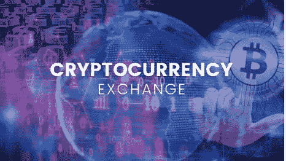

# 加密货币交易所

> 原文：<https://medium.com/coinmonks/cryptocurrency-excahnegs-82b9772a34d3?source=collection_archive---------64----------------------->

什么是加密交换？

基本上，交易所是货币交易的平台，也就是你可以买卖的地方。

因此，加密交易所是一个为您买卖加密货币提供必要工具的平台。在密码交易所，你可以用一个密码交换另一个密码，就像把以太坊兑换成 USDT 一样，你也可以用法定货币购买任何加密货币，比如美元、欧元或英镑。交易所平台尽可能反映其提供的加密货币的当前市场价格。

换句话说，交易所基本上是市场场所。

3 种主要类型的加密货币交易所

*   集中式交易所
    集中式交易所(CEXs)是一个大规模进行加密货币交易的平台，它利用了与股票交易所等传统资产交易所类似的商业模式。
*   分散式交易所
    分散式交易所(或 dex)是一个点对点的市场，在这里，密码交易员之间进行直接交易，一方买入，另一方卖出。可以说，dex 使 crypto 的核心优势之一成为可能，即促进不受经纪人、银行、任何中介或监管机构监管的金融交易。
*   混合加密货币交易所
    混合加密货币交易所分别利用集中式交易所(CEX)和分散式交易所(DEX)。它结合了集中式平台的快速交易速度和分散式交易所提供的安全性保证。

密码交易所如何赚钱？
加密货币交易所通过向购买、出售或提取加密货币的用户收取交易费用来赚钱。除此之外，拥有“期货”交易选择权的交易所，当一个交易者失去一个交易者并被清算时，它们就能赚钱。

热门交易所列表
1。币安
2。比特币基地交易所
3。FTX 4。北海巨妖 5。库币
6。Gate.io
7。火币全球
8。Bitfinex
9。Crypto.com 交易所
10。Bitstamp 等

如需进一步查询、澄清或专业聘用/合同
联系人:
邮件:akanfeoluwagbemiga@gmail.com
Whatsapp:[点击此处](https://wa.me/message/2OTJVOE7654RC1)

> 加入 Coinmonks [电报频道](https://t.me/coincodecap)和 [Youtube 频道](https://www.youtube.com/c/coinmonks/videos)了解加密交易和投资

# 另外，阅读

*   [10 本关于加密的最佳书籍](https://coincodecap.com/best-crypto-books) | [英国 5 个最佳加密机器人](https://coincodecap.com/uk-trading-bots)
*   [Koinly 点评](https://coincodecap.com/koinly-review) | [Binaryx 点评](https://coincodecap.com/binaryx-review) | [Hodlnaut vs CakeDefi](https://coincodecap.com/hodlnaut-vs-cakedefi-vs-celsius)
*   [MoonXBT vs Bybit vs 币安](https://coincodecap.com/bybit-binance-moonxbt) | [硬件钱包](/coinmonks/hardware-wallets-dfa1211730c6)
*   [火币交易机器人](https://coincodecap.com/huobi-trading-bot) | [如何购买 ADA](https://coincodecap.com/buy-ada-cardano) | [Geco。一次回顾](https://coincodecap.com/geco-one-review)
*   [币安 vs 比特邮票](https://coincodecap.com/binance-vs-bitstamp) | [比特熊猫 vs 比特币基地 vs Coinsbit](https://coincodecap.com/bitpanda-coinbase-coinsbit)