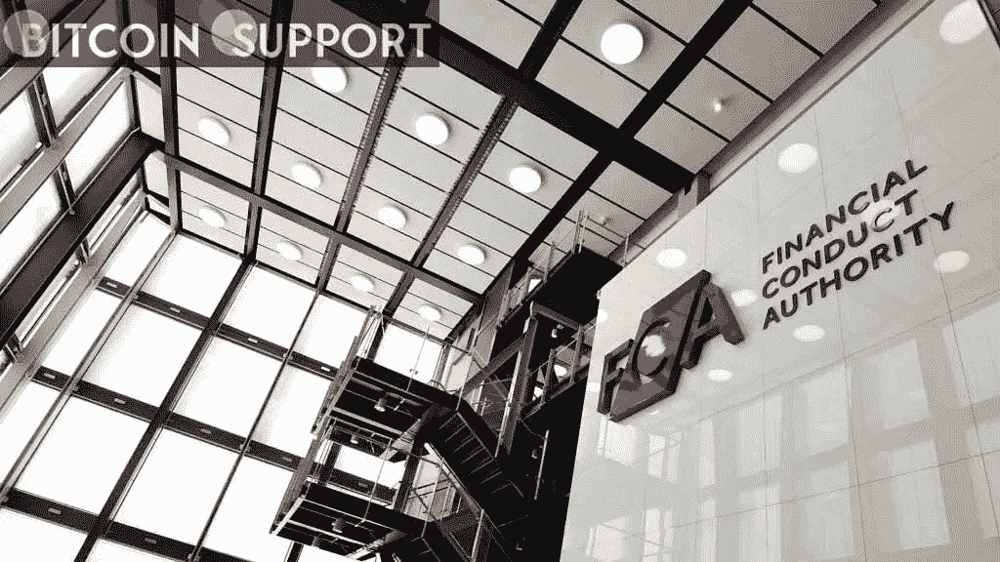

# 随着英国注册截止日期的临近，加密货币公司正在考虑自己的选择

> 原文：<https://medium.com/coinmonks/cryptocurrency-firms-consider-their-options-as-the-uk-registration-deadline-approaches-1bbf3683ab79?source=collection_archive---------62----------------------->

**Visit our website:-** [**https://bitcoinsupports.com/**](https://bitcoinsupports.com/)

没有获得《公平竞争法》许可的公司可以选择从国外在联合王国开展业务，或者向法院上诉。寻求在英国运营的加密货币企业必须在周四之前获得金融监管机构金融行为监管局(FCA)的批准。迄今为止，只有 33 家通过了监管机构的审查。

FCA 在今年早些时候被任命为该国加密货币行业反洗钱和反恐融资监管机构后，于 2020 年 12 月实施了一项临时计划，此后有 100 多家公司申请注册。大约 60 名申请人被拒绝永久登记或撤回申请。

周三，英国《公平竞争法》混淆了临时注册制度(TRR)中剩余的 13 家公司的前景，宣布将延长“少数继续临时注册是绝对必要的实体”3 月 31 日的最后期限它没有指明这些公司，也没有具体说明延期的期限。向机构提供比特币服务的 Copper，估值 330 亿美元的金融科技公司 Revolut，以及估值约 140 亿美元的加密交易所和数字钱包提供商 Blockchain.com，都在等待结果。

据业内人士称，英国《公平竞争法》在审批过程中采取了过度规避风险的立场。一家公司的首席执行官考虑撤回其申请，为了避免惹恼 FCA，他要求匿名。"他们在寻找最微小的划痕，并利用它来使整个应用程序无效."这一批评类似于 Blockchain.com 首席执行官彼得·史密斯在 2 月份接受英国《电讯报》采访时对《公平竞争法》的批评。史密斯断言，监管机构“不太愿意刺激创新和与行业合作。”因此，英国已经“落后了”，他说。在 5 月份的一轮 3 亿美元融资后，Blockchain.com 的估值为 52 亿美元。受其他国家管辖的公司可以通过轮换活动继续开展业务。加密货币支付公司 Wirex 本周早些时候宣布，它已撤回申请，转而通过一家在克罗地亚获得许可的子公司为英国客户提供服务。如果英国金融服务管理局或财政部改变立场，法律途径很可能会终结未来任何重组的可能性。任何报名参加这个项目的人都需要大量的资金。

同样接管加密货币广告监管的 FCA 表示，它正在努力履行其法律义务。监管机构补充称:“我们将继续对加密公司进行注册，以确保它们不会被用作洗钱的渠道，并且刚刚就如何向消费者推销加密货币展开了咨询。”。“我们将继续与英国财政部合作，后者确立了英国加密货币立法的范围。”

**访问我们的网站:-**[**https://bitcoinsupports.com/**](https://bitcoinsupports.com/)

**免责声明:以上为作者观点，不应视为投资建议。读者应该自己做研究。**

> *加入 Coinmonks* [*电报频道*](https://t.me/coincodecap) *和* [*Youtube 频道*](https://www.youtube.com/c/coinmonks/videos) *了解加密交易和投资*

# 另外，阅读

*   [加密货币储蓄账户](/coinmonks/cryptocurrency-savings-accounts-be3bc0feffbf) | [YoBit 审核](/coinmonks/yobit-review-175464162c62)
*   [Botsfolio vs nap bots vs Mudrex](/coinmonks/botsfolio-vs-napbots-vs-mudrex-c81344970c02)|[gate . io 交流回顾](/coinmonks/gate-io-exchange-review-61bf87b7078f)
*   [CoinFLEX 评论](https://coincodecap.com/coinflex-review) | [AEX 交易所评论](https://coincodecap.com/aex-exchange-review) | [UPbit 评论](https://coincodecap.com/upbit-review)
*   [AscendEx 保证金交易](https://coincodecap.com/ascendex-margin-trading) | [Bitfinex 赌注](https://coincodecap.com/bitfinex-staking) | [bitFlyer 审核](https://coincodecap.com/bitflyer-review)
*   [Bitget 评论](https://coincodecap.com/bitget-review)|[Gemini vs block fi](https://coincodecap.com/gemini-vs-blockfi)cmd |[OKEx 期货交易](https://coincodecap.com/okex-futures-trading)