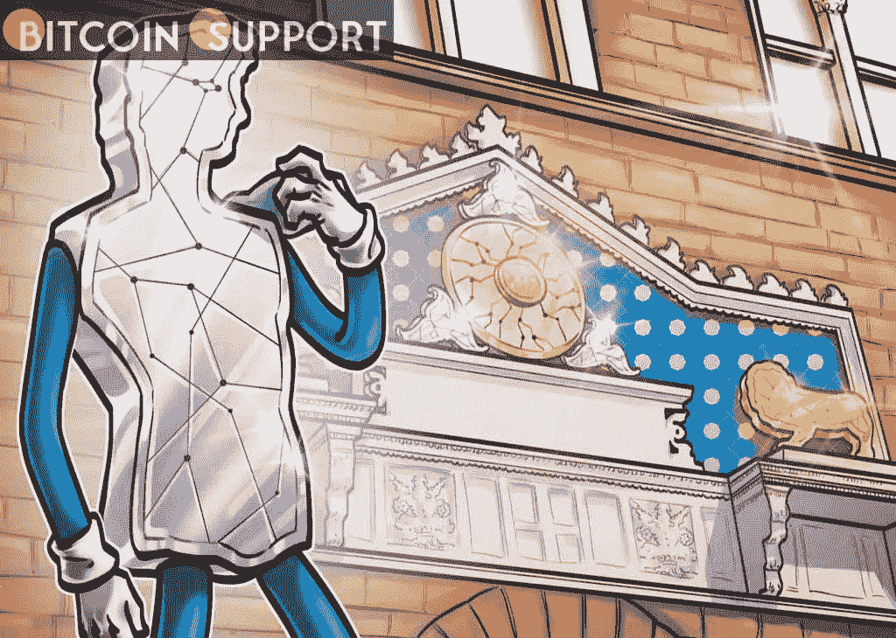

# 2021 年拉丁美洲的加密货币:NFTs、支付和会议

> 原文：<https://medium.com/coinmonks/cryptocurrency-in-latin-america-in-2021-nfts-payments-and-conferences-f03452617b9a?source=collection_archive---------56----------------------->

[https://bitcoinsupports.com/](https://bitcoinsupports.com/)

2021 was an eventful year for Latin America, thanks to the bull market, the NFT mania, and the rise of DeFi.

The 20 countries and 14 dependencies that comprise up Latin America saw a meteoric growth in crypto use in 2021.

Last year was an interesting one for the region, with a plethora of conferences, associations, new rules, and nonfungible token (NFT) projects, as well as the worldwide bull market.

Let’s look at some of the most exciting developments in the Latin American blockchain and cryptocurrency industry in 2021.

Colombian financial institutions collaborate with cryptocurrency exchanges.

Colombia’s Financial Superintendence approved a number of collaborations between banking institutions licenced in the country’s financial system and cryptocurrency exchanges in early 2021.

Binance and Tyler and Cameron Winklevoss’ Gemini were among the nine partnerships, which included big names in the cryptocurrency business.

These approvals were obtained within a regulatory sandbox for testing technological solutions in the global financial sector, according to the regulator, and will have a one-year trial duration.

**Latin America is becoming more aware of cryptocurrency.**

Despite its reputation for volatility, the rapid expansion of digital currencies pushed some Latin American authorities to officially accept their use as a payment mechanism in 2021\. El Salvador’s official adoption of Bitcoin (BTC) as legal money, a first in the world, caused a stir not only in Latin America but also around the globe.

The Bitcoin Law, signed by Salvadoran President Nayib Bukele and approved by a majority vote in the country’s representative body, the Legislative Assembly, took effect in September.

The Central Bank of Cuba is likely to recognise cryptocurrencies such as Bitcoin (BTC), Ether (ETH), Litecoin (LTC), and Tether (USDT) for commercial transactions and investments, according to in August 2021.

Julio Velarde, the president of Peru’s Central Reserve Bank, declared in November that the country would collaborate with the central banks of India, Hong Kong, and Singapore to build its own digital currency.

In 2021, there will be several blockchain events.

As a result of the COVID-19 pandemic’s lockdowns and subsequent imprisonment, many blockchain enterprises and groups reevaluated their tactics and turned to the internet to meet up and attend conferences.

**Latam Blockchain Summit**

The Blockchain Summit Latam conference is regarded as one of Latin America’s most prominent crypto events, boosting the region’s crypto and blockchain ecosystem. Its 5th edition, held in September 2021, featured 100 experienced speakers from across the ecosystem.

Over the course of five days, more than 60 virtual venues conducted blockchain-related seminars and conversations. Infrastructure and applications, the Ibero-American ecosystem, business, decentralised finance, blockchain with traditional financial systems, and more were among the subjects discussed.

**LaBitConf**

The ninth edition of the Spanish-speaking Latin American Bitcoin and Blockchain Conference, often known as LaBitConf, will take place in November 2021\. More than 150 industry experts gave more than 40 talks on themes like Bitcoin mining, the future of exchanges in Latin America, legislation, and privacy and security, among others, at the conference, which mixed face-to-face and virtual sessions.

Cripto Latin Fest is a festival dedicated to all things Latin.

The fourth edition of Crypto Latin Fest, held in December, included online and in-person meetings over two 14-hour days, featuring speeches and workshops by cryptocurrency specialists.

Blockchain, stablecoins, cybersecurity, legality, DeFi, and crypto adoption were discussed by prominent members of the Latin American crypto ecosystem, including José Rodrguez, director of Blockchain Land at Talent Land, and Elian Huesca, community lead for Latin America at Bitso.

**Land of the Blockchain**

The large Spanish-language Blockchain Land conference, which was organised by the same organisation that put on Talent Land Latinoamerica, debuted in 2020 and was simultaneously aired in the Decentraland and Cryptovoxels metaverses.

The event, which took place in April, was one of the largest and most creative in the Spanish-speaking world, as it was aired concurrently in two virtual worlds based on the Ethereum blockchain, where participants could interact, chat, and network.

**Latin America is experiencing an NFT boom.**

Nonfungible tokens exploded in popularity in Latin America and around the world last year.

SeSocioNFT, an Argentine NFT marketplace, debuted in September, promoting and selling works by Latin American artists. According to reports, the platform intends to convert works by various artists into NFTs, which would subsequently be sold on the marketplace.

The NFT boom resulted in the opening of Ecuador’s first digital art gallery, NFTs Exhibition UIDE, at the International University of Ecuador. The gallery was open from November 24 to December 23 and featured roughly 40 works by four Ecuadorian artists and 15 foreign artists, with a total worth of $160 million.

In December, a group of Venezuelan artists known as La Tokenia launched their NFT show on the Tezos network.

Meanwhile, the Colombian government inked a mining agreement with the National Mining Agency in November, which was registered as NFT on the Ethereum-compatible GoChain blockchain.

**Disclaimer: These are the writer’s opinions and should not be considered investment advice. Readers should do their own research.**

> *加入 Coinmonks* [*电报频道*](https://t.me/coincodecap) *和* [*Youtube 频道*](https://www.youtube.com/c/coinmonks/videos) *了解加密交易和投资*

# 另外，阅读

*   [有哪些交易信号？](https://coincodecap.com/trading-signal) | [Bitstamp vs 比特币基地](https://coincodecap.com/bitstamp-coinbase) | [买索拉纳](https://coincodecap.com/buy-solana)
*   [ProfitFarmers 点评](https://coincodecap.com/profitfarmers-review) | [如何使用 Cornix 交易机器人](https://coincodecap.com/cornix-trading-bot)
*   [十大最佳加密货币博客](https://coincodecap.com/best-cryptocurrency-blogs) | [YouHodler 评论](https://coincodecap.com/youhodler-review)
*   [my constant Review](https://coincodecap.com/myconstant-review)|[8 款最佳摇摆交易机器人](https://coincodecap.com/best-swing-trading-bots)
*   [MXC 交易所评论](/coinmonks/mxc-exchange-review-3af0ec1cba8c) | [Pionex vs 币安](https://coincodecap.com/pionex-vs-binance) | [Pionex 套利机器人](https://coincodecap.com/pionex-arbitrage-bot)
*   [我的密码交易经验](/coinmonks/my-experience-with-crypto-copy-trading-d6feb2ce3ac5) | [比特币基地评论](/coinmonks/coinbase-review-6ef4e0f56064)
*   [CoinFLEX 评论](https://coincodecap.com/coinflex-review) | [AEX 交易所评论](https://coincodecap.com/aex-exchange-review) | [UPbit 评论](https://coincodecap.com/upbit-review)
*   [AscendEx 保证金交易](https://coincodecap.com/ascendex-margin-trading) | [Bitfinex 赌注](https://coincodecap.com/bitfinex-staking) | [bitFlyer 点评](https://coincodecap.com/bitflyer-review)
*   [麻雀交换评论](https://coincodecap.com/sparrow-exchange-review) | [纳什交换评论](https://coincodecap.com/nash-exchange-review)
*   [支持卡审核](https://coincodecap.com/uphold-card-review) | [信任钱包 vs 元掩码](https://coincodecap.com/trust-wallet-vs-metamask)
*   [Exness 回顾](https://coincodecap.com/exness-review)|[moon xbt Vs bit get Vs Bingbon](https://coincodecap.com/bingbon-vs-bitget-vs-moonxbt)
*   [如何开始通过加密贷款赚取被动收入](https://coincodecap.com/passive-income-crypto-lending)
*   [加密货币储蓄账户](/coinmonks/cryptocurrency-savings-accounts-be3bc0feffbf) | [加密交易机器人](https://coincodecap.com/best-crypto-trading-bots)
*   [BigONE 交易所评论](/coinmonks/bigone-exchange-review-64705d85a1d4) | [CEX。IO 审查](https://coincodecap.com/cex-io-review) | [交换区审查](/coinmonks/swapzone-review-crypto-exchange-data-aggregator-e0ad78e55ed7)