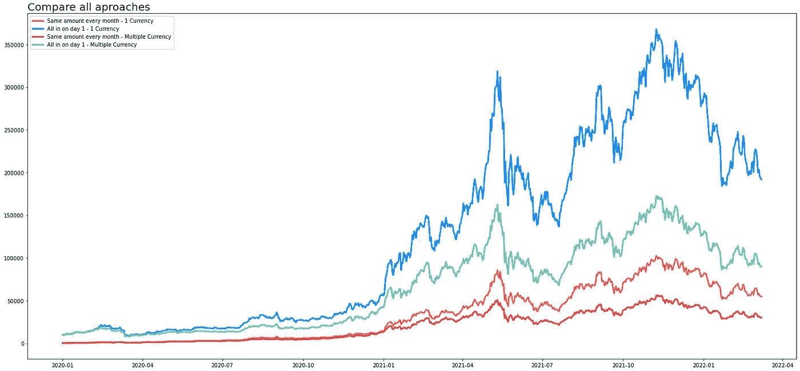
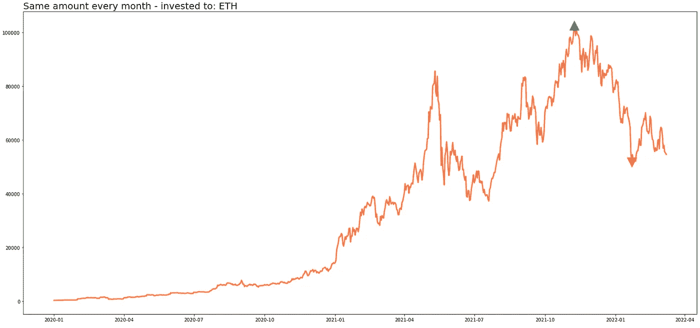
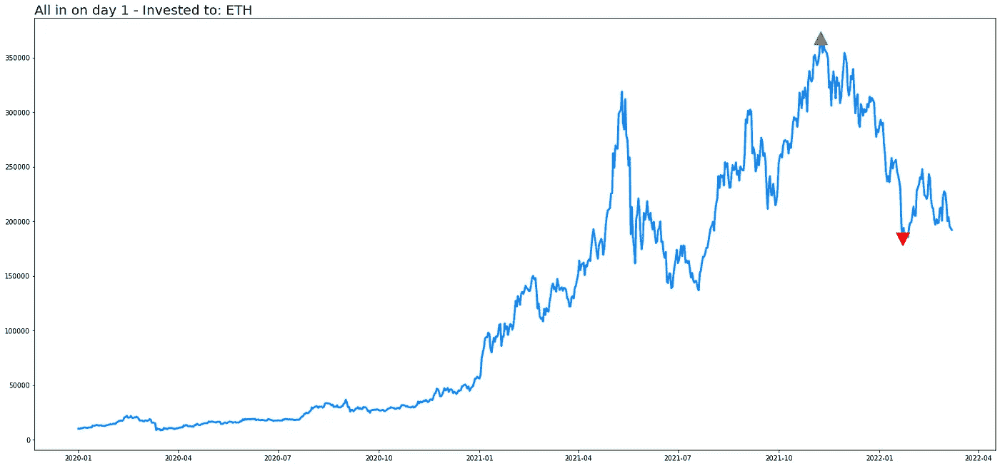
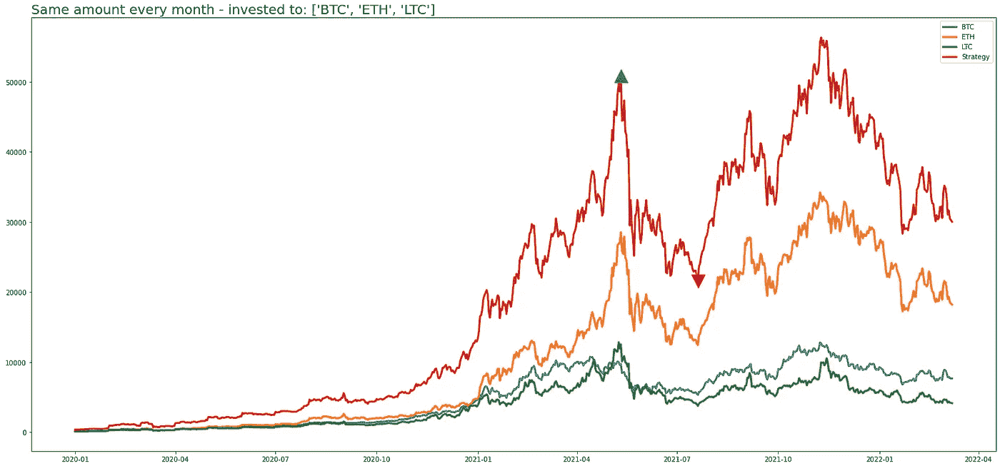
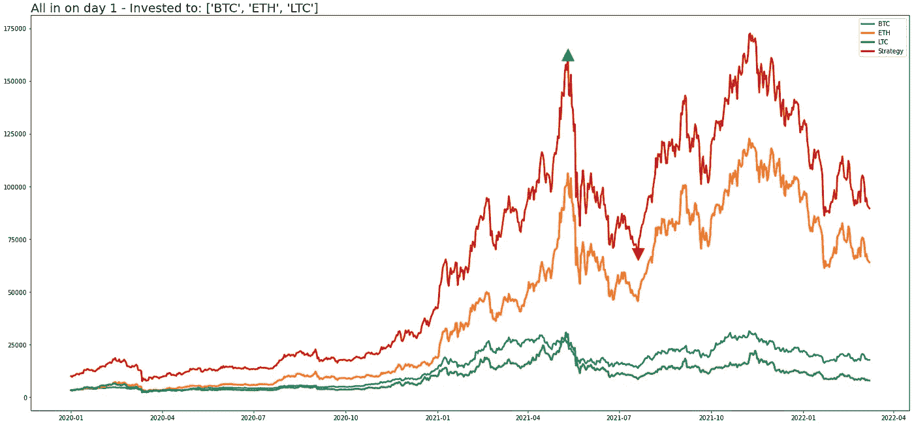
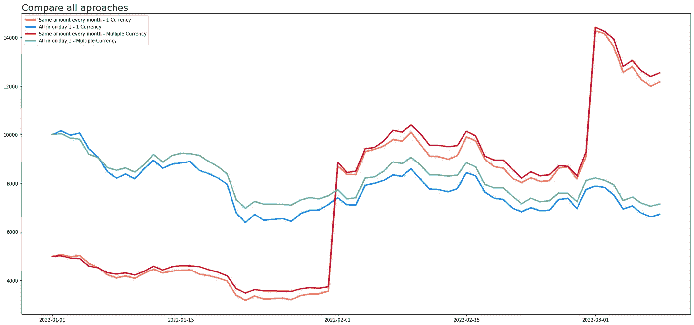

# 加密货币投资—与 Python 比较方法

> 原文：<https://medium.com/coinmonks/cryptocurrency-investing-compare-approaches-with-python-1ed2b96231e7?source=collection_archive---------62----------------------->



# **免责声明**

本文的目的只是为了演示使用 Python 的投资策略。它不服务于具体投资建议的任何目的。

# **简介**

加密货币是数字资产，在全球范围内全天候交易。它们越来越受欢迎，所以你可能听说过这个不太新的发光物体。加密货币是一种测量单位。它是一种数字令牌，可以从一方转移到另一方，但不能复制。但对我们大多数人来说，这只是投资伟大技术赚钱的大好机会。

通货膨胀正在吞噬我们的储蓄，而银行不提供支付比我们损失更多的储蓄账户。保护和增加我们的资本的选择之一是投资有上升潜力的地方。加密货币是选项之一。他们是不稳定的，其中一些可以让你很快失去所有的钱。但在目前的市场上，即使是传统的投资工具也在疯狂地跳来跳去，所以传统的多元化可能仍然是最好的策略。

我前段时间给自己做了这个项目，当时我正在思考我投资加密货币的方法。有数百种不同的方法来得到它的权利，甚至更多的把你的钱扔进下水道。

过去的表现肯定不能保证未来的结果，但看看目前为止的工作情况仍然是个好主意。也就是说，当你决定投资加密货币(或任何其他资产)时，有几种方法可以考虑。

# **Github**

带有代码的 Jupyter 笔记本存放在我的 Github 上:[https://github.com/afirrk/Cryptocurrency-investing-用 Python 比较方法](https://github.com/afirrk/Cryptocurrency-investing---Compare-approaches-with-Python)

# **参数**

首先我想设置一些参数。基础加密货币是 ETH，但是你可以把它改成你想要的。然后，如果我在 2020 年 1 月开始投资，我希望看到结果，我将在每个月的第一天投资。总投资将为 10 000 €。

作为一个数据源，我想使用雅虎金融，因为它易于使用，并支持大多数最大的加密货币(但也包括股票和更多，如果你想比较这些)。

# **每月投入相同金额**

第一种方法可能是大多数新人会选择的。如果你现在有多余的钱，把它们投入市场，祈祷正回报。如果你现在没有很多存款，这种方法很好，但你可以每个月增加一点额外的存款。你不需要成为城里最好的投资者，你所需要的只是上涨趋势、低费用和持仓，直到你达到目标。



```
Invested: 10000 €
Value at the end: 54678 €
Return on Investment(ROI): 446.78 %
Maximum Drawdown: 49.58 %
```

# **第 1 天全押**

第二种方法需要很多运气、内部消息或某种洞察力。如果你已经存了一些，你可以一次用完，闭上眼睛看着它成长(或者不成长)。在这个例子中，这种方法产生了更大最终回报，但是它极大地依赖于时机和投资工具。



```
Invested: 10000 €
Value at the end: 191953 €
Return on Investment(ROI): 1819.53 %
Maximum Drawdown: 50.02 %
```

# **在多种加密货币之间分割投资——每月相同金额**

第三种方法与第一种基本相同。唯一不同的是，这次我们不投资一种加密货币，而是投资我们选择的一篮子货币。我测试了 3 个，但是你可以在我的 Github 库中的笔记本中添加你想要的数量。

如果你把所有的钱都投资在表现最好的资产上，你的投资组合将会比你把钱分开投资增值更多。问题显然在于选择表现最佳的资产。过去上涨的东西会掉头下跌，甚至跌得更快。简单的方法是把你的钱分成多种资产，并希望在你投资的这段时间里，上升的资产数量大于下降的资产数量。



```
Invested: 10000 €
Value at the end: 30036 €
Return on Investment(ROI): 200.36 %
Maximum Drawdown: 57.67 %
```

# **在多种加密货币之间分割投资——全部在第一天**

在最后一种方法中，我们在第一天就把所有的钱投资到多个硬币上。正如我之前所说，我们的结果取决于时机。如果我们运气好，我们可以很快赚很多钱，但你可以运气好几次，然后在一次糟糕的投资中损失大部分(我就发生过几次)。



```
Invested: 10000 €
Value at the end: 89548 €
Return on Investment(ROI): 795.48 %
Maximum Drawdown: 58.21 %
```

# 比较所有方法

最后，在这里你可以看到所有的方法。正如我所说，最好的“策略”是把你所有的钱都投入到一个表现最好的资产中，并选择正确的时机。大多数时候显然不是这样


举个例子，假设你在 2022 年开始投资。性能看起来完全不一样。现在每个月的投资给我们带来了更好的回报



# **结论**

正如我在引言部分所说，我为自己的投资做了这个简单的比较。您可以在 Excel 中更快地做类似的事情。但是使用 Python，现在我们可以随时重新运行这段代码，看看新数据带来的性能变化。

这种投资方法是非常基本的，而且之所以奏效，主要是因为密码市场作为一个整体正在崛起。如果市场体制发生变化，我们将需要更复杂的方法。

如果你觉得这很有趣，请**跟着**和**拍**。谢谢:)