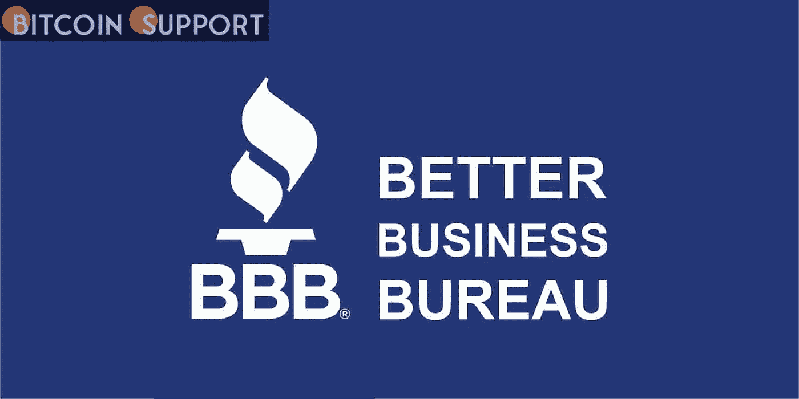
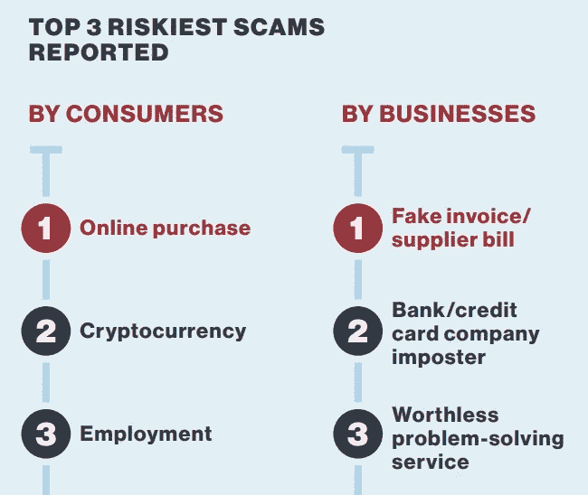

# 商业改善局称，加密货币是危险的。密码骗局是第二大风险

> 原文：<https://medium.com/coinmonks/cryptocurrency-is-dangerous-the-better-business-bureau-says-401f94bf580e?source=collection_archive---------111----------------------->

**Visit our website:-** [**https://bitcoinsupports.com/**](https://bitcoinsupports.com/)

美国商业改善局(BBB)的一份报告称，加密货币诈骗现在是第二大危险。它还表示，“从 2020 年起，导致金钱损失的加密货币支付增加了一倍以上。”

**BBB 正目睹加密诈骗的兴起。**

美国商业促进局(BBB)周五发布了 2021 年 BBB 诈骗追踪风险报告。这份报告显示了一个企业欺骗你的可能性有多大。“这份年度报告是基于个人和企业发送给 BBB 诈骗追踪器的数据，”报告称。它显示了骗局是如何进行的，谁被骗，哪些骗局影响最大，等等。BBB 成立于 1912 年，是一个致力于在市场中建立信任的私人非营利组织，其网站上写道。报告称:加密货币诈骗从 2020 年的第七大风险上升到 2021 年的第二大风险。

网络诈骗高居最危险诈骗排行榜之首，占 2021 年 BBB 诈骗追踪器报告的所有诈骗的 37.4%。2021 年，就业诈骗是第三大危险。这是第二危险的事情。

**Visit our website:-** [**https://bitcoinsupports.com/**](https://bitcoinsupports.com/)

向 BBB 诈骗追踪器报告的诈骗中，只有 1.9%涉及加密货币。美元损失的中位数是 1200 美元。这比 169 美元的整体美元损失中值要高得多。根据该报告，超过 66%的人被这种类型的骗局骗走了钱。BBB 称，人们在许多不同的社交媒体平台上被希望帮助他们投资比特币的人诈骗。

2020 年，导致金钱损失的加密货币支付数量增加了一倍多。BBB Institute for market place Trust 的一份报告称，诈骗者一直在改变他们的策略，似乎正在使用更多的加密货币来实施诈骗。BBB 市场信任研究所的执行主任梅丽莎·兰宁·特朗普沃这样说道。商业改善局的报告也给出了一些关于如何远离加密货币骗局的建议，它也是这样做的。人们应该做的第一件事是警惕那些说他们可以几乎没有风险地快速赚大钱的人。报告称，诈骗者还可以“通过侵入他们的账户，在社交媒体上伪装成你的朋友”。

他们还说不要用网上支付系统给不认识的人付款，要经常查看金融业监管局(FINRA)的网站，看看某人是不是经纪人。

**访问我们的网站:-**[**https://bitcoinsupports.com/**](https://bitcoinsupports.com/)

**免责声明:以上为作者观点，不应视为投资建议。读者应该自己做研究。**

> 加入 Coinmonks [电报频道](https://t.me/coincodecap)和 [Youtube 频道](https://www.youtube.com/c/coinmonks/videos)了解加密交易和投资

# 另外，阅读

*   [加密货币储蓄账户](/coinmonks/cryptocurrency-savings-accounts-be3bc0feffbf) | [加密交易机器人](https://coincodecap.com/best-crypto-trading-bots)
*   [BigONE 交易所评论](/coinmonks/bigone-exchange-review-64705d85a1d4) | [CEX。IO 审查](https://coincodecap.com/cex-io-review) | [交换区审查](/coinmonks/swapzone-review-crypto-exchange-data-aggregator-e0ad78e55ed7)
*   [最佳比特币保证金交易](/coinmonks/bitcoin-margin-trading-exchange-bcbfcbf7b8e3) | [比特币保证金交易](https://coincodecap.com/bityard-margin-trading)
*   [加密保证金交易交易所](/coinmonks/crypto-margin-trading-exchanges-428b1f7ad108) | [赚取比特币](/coinmonks/earn-bitcoin-6e8bd3c592d9)
*   [WazirX vs coin dcx vs bit bns](/coinmonks/wazirx-vs-coindcx-vs-bitbns-149f4f19a2f1)|[block fi vs coin loan vs Nexo](/coinmonks/blockfi-vs-coinloan-vs-nexo-cb624635230d)
*   [BlockFi 信用卡](https://coincodecap.com/blockfi-credit-card) | [如何在币安购买比特币](https://coincodecap.com/buy-bitcoin-binance)