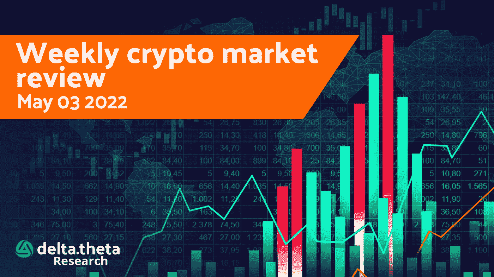
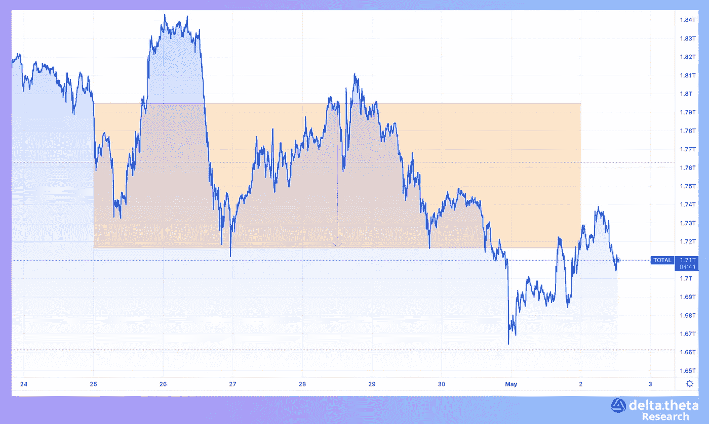
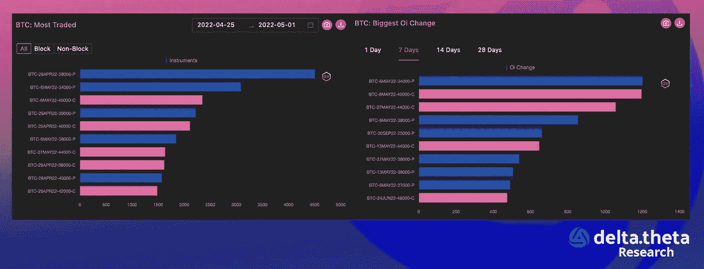
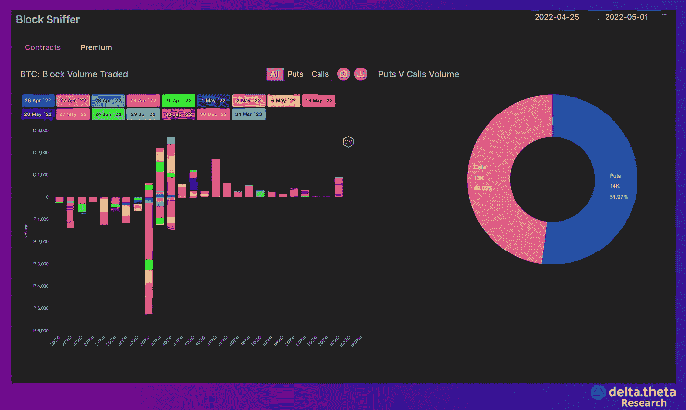

# 全球加密货币市场正式进入“熊市”

> 原文：<https://medium.com/coinmonks/cryptocurrency-market-globally-has-officially-entered-the-bear-phase-99ec821aec4d?source=collection_archive---------30----------------------->

4 月 25 日至 5 月 2 日的一周是加密市场横盘运动的延续，这次略有下降。加密货币总市值指数从 1.78 万亿美元开始。第二天，我们可以看到增加到 1.84 万亿美元。然而，到周末，该指数停在了 1.68 万亿美元。到周末，跌幅为 5.6%。

“第一种加密货币”在很大程度上重复了这种略微向下的横向运动，波动性相当适中。比特币在 39 450 水平附近开始，第二天达到 40 610 的局部峰值，然后我们可以看到逐渐下降到 38 860。因此，周末的总跌幅为 1.5%。

奇怪的是，本周 Etherium 的情况几乎相同:从 2920 点的局部底部开始，然后上升到 3140 点的局部高点。随后，到本周末，我们可以看到下降到 2860。最终跌幅为 2.7%。进一步的市场动态将在很大程度上由本周即将召开的美国美联储会议决定，届时将做出下一次加息决定。

# 新闻

据 TechCrunch 报道，安德森·霍洛维茨公司(a16z) [打算](https://techcrunch.com/2022/05/02/andreessen-horowitz-india/?guccounter=1&guce_referrer=aHR0cHM6Ly93d3cuZ29vZ2xlLmNvbS8&guce_referrer_sig=AQAAACYE2qE8989GoQVD7t4wDmWtHKdTN3mzLLZ7Ryr3JL9JBmQYi2mdaIs5JCYAVruldQHyEKK1ev-U2kFTHLaa4R97mt-PEoSus6bAx4dtayzRP_04999YRCoZpTC58k28witBBZn5bLP4NHUHiB48FRp4zH7Ldqt8uzYdLXyOUqJV)向印度的初创公司投资 5 亿美元。该公司还打算在印度招聘几名投资职位的员工。a16z 目前的合作伙伴，包括 Seema Amble 和 Sumit Singh，都已经与当地的创业公司进行了接触。据报道，a16z 希望投资一家估值约为 2.5 亿美元的交易所初创企业，同时也在接触一家早期金融科技初创企业。

世界足球的全球管理机构国际足联已经聘请阿尔格兰德作为其区块链官方合作伙伴。根据[协议](https://www.fifa.com/about-fifa/president/media-releases/fifa-announces-partnership-with-blockchain-innovator-algorand)，阿尔格兰德将成为卡塔尔 FIFA 世界杯北美和欧洲的“地区赞助商”，以及明年澳大利亚和新西兰女足世界杯的官方赞助商。该协议是在加密货币交易所 Crypto.com 成为 2022 年国际足联世界杯赞助商几周后达成的。作为赞助和技术合作的一部分，阿尔格兰德将提供国际足联官方的区块链钱包，还将能够通过国际足联进行推广和媒体报道。

Nym Technologies 是一家瑞士身份保护初创公司，通过“mixnet”保护在线活动免受窥探，[宣布](https://cointelegraph.com/news/nym-technologies-raises-300m-to-advance-internet-privacy-sending-token-price-up)一项新的 3 亿美元基金，以吸引开发者加入其生态系统。纽约商品交易所创新基金已经从一些风险投资家那里获得了 3 亿美元的承诺。其中包括 Polychain、Greenfield One、Huobi 孵化器、Tioga Capital、Eden Block、NGC 创投、HashKey Capital、Figment、Fenbushi Capital、OKX Blockdream Ventures、Tayssir Capital、KR1、Lemniscap 和 Andreessen Horowitz (a16z)。

比利时加密货币公司 Venly 向电子商务品牌和游戏平台提供技术，[在首轮融资中筹集了](https://www.theblockcrypto.com/post/143844/crypto-wallet-firm-venly-raises-23-million-in-series-a-funding)2300 万美元。这轮融资由 Courtside Ventures 领投，创见基金、比特币基地风险投资公司、Tioga Capital 等参与其中。Venly 成立于 2018 年，将钱包和 NFT 产品与品牌的区块链整合在一起，不考虑使用的区块链(这很大程度上是为什么 Venly 的合作伙伴包括 Polygon，币安，Avalanche 和 Hedera)。

# 市场形势

4 月份相当大的市场跌幅(BTC 下跌 18%，相比之下纳斯达克下跌 15%)并不能保证这是绝对的最小值。根据研究服务公司 glassnode 的数据，短期持有者(在外部钱包中持有 BTC 不到 6 个月)最容易受到价格下行压力的影响，他们可能会出售部分资产。这种情况可能导致加密货币的抛售，这可能导致 BTC 跌至 33600 美元。

整体情绪面临持续高通胀、加息周期以及中国地方检疫措施重新启动的压力，导致去年供应链中断的情况重演。

在期权市场上，5 月份执行的短期期权交易最活跃。预计美联储会议和随后的新闻发布会以及英国央行的再融资利率决定将对全球市场产生重大影响。

根据 gvol 的数据，在上周的大宗交易中，交易员更倾向于押注美联储会议后波动性上升，交易短期罢工。另一种选择是在预期全球环境变化的情况下购买长期期权——这种交易(在 9 月份购买行使价为 25 000 英镑的看跌期权，或在 80 000 英镑购买看涨期权，几乎没有价值，但在价格剧烈变化的情况下能够产生可观的利润)。

在全球范围内，加密货币市场已经正式进入“熊市阶段”——价格进一步下跌的预期占据主导地位。然而，“价格发现”阶段和寻找最终底部的过程可能会推迟。新的大玩家或监管变化可能会支撑市场(尽管大西洋两岸都在积极讨论，但预计这种变化要到秋季才会出现)。

> 加入 Coinmonks [电报频道](https://t.me/coincodecap)和 [Youtube 频道](https://www.youtube.com/c/coinmonks/videos)了解加密交易和投资

# 另外，阅读

*   [最佳网上赌场](https://coincodecap.com/best-online-casinos) | [币安评论](/coinmonks/binance-review-ee10d3bf3b6e) | [BitMEX 评论](https://coincodecap.com/bitmex-review)
*   [麻雀交换评论](https://coincodecap.com/sparrow-exchange-review) | [纳什交换评论](https://coincodecap.com/nash-exchange-review)
*   [美国最佳加密交易机器人](https://coincodecap.com/crypto-trading-bots-in-the-us) | [经常性回顾](https://coincodecap.com/changelly-review)
*   [在印度利用加密套利赚取被动收入](https://coincodecap.com/crypto-arbitrage-in-india)
*   [Godex.io 评审](/coinmonks/godex-io-review-7366086519fb) | [邀请评审](/coinmonks/invity-review-70f3030c0502) | [BitForex 评审](https://coincodecap.com/bitforex-review)