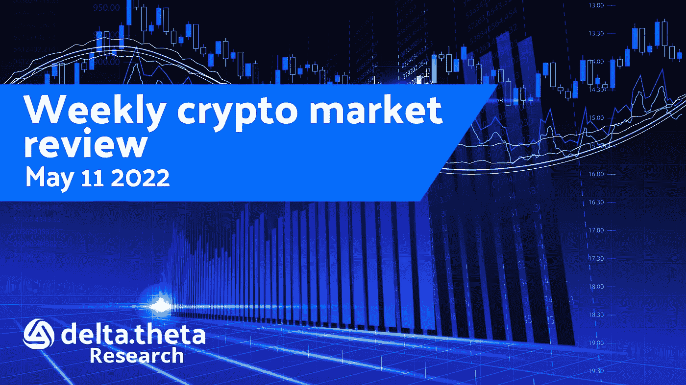
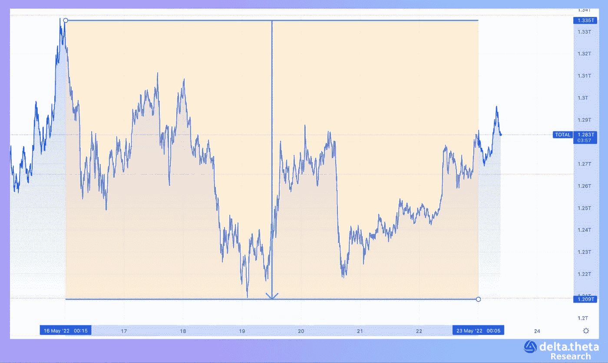
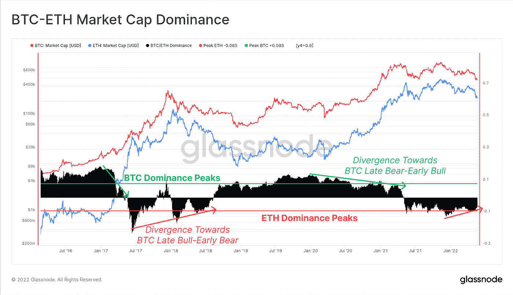
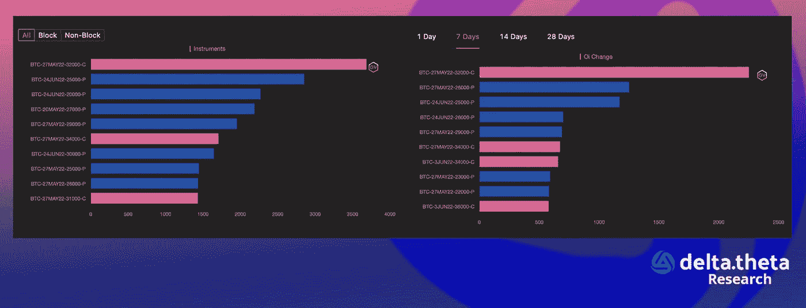
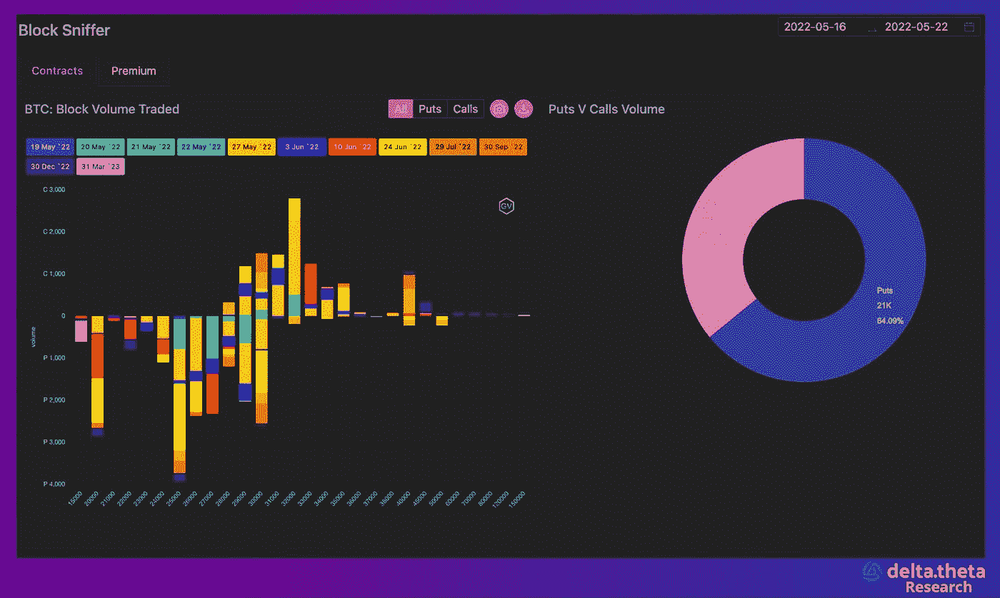

# 在历史疲软的夏季，加密货币价格可能会继续下跌

> 原文：<https://medium.com/coinmonks/cryptocurrency-prices-may-continue-to-drop-during-the-historically-weak-summer-period-efe1bbdb78dc?source=collection_archive---------24----------------------->

过去一周，加密市场一直处于近乎“干净”的横盘走势，没有明显的波动。总加密市值指数本周初为 1.268 万亿美元，跌至周中高点 1.212 万亿美元。本周结束时为 1.285 万亿美元(本周累计上涨 1.34%)。

比特币的优势指数(44.91%)回到了 2021 年 10 月的表现，暂时在基本面 30 000 点附近盘整，本周开始和结束时几乎处于同一水平，周中局部跌至 28 680 点。

以太网——一个相同的模式。这一周开始时略高于 2000 点，结束时处于同一水平，结束时几乎没有变化(除了周中跌至 1910 点)。

# 新闻

广受欢迎的 NFT 市场 open sea[发布了一个买卖非功能性交易的新协议](https://www.theblockcrypto.com/post/148094/opensea-launches-new-marketplace-protocol-dubbed-seaport)。周五早些时候首次曝光的这一消息已经得到了该公司自己的证实。这个名为 Seaport 的协议允许用户以各种新的方式购买 NFT。使用海港的交易者可以聚集不同的资产来交换 NFT，这与标准方案相反，在标准方案中，NFT 只能交换可互换的令牌。例如，价值为 100 埃特的 NFT 可以直接用代币兑换价值为 40 埃特和 60 埃特的 NFT。

潘迪拉资本，Terraform Labs 的主要支持者，[在 TerraUSD (UST)上周崩溃之前，兑现了其在 Terra](https://www.coinspeaker.com/pantera-capital-luna-ust-crash/) (LUNA)投资的近 80%。潘迪拉资本至少两次投资 Terraform Labs 一次是在 2021 年 1 月投资 2500 万美元，然后在 2021 年 7 月加入 1.5 亿美元的生态系统基金。由于潘迪拉在早期阶段退出了大部分投资，它获得了可观的利润。该公司将 170 万美元变成了约 1.7 亿美元。与此同时，支持 Terraform 的其他投资者遭受了巨大损失，因为 Terra 的本土 LUNA token 由于失去了与 UST 的美元挂钩而几乎失去了所有价值。

视频游戏零售商 GameStop [宣布推出加密货币和 NFT](https://www.coindesk.com/business/2022/05/23/gamestop-unveils-crypto-and-nft-wallet-shares-up-3/) 钱包。非托管以太坊钱包将允许游戏玩家和其他用户在分散的应用程序中存储、发送、接收和使用加密货币和 NFT。该解决方案还将允许与自己的 NFT 市场进行有效互动，GameStop 正在与 Immutable X 合作建立该市场。金融科技公司 Revolut 也[本周宣布了创建自己的 Web3 钱包](https://www.theblockcrypto.com/post/147768/revoluts-planned-native-token-will-reward-customer-loyalty-storonosky-says)的计划。

安德森·霍洛维茨[正在推出一只新基金](https://www.theblockcrypto.com/post/147591/a16z-launches-600-million-fund-to-invest-in-gaming-industry)，专门关注博彩业的新机遇。新的 6 亿美元基金是一个捐赠基金和一个新的内部部门。“游戏基金一号”加入了 a16z 的其他行业部门，包括密码和生物部门。该基金由普通合伙人陈楚翔、John Lai 和 James Gwertzman 领导。基金发起人包括多名来自游戏行业的高管，包括 King、Discord、Roblox、Zynga、Twitch、暴雪和 Riot Games 的联合创始人。

# 市场情况

巩固阶段已经持续了两周左右，可能会持续一段时间。接下来的重大事件——美联储和欧洲及英国央行会议——定于 6 月中旬举行。在此之前，只有与黑客协议或禁用任何区块链相关的突发新闻是可能的。在这种情况下，交易者的注意力经常被吸引到潜在的“领先”指标上，这些指标有助于更准确地预测全球趋势变化。其中一种方法是比较比特币和以太坊在加密货币整体市值中的主导地位。从历史上看，以太的优势指数上升，而比特币的优势正在下降，这反映了市场参与者的风险偏好。根据 Glassnode 的分析，市场目前正处于既定的熊市周期。要想出现趋势逆转，比特币的主导地位必须显著提高，这反过来要求要么降低与传统市场的相关性，要么改善全球经济环境。

期权市场上普遍存在谨慎和克制。交易者尽量不进行远程打击交易，不期望比特币的波动性在短期内大幅飙升。

在大宗期权交易策略中，主要策略与使用具有短期执行日期和执行价格的看跌价差和对角(日历)看跌价差有关。对价格进一步下跌的担忧持续存在于市场中，并反映在所选择的策略中。

尽管波动性下降和市场整合，市场形势仍然相当动荡。许多指标表明看跌情绪持续强劲，这不排除在历史疲软的夏季价格进一步下跌的可能性。

**抢先了解最新消息和事件:**
官网:[https://delta theta . tech](https://deltatheta.tech/)
推特:[https://twitter.com/deltatheta_tech](https://twitter.com/deltatheta_tech)
TG 新闻(EN):[https://t.me/DeltathetaNEWS](https://t.me/DeltathetaNEWS)
TG 聊天(EN):[https://t.me/deltatheta](https://t.me/deltatheta)
场外交易聊天:[https://t.me/deltatheta_TradingGroup](https://t.me/deltatheta_TradingGroup)

> 加入 Coinmonks [电报频道](https://t.me/coincodecap)和 [Youtube 频道](https://www.youtube.com/c/coinmonks/videos)了解加密交易和投资

# 另外，阅读

*   [BigONE 交易所评论](/coinmonks/bigone-exchange-review-64705d85a1d4) | [电网交易机器人](https://coincodecap.com/grid-trading)
*   [氹欞侊贸易评论](https://coincodecap.com/anny-trade-review) | [CoinSpot 评论](https://coincodecap.com/coinspot-review)
*   [新加坡十大最佳加密交易所](https://coincodecap.com/crypto-exchange-in-singapore) | [购买 AXS](https://coincodecap.com/buy-axs-token)
*   [投资印度的最佳加密软件](https://coincodecap.com/best-crypto-to-invest-in-india-in-2021) | [WazirX P2P](https://coincodecap.com/wazirx-p2p)
*   [7 个最佳零费用加密交易平台](https://coincodecap.com/zero-fee-crypto-exchanges)
*   [最佳网上赌场](https://coincodecap.com/best-online-casinos) | [期货交易机器人](/coinmonks/futures-trading-bots-5a282ccee3f5)