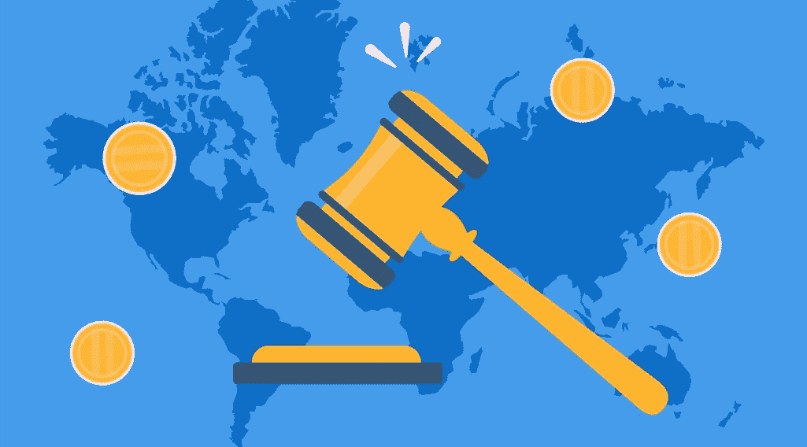

# 加密货币监管:监管对加密有利吗？

> 原文：<https://medium.com/coinmonks/cryptocurrency-regulation-is-regulation-good-for-crypto-719f2c8b77ee?source=collection_archive---------40----------------------->

加密货币不局限于通常的国家边界，因为每个人都可以使用，这是他们毋庸置疑的优势。同时，加密货币侵占了银行的直接功能，这也是许多金融机构支持政府监管的原因。只需花一点时间通读并了解关于加密货币监管所需的一切。

# 监管对密码有利吗？

加密货币监管是利用立法来建立存储、购买和销售数字资产的规则。目前，全球还没有对加密货币的统一法律监管。例如，在日本，比特币是一种合法的支付手段，在中国，加密货币是被禁止的，在一些国家，加密货币的地位没有定义。

由于加密货币是分散的和匿名的，它引起了极大的关注，并使政府考虑加密法规以保护其公民免受以下后果的影响:

*   垄断压力。矿工之间的勾结会危及加密货币的安全性和及时性。大型矿池所有者拥有速度优势，并有能力从采矿中获取垄断利润。
*   黑客攻击。由于加密货币不是一种通用的支付手段，将它们兑换成商品、服务或法定货币需要买家和卖家之间的沟通。它是由作为中介的交易所提供的。虽然更容易找到交易对手，但它们增加了加密货币所有者的风险，因为它们成为黑客和盗窃的目标。
*   洗钱和犯罪活动。由于缺乏共同的国际规则，各管辖区得以为犯罪活动寻找最安全的条件。

# 为什么有些投资者反对密码监管？

尽管新法律旨在确保保护，但一些投资者表示，为什么不监管加密货币，原因如下:

*   **匿名的损失** y，因此不仅监管机构，还有营销人员和其他第三方都将知道用户的交易。
*   **官僚**。引入新的法律意味着必须获得证书，并通过验证程序，有时甚至对个人来说都很漫长，更不用说法律实体了。
*   **成本增加**。监管带来了纳税的财务损失。例如，作为商业活动的采矿税可能超过 40-50%。此外，以加密货币赚取的人的收入将减少，因为将收取所得税。

# 不同国家对加密货币的政府监管

## 日本

日本在 2017 年成为第一个对加密市场实施强制监管的国家。加密交换受安全和审计要求的约束，它们必须遵守 KYS 原则，即识别参与方并跟踪涉及它们的所有交易。2021 年底，日本金融厅监管机构宣布，计划从 2022 年起仅允许银行继续发行稳定债券。

## 澳大利亚

2021 年末，澳大利亚两家加密交易所破产。随后，澳大利亚储备银行行长菲利普·劳(Philip Lowe)承诺收紧对加密货币(包括稳定币)的监管。政府正在准备一项特别计划来保护加密投资者，因为已经有 17%的澳大利亚人拥有加密货币。计划对交易所发放许可证。

## 加拿大

加拿大正在发展稳定货币的监管概念，加密货币的监管类似于证券，加密货币交易所必须向加拿大证券管理机构注册。加密 ETF 在这个国家运作，公民购买、出售和持有不同的数字资产不受法律限制，超过 25%的加拿大人投资于数字资产。

## 美利坚合众国

美国政府通过以下机构监管加密货币:

*   在最高法院于 2018 年承认数字资产为证券后，SEC 对加密交易所进行了监管；
*   CFTC 监管基于比特币的期货交易和被视为商品的硬币的购买/出售；
*   美国国税局处理涉及加密货币资产的税务。

## 印度

印度储备银行提议完全禁止加密货币，但政府迄今已宣布对数字资产收入征收 30%的税(同样的税也适用于赌博和类似活动的奖金)。印度议会将在今年上半年推出一项监管加密货币的法案。

# 加密货币监管的未来

许多专家认为，更多国家将很快监管加密货币，那些已经通过此类法律的政府将制定更加严格的法规。Allnodes 的业务发展主管塔利·格林伯格(Tally Greenberg)认为，这将有助于市场稳定和保护投资者。

> 监管会出台，而且在某个时候必须出台，这将进一步稳定市场。这保护了投资者，所以是件好事。这不是一件坏事。
> 
> 塔利·格林伯格

布鲁金斯学会经济研究高级研究员亚伦·克莱恩说，进一步的监管是保护投资者和降低欺诈风险的一种方式。

> 事实上，你有三种可能:没有监管，监管不好，监管好。
> 
> 亚伦·克莱恩

据他说，这里首要的事情是选择正确的框架。麻省理工学院媒体实验室数字货币项目主任 Neha Narula 同意他的观点，并注意到由于加密货币不同于法定货币，它们不能按照相同的规则工作。

> 我们不想生活在一个零监管的世界。保护消费者和建立人们对技术的信任是很重要的。所以问题是什么样的监管？应该是什么样子？
> 
> 内哈·纳鲁拉

# 当加密受到更多管制时会发生什么？

专家认为，在以下领域应该会有所改变:

*   **术语**。人们将对加密货币有更好的了解。
*   **税收**。各国将增加流入国家预算的资金。区块链技术的用户将能够在生活的各个领域合法使用加密货币。
*   **ICO 创业公司**。加密货币项目将开始为支出提供担保。投资人赔钱的可能性会小一些，ICO 项目也会因为信任度提高而增加资助。
*   **采矿**。加密货币开采将成为一种商业活动。采矿中心将在不同的国家正式运营。

总体而言，如果一切都得到正确监管，监管将降低代币持有者的风险，并吸引更多投资者进入该行业。否则，会导致匿名问题和高税收。

最后，如果你决定加入加密社区，你可以开始在[即时加密交易所 StealthEX](https://stealthex.io/) 购买自己的硬币。这项服务免注册，不将用户的资金存放在平台上。

# [如何用信用卡购买 Crypto？](https://stealthex.io/blog/2021/03/23/how-to-buy-crypto-with-credit-card/)

直接去[偷 X](https://stealthex.io/?from=btc&to=eth&amount=0.1) 。打开[购买密码](https://stealthex.io/?amount=100&from=usd&to=btc)窗口，而不是自动加载的交易所。

1.  然后选择法定货币，并选择您想要购买的加密货币。例如，美元兑换 [BTC](https://stealthex.io/coin/btc) 。
2.  输入您的加密钱包地址。
3.  同意 StealthEX 的服务条款。首次购买 crypto 时，您需要确认您的身份并输入 Mercuryo 系统要求的数据。一旦所有提供的信息将被确认，您将能够购买加密，而无需通过这一程序了。
4.  发送菲亚特，等待您的购买通过！

在 [Medium](https://stealthex-io.medium.com/) 、 [Twitter](https://twitter.com/Stealthex_io) 、 [Telegram](https://t.me/StealthEX) 、 [YouTube](https://www.youtube.com/channel/UCeES_XBesX76ge7xf1meuSw) 和 [Reddit](https://www.reddit.com/user/Stealthex_io) 上关注我们，获取 [StealthEX.io](https://stealthex.io/) 更新和关于密码世界的最新消息。对于所有请求，请通过 support@stealthex.io 给我们发消息。

*此处表达的观点和意见仅代表作者个人。每一次投资和交易都有风险。做决定时，你应该进行自己的研究。*

**非常欢迎您来参观**[**StealthEX exchange**](https://stealthex.io/)**看看**有多快多方便。

*原载于 2022 年 4 月 6 日*[*https://stealthex . io*](https://stealthex.io/blog/2022/04/06/cryptocurrency-regulation-is-regulation-good-for-crypto/)*。*

> 加入 Coinmonks [电报频道](https://t.me/coincodecap)和 [Youtube 频道](https://www.youtube.com/c/coinmonks/videos)了解加密交易和投资

# 另外，阅读

*   [Bookmap 评论](https://coincodecap.com/bookmap-review-2021-best-trading-software) | [美国 5 大最佳加密交易所](https://coincodecap.com/crypto-exchange-usa)
*   最佳加密[硬件钱包](/coinmonks/hardware-wallets-dfa1211730c6) | [Bitbns 评论](/coinmonks/bitbns-review-38256a07e161)
*   [新加坡十大最佳加密交易所](https://coincodecap.com/crypto-exchange-in-singapore) | [购买 AXS](https://coincodecap.com/buy-axs-token)
*   [红狗赌场评论](https://coincodecap.com/red-dog-casino-review) | [Swyftx 评论](https://coincodecap.com/swyftx-review) | [造币厂评论](https://coincodecap.com/coingate-review)
*   [投资印度的最佳密码](https://coincodecap.com/best-crypto-to-invest-in-india-in-2021)|[WazirX P2P](https://coincodecap.com/wazirx-p2p)|[Hi Dollar Review](https://coincodecap.com/hi-dollar-review)