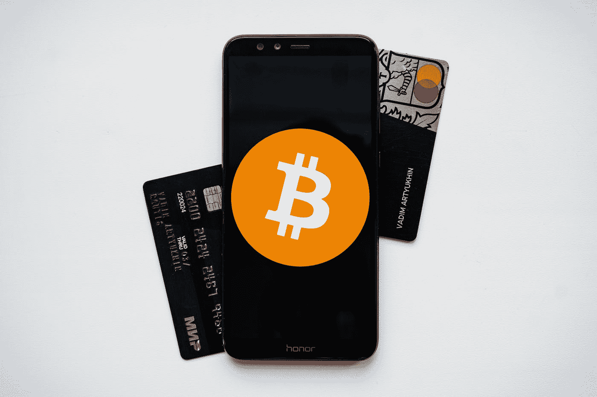

# 加密货币在乌干达仍然是非法的，在其他非洲国家是合法货币。

> 原文：<https://medium.com/coinmonks/cryptocurrency-still-illegal-in-uganda-legal-tender-in-other-african-countries-bd9fd175d53d?source=collection_archive---------38----------------------->

Photo by [Kanchanara](https://unsplash.com/@kanchanara?utm_source=medium&utm_medium=referral) on [Unsplash](https://unsplash.com?utm_source=medium&utm_medium=referral)

Dailymonitor 发布了这一点，但你可能没有看到这篇文章，因为他们已经迁移到数字，就像新视野数字体验一样。为了现在访问一些文章，你将需要有一个帐户和互联网。

乌干达银行将加密货币列入黑名单，政府警告人们交易加密货币已经有一段时间了。乌干达银行没有许可任何机构销售加密货币，然而许多大公司仍然在乌干达促进加密货币的贸易。

2019 年，财政部长马蒂亚·卡塞贾说:“乌干达政府不承认加密货币是乌干达的法定货币，也没有授权乌干达的任何组织出售加密货币或促进加密货币贸易。”

## 什么是加密货币？

加密货币是一种在互联网上运行的数字或虚拟货币，它位于一个叫做区块链的分布式或分散式网络上。分散化意味着没有银行、董事会或委员会来监管这种类型的货币或网络。没人能控制加密货币世界会发生什么。

我猜这就是为什么一些政府和金融机构讨厌它。

分布式网络(区块链)由世界各地不同人拥有的各种机器运行。这就是分权的含义。至于虚拟货币，你不能触摸它，但它有价值，可以让你交换它，用它交换其他数字资产、商品，甚至是实物资产。

比如[可以买](https://www.euronews.com/next/2021/12/04/paying-with-cryptocurrencies-these-are-the-major-companies-that-accept-cryptos-as-payment)一辆带加密货币的特斯拉，[古驰](https://www.voguebusiness.com/technology/gucci-takes-the-leap-will-accept-crypto-in-us-stores)，在[美洲](https://finance.yahoo.com/news/10-major-companies-accept-bitcoin-190340692.html)的一些商店，可口可乐，微软，肯德基，AT & T，星巴克，Twitch 等。

## 政府能阻止这一切吗？

不一定，但政府有权阻止你交易比特币(顶级加密货币之一)，或以太坊或任何其他你可能已经拥有的数字货币。

然而，他们不能做的是阻止你拥有它。那是因为，只要你有互联网，你就可以创建一个 ***加密钱包*** 并开始交易加密。就这么简单。你不必等待别人批准你的申请或帐户注册。

## 什么是加密钱包？

加密钱包允许您在区块链网络上存储和访问您的数字资产和加密货币。这些钱包就像你的私人银行。他们负责保护您的登录密钥(私钥和公钥)，并在购买比特币或任何其他受支持的数字货币、硬币或令牌时验证任何交易。

然而，重要的是要注意，不像普通的钱包，它可以保存实际的现金，加密钱包在技术上不存储你的密码。你的财产在区块链网络上直播。您的加密钱包仅存储允许您访问区块链上的加密资产的密钥。

***提示:*** *数字资产可以是游戏资产中的任何东西，如武器、头像、代币、虚拟土地和虚拟货币或硬币。*

Create a Crypto Wallet with [Coinbase](https://bit.ly/CoinbaseNewAccount)

## 什么是区块链？

我提到过加密钱包就像公共银行一样，每个人都可以在那里存放自己的资产吗？区块链是记录一个接一个存储的所有数字资产的书。区块链的特别之处在于它是不可变的，每个人都可以在这个网络或账本上写东西，但没有人可以擦除其中的数据。

数据块一个接一个地链接在一起，形成了区块链，不可能在已经记录的数据块之间插入数据块。它们是用算法加密的。

## 你需要了解的区块链的其他特性包括:

*   工作证明(Proof of of Work)——记住区块链是由世界各地不同的计算机运行的。当有人进行交易时，这些计算机负责通过解决复杂的数学难题来验证交易。谁拥有解决这个难题的电脑，谁就赢得奖励。这让我们想到了区块链的另一个特性。
*   **挖掘** —挖掘是在区块链上验证交易的过程。矿工利用他们的资源(时间、金钱、电力等)。)来验证新的交易并将其记录在公共账本(区块链)上，结果他们从人们为这些交易收取的费用中获得回报。
*   **利益证明**—2018 年，以太坊的创造者们开始从工作共识证明走向利益证明。工作证明在开采过程中消耗大量能源，电费非常高。赌注证明利用了我们所说的赌注，任何拥有以太坊的人都可以将它保留在网络上，以促进交易，换取网络上一定比例的费用。

## 区块链是如何运作的？

一旦记录了一个区块，区块链就会借助公钥或地址(用户名)以及存储在您钱包中的私钥(PIN 码)或种子短语来验证交易和您的加密资产所有权。首先联系分布式网络上的不同计算机，以确保您实际拥有该资产。

除了随着 2009 年比特币的诞生而诞生的主要区块链，其他区块链网络也已创建，包括以太坊网络、币安的币安智能链、更快更低交易费用的索拉纳区块链、多边形等。

## 什么是智能合约和去中心化应用(DApps)？

T 以太坊区块链(不要与 ETH -以太坊加密货币混淆)，允许应用程序通过用 Solidity 编程语言开发的智能合约来编写和运行([学习 Solidity](https://bit.ly/LinkedInLearningTrial) )。智能合同是你可能听说过的 DApps 或分散式应用。分散式应用在区块链上运行，这意味着一旦启动就无法更改。

Photo by [Vadim Artyukhin](https://unsplash.com/es/@vademann?utm_source=medium&utm_medium=referral) on [Unsplash](https://unsplash.com?utm_source=medium&utm_medium=referral)

## 什么是比特币钱包？

你可能想知道，比特币钱包是如何工作的？这就是当你创建一个比特币钱包时，为你创建一个用户名或公钥(也称为地址)的方式，只有比特币可以被发送到那个钱包。这些密钥允许你在区块链上访问你的比特币。这两个密钥必须是安全的，特别是私钥，也称为种子短语，如果您丢失了种子短语，您就失去了所有的钱。

有些钱包支持多种资产。事实上，大多数加密钱包支持不止一种数字货币或资产。

现在，您已经了解了区块链、加密钱包和加密货币，让我们看看可以用来存储加密或数字资产的各种钱包。

# 加密货币钱包的类型

钱包除了帮助您处理和验证购买或交易之外，还简单地存储您的私钥和公钥。加密钱包还允许你浏览和使用 DeFi(分散金融)应用程序，以及大多数内置在 web3 浏览器中的分散应用程序。

分散金融允许您使用银行功能，如通过智能合约构建的分散应用程序(DApps)进行储蓄、借贷。

大多数区块链钱包都配备了 Web3 浏览器，除了访问您的数字货币和游戏模型等资产以赢得区块链游戏，如[沙盒](https://bit.ly/EnterSandboxMetaverse)、Axie Infinity、分散土地等，您还可以查看 Web3 应用程序并与之互动。

## 什么是玩赚(P2E)？

除了存储代币和硬币，这些钱包还可以存储 NFT(不可替换的代币)。NFT 是验证区块链数字资产所有权的一种方式。事实上，像 Axie Infinity、Decentraland、[沙盒游戏](https://bit.ly/EnterSandboxMetaverse) maker、crypto kitties、TFC(足球俱乐部)和许多其他游戏(P2E)中使用的游戏资产都是由 NFT(头像、武器和其他游戏资产)表示的。

当游戏是 [P2E(玩赚游戏)](https://www.business2community.com/cryptocurrency/best-play-to-earn-games)时，这意味着您的参与将获得代币、数字现金或不可替代代币的奖励。这些游戏使用加密货币的区块链技术，允许人们从他们的游戏进度中自动接收付款。

大多数“玩赚”游戏(P2E)已经成为主流，成为几乎所有[元宇宙](https://www.mugabiimran.com/post/what-is-the-metaverse-and-web3)的核心组件，一些受欢迎的 P2E 游戏包括[沙盒](https://bit.ly/EnterSandboxMetaverse)、分散之地、Axie Infinity 等等。

让我们回到加密钱包，因为你需要一个钱包来支付你的每一场 P2E 游戏和你赢得的 NFT 奖励或礼物。

## 钱包主要有两种:冷钱包和热钱包。

冷钱包可以离线存储您的加密密钥，这意味着黑客入侵的风险更低，而热钱包只能在线访问，以帮助促进加密货币交易。加密钱包只是存储您的私人和公共密钥，让您访问您的数字资产。

## 纸质钱包:

记住你创建钱包时创建的私人密钥，你可以把你的私人密钥写在一张纸上，这张纸将成为你的纸钱包。你必须保护这份文件，就像保护你的财富一样。

## 在线钱包:(热门钱包)

这些是浏览器或软件钱包，可以借助浏览器扩展在浏览器中使用，下载到计算机上或作为移动应用程序。

观看此视频，了解如何安装浏览器扩展钱包。

How to Install the [Binance wallet](https://bit.ly/BinanceAccountLogin) via a browser extension in Chrome

## 最佳在线钱包包括:

*   **比特币基地钱包**——这与通过主网站访问的[比特币基地应用](https://bit.ly/CoinbaseNewAccount)不同，主网站允许你买卖密码或将其兑换成法定货币并转移到银行账户。
*   **币安** —这款钱包可以让你购买、交易和持有 600 多种加密货币，还可以储存法定货币，你可以用它来转换成加密货币。[币安](https://bit.ly/BinanceAccountLogin)和[比特币基地](https://bit.ly/CoinbaseNewAccount)一样，都是以交易所起家。现在，币安有了他们自己的区块链(币安智能链)和他们自己的硬币，最初是一种象征，[币安硬币](https://bit.ly/BinanceAccountLogin) (BNB)，已经成为密码市场上领先的数字资产之一。
*   **MetaMask** — MetaMask 是一款软件加密货币钱包，用于与以太坊区块链进行交互。它允许用户通过浏览器扩展或移动应用程序访问他们的以太坊钱包，然后可以用来与分散的应用程序和 [*元宇宙*](https://www.mugabiimran.com/post/what-is-the-metaverse-and-web3) 进行交互。
*   **区块链**—最值得信赖的加密钱包之一，自 2011 年以来拥有超过 8200 万个钱包，在 200 多个国家进行超过 1 万亿美元的加密交易。区块链，区块链钱包的创造者，始于 2011 年第一个比特币[区块链探索者](https://www.blockchain.com/explorer)。
*   **信任钱包** —顾名思义，信任钱包是最值得信赖的&安全加密钱包之一。你可以用它来访问(分散应用)DApps，购买，存储，收集 NFT，交换& earn crypto。

## 硬件钱包:

这些设备存储并允许您访问您的加密资产。大部分看起来像 u 盘或者硬盘。最常见的硬件钱包叫做[莱杰纳米](https://bit.ly/LedgerNanoPlus)。硬件钱包可能是最安全也是最贵的数字钱包。

## 最佳硬件钱包包括:

**Ledger Nano** — Ledger 是保护、购买、交换
和增加您的加密资产的最聪明的方式之一。参见[新台账纳米](https://bit.ly/LedgerNanoPlus) Plus。

Trezor 是由 Satoshi Labs 开发的一款高级加密货币硬件钱包，允许您以最小的风险存储 100 多种加密资产、令牌、硬币、密码和其他密钥。

***亲提示:*** *永远记下你的私钥，放在安全的地方。记住，如果你丢失了你的私人钥匙，你就失去了你的钱。*

所以，你看，加密货币并不难理解。尽管很多人觉得这像是火箭科学。

尽管加密货币交易不断受到警告，甘达仍然是许多加密货币公司的所在地。而其他非洲国家，如中非共和国等，已经[采用加密货币作为法定货币。](https://www.monitor.co.ug/uganda/business/finance/central-african-republic-adopts-bitcoin-as-legal-currency-3796384)据估计[超过 450 万人](https://triple-a.io/crypto-ownership-kenya/)，占肯尼亚总人口的 8.5%，目前拥有加密货币。

## 如何从你的加密钱包中取出？

想要随时将比特币直接转换成现金并不容易，但你可以在比特币基地、币安、区块链等交易所出售你的比特币或以太坊，以换取法定货币。

## 什么是加密货币交易所？

一个密码交易所存储密码并代表你处理交易(匿名在区块链上)。交易所帮助你找到买家，这样你就可以迅速将比特币的价值转换成你需要的现金。

像比特币基地这样的交易所有一个加密储备，允许他们卖给你法定货币来换取你的加密。他们会将这张票据直接发送到您选择的银行，您也可以提取移动货币，例如使用[币安](https://bit.ly/BinanceAccountLogin)和 Flutterwave、Chippercash、 [Yellowcard](https://bit.ly/YellowcardProfile) 等。

## 购买加密货币和其他数字资产的 3 种方式

1.  **使用法定货币和移动货币**——币安和其他一些国家有一种叫做 P2P(点对点)的系统，允许你直接向你周围的人买卖密码。
2.  **直接从朋友那里购买**——如果你拥有一些以太坊，并且你想在当地不接受加密货币作为支付形式的商店消费一些现金。比如在加密货币不是法定货币的乌干达，我们可以同意并接受互相兑换。这就是点对点(P2P)的含义。我送你菲亚特，你送我以太坊或者比特币。它可以与贝宝，移动货币，加密钱包。
3.  **使用交易所**——如前所述，你可以在[比特币基地](https://bit.ly/CoinbaseNewAccount)、[币安](https://bit.ly/BinanceAccountLogin)、区块链等交易所使用信用卡/借记卡购买密码。

## 乌干达政府将加密货币列入黑名单是否正确？

这仍然是个问题。然而，要回答这个问题，我认为我们需要看看政府的意图是什么，我认为政府试图保护它的公民。仅此而已。由于不了解加密货币及其工作原理，许多人已经成为网络诈骗的受害者。

## 乌干达银行为什么把乌干达的加密货币列入黑名单？

乌干达政府不接受加密货币的首要原因是，他们仍在寻找监管加密货币的方法。

再说一次，为了你好。

你看，事情是这样的，金融机构包括信贷机构、小额信贷存款机构(MDIs)、外汇兑换处，以及乌干达的银行，如渣打银行、克兰银行、斯坦比克银行、ABSA 银行、UBA 银行等，都受乌干达银行监管，就像 NBS 或 Bukedde TV 等电视受 UCC(乌干达通信委员会)监管一样。也就是说，如果银行丢了你的钱，或者你的存款发生了不幸的事情，也许有办法拿回来。

与乌干达或任何其他国家的加密货币持有者不同，如果你失去了加密货币持有的价值，就没有消费者保护。

但是无论如何，从这篇文章开始你就已经知道了。

我只希望政府继续教育乌干达人关于加密货币的知识，当他们找到监管的方法时，至少人们会知道他们在做什么。

帮助你的朋友了解区块链技术，在你的社交媒体 WhatsApp 上分享这篇文章，别忘了[订阅我的 YouTube](http://bit.ly/MugabiImranYouTube) 。

传播知识，不断学习。

> 加入 Coinmonks [电报频道](https://t.me/coincodecap)和 [Youtube 频道](https://www.youtube.com/c/coinmonks/videos)了解加密交易和投资

# 另外，阅读

*   [3 商业评论](/coinmonks/3commas-review-an-excellent-crypto-trading-bot-2020-1313a58bec92) | [Pionex 评论](https://coincodecap.com/pionex-review-exchange-with-crypto-trading-bot) | [Coinrule 评论](/coinmonks/coinrule-review-2021-a-beginner-friendly-crypto-trading-bot-daf0504848ba)
*   [莱杰 vs n rave](/coinmonks/ledger-vs-ngrave-zero-7e40f0c1d694)|[莱杰 nano s vs x](/coinmonks/ledger-nano-s-vs-x-battery-hardware-price-storage-59a6663fe3b0) | [币安评论](/coinmonks/binance-review-ee10d3bf3b6e)
*   [Bybit Exchange 审查](/coinmonks/bybit-exchange-review-dbd570019b71) | [Bityard 审查](https://coincodecap.com/bityard-reivew) | [Jet-Bot 审查](https://coincodecap.com/jet-bot-review)
*   [3 commas vs crypto hopper](/coinmonks/3commas-vs-pionex-vs-cryptohopper-best-crypto-bot-6a98d2baa203)|[赚取加密利息](/coinmonks/earn-crypto-interest-b10b810fdda3)
*   最好的比特币[硬件钱包](/coinmonks/hardware-wallets-dfa1211730c6) | [BitBox02 回顾](/coinmonks/bitbox02-review-your-swiss-bitcoin-hardware-wallet-c36c88fff29)
*   [BlockFi vs 摄氏度](/coinmonks/blockfi-vs-celsius-vs-hodlnaut-8a1cc8c26630) | [Hodlnaut 审核](/coinmonks/hodlnaut-review-best-way-to-hodl-is-to-earn-interest-on-your-bitcoin-6658a8c19edf) | [KuCoin 审核](https://coincodecap.com/kucoin-review)