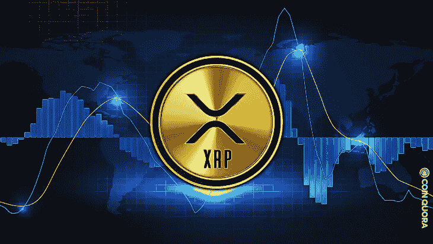

# 加密货币的故事——波纹币(XRP)

> 原文：<https://medium.com/coinmonks/cryptocurrency-story-ripple-coin-xrp-971429553dc1?source=collection_archive---------27----------------------->

大家好！
我带来了一个你可能会感兴趣的硬币故事。:)

今天的故事是关于“XRP 波纹币”！

## 什么是涟漪？XRP？

By Tina Mutare on Coin Quora

很多人认为涟漪和 XRP 是一样的。Ripple 是公司的名字，XRP 是一种加密货币，由 Ripple 运营的硬币。

## Ripple 是一家怎样的公司？

Ripple 是一家美国科技公司，成立于 2012 年，旨在改造全球银行系统。

Ripple 的愿景是在跨境转移资产时提供更快、更便宜、更安全的支付系统。换句话说，Ripple 最终是 SWIFT(在跨境传输时设定当前标准的市场领导者)的竞争对手。因此，Ripple 提供了多种软件解决方案。

By Arnab Shome on Finance Magnates

如果把比特币设计成一种没有中介的支付方式，Ripple 就是一种基于银行现有基础设施的支付系统。

这就是为什么很多人甚至称 Ripple 为银行家的硬币！

GIF on Dribbble

在某些方面，Ripple 作为现有银行系统的替代方案而开发的事实与加密货币的原始含义相矛盾。

## 涟漪的第一步

Ripple 的第一次创业是在 2004 年，当时 Ryan Fugger 创立了 Ripple Pay。

From Crunchbase

2012 年，当前的 ripple 项目得以实现，并创建了一个名为 Ripple 交易协议(RTXP)的新支付协议。

By Lets Talk on Fast & Clean

2013 年 9 月，OpenCoin Inc .更名为 Ripple Labs Inc .，并发布 P2P 网络源代码作为开源软件。

当时，Ripple Labs 开始向金融和银行机构推广使用 Ripple 技术，并于 2015 年 10 月从 Ripple Labs 更名为 Ripple。

## 涟漪诉讼？

GIF on Tenor

你们中的许多人都知道 Ripple 目前正处于诉讼中，所以我将谈论它，因为你们中的一些人不知道确切的原因以及它为什么重要！

1.  **涟漪诉讼为什么重要？**

正如我之前提到的，Ripple 是一家管理和运营国际汇款虚拟资产的公司。

这场诉讼很重要，因为它决定了美国虚拟资产市场和行业的未来。

这场官司的结果影响着虚拟资产市场的监管标准和方向。

所以很多人都在关注这个案子。

**2。SEC 为什么要提起诉讼？**

美国证券交易委员会监管证券和交易所。

这意味着 SEC 将 XRP 视为一种证券。

而且，发行人认为它应该在美国证券交易委员会注册，但有人认为这违反了它。​

**3。有证据表明 XRP 是未注册的安全人员吗？**

美国证券交易所通过豪威测试来确定它是否是一只股票。

如果通过这个测试被判定为证券，就应该受到证券法的规制。

豪威试验如下:

From LeewayHertz

**1。你是否投了钱**

劳动或精神贡献不是投资。

**2。您是否投资了一家公司**

基金会和发行人的投资也是投资。

**3。你是否抱着获利的希望投资**

如果你没有任何期望地花钱，那就不是投资，而是捐赠或礼物。

**4。第三方的努力是否盈利**

第三方省钱的努力应该是盈利，而不是投资人自己的努力。

如果你符合以上这些条件，你就被证券评判了。

SEC 声称，

1.  **Ripple Labs 投入资金**
2.  他们投资了 Ripple 基金会
3.  **Ripple 投资时相信他们能够获利**
4.  **涟漪开发商努力赚钱**

案子还没完呢！

GIF on Giphy

这仍有待观察，但 Ripple 的律师杰里米·霍根近日表示，“我认为 Ripple 在 9 月和 10 月赢得与 SEC 的法律战后，将以禁止重审的原则结束集体诉讼，”并补充说，“我对预测裁决更有信心。”

## 当前排名、交易量

现在，回到主题，XRP，从我写这篇文章的时候开始，它目前在硬币市场排名第六，24 小时交易量为 1，187，124，576 美元。

你可以随时在这个网站上查看你感兴趣的硬币排名，交易量，交易所排名:

[https://coinmarketcap.com/](https://coinmarketcap.com/)

> 你喜欢今天的阅读吗？
> 
> 如果你一点一点地学习硬币并练习，总有一天你会成为硬币大师，对吗？:)
> 
> 好好学习，我希望你有一个富有成效的一周。
> 
> 如果您有任何问题或想要获得硬币相关的信息，请随时来和我们下面的社区交谈:)
> 
> 推特:[https://twitter.com/el_coinmonster](https://twitter.com/el_coinmonster)
> 
> 然后，下一个故事再见！

> 加入 Coinmonks [电报频道](https://t.me/coincodecap)和 [Youtube 频道](https://www.youtube.com/c/coinmonks/videos)了解加密交易和投资

# 另外，阅读

*   [瓦济里克斯 NFT 评论](https://coincodecap.com/wazirx-nft-review) | [比茨盖普 vs 皮奥克斯](https://coincodecap.com/bitsgap-vs-pionex) | [坦吉姆评论](https://coincodecap.com/tangem-wallet-review)
*   [如何使用 Solidity 在以太坊上创建 DApp？](https://coincodecap.com/create-a-dapp-on-ethereum-using-solidity)
*   [币安 vs FTX](https://coincodecap.com/binance-vs-ftx) | [最佳(SOL)索拉纳钱包](https://coincodecap.com/solana-wallets)
*   [如何在 Uniswap 上交换加密？](https://coincodecap.com/swap-crypto-on-uniswap) | [A-Ads 审核](https://coincodecap.com/a-ads-review)
*   [加密货币储蓄账户](/coinmonks/cryptocurrency-savings-accounts-be3bc0feffbf) | [YoBit 评论](/coinmonks/yobit-review-175464162c62)