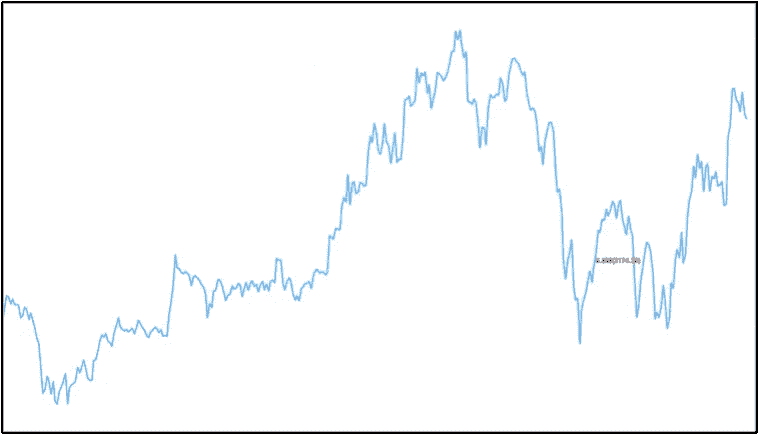
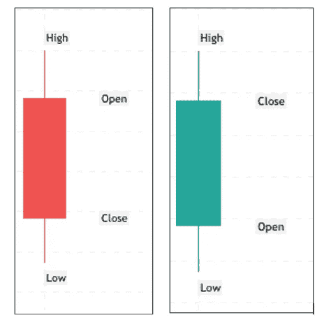
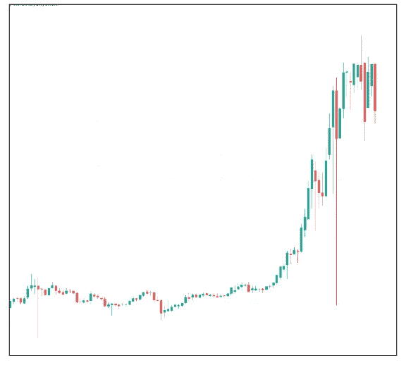
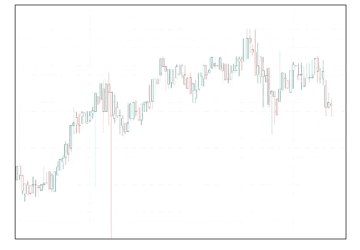
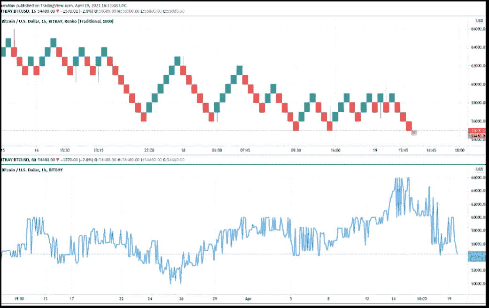
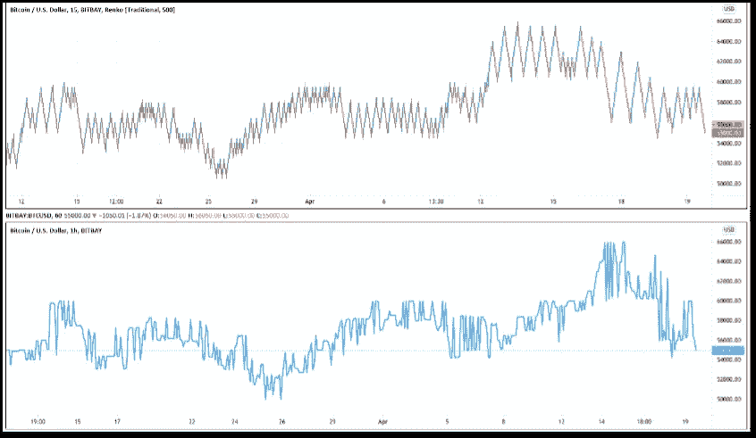
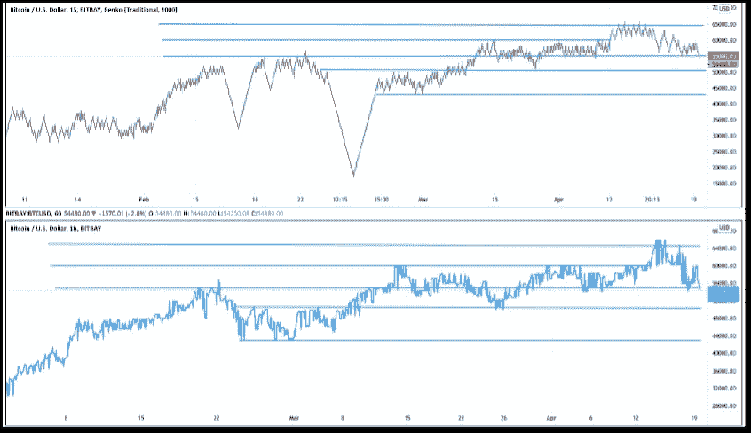
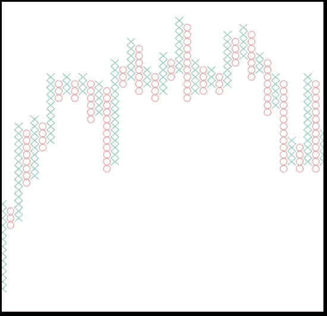
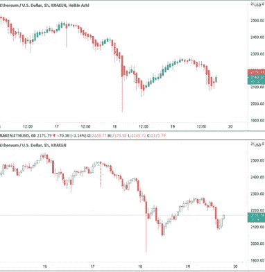
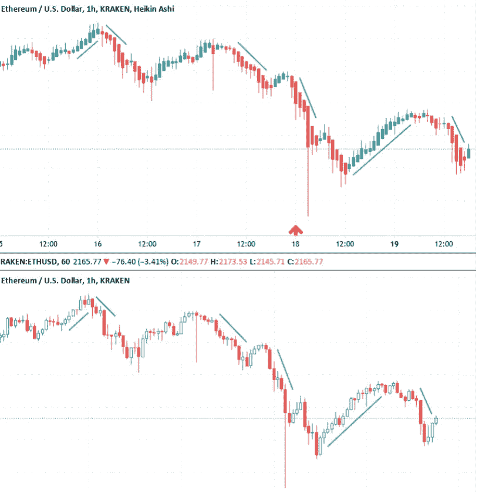

# 加密货币技术分析:图表类型和图表简介

> 原文：<https://medium.com/coinmonks/cryptocurrency-technical-analysis-chart-types-introduction-to-charting-bfb614a1c376?source=collection_archive---------42----------------------->

图表是技术分析的基础；它们构成了研究价格和发现模式的基础。图表，在一个层面上是简单的，在另一个层面上，是深刻而复杂的。本文旨在介绍一些基础知识；不同类型的图表及其不同用途如下，从折线图开始:

> 折线图
> 
> 烛台图表
> 
> 伦科图表
> 
> 点数图
> 
> 黑肯-阿希图表

**折线图**

折线图是用一条线表示价格的图表。大多数图表都是折线图，因为尽管它们包含的信息比流行的图表少，但它们非常容易理解。罗宾汉(Robinhood)和比特币基地(这两家公司的服务对象都是缺乏经验的投资者)的默认图表类型是折线图，而查尔斯·施瓦布和币安等面向更有经验的受众的机构则使用其他图表形式。

[**[i]**](#_edn1)(tradingview.com) Figure 10: Line Chart[[ii]](#_edn2)

**烛台图表**

烛台图表是一种更有用的显示硬币信息的形式，是大多数投资者的首选图表。在给定的时期内，蜡烛图有一个宽的“实体”，可能是红色或绿色(另一种常见的配色方案是空的和填充的实体)，如果是红色(填充)，收盘低于开盘(意味着下跌)。如果真实的身体是红色的(空的)，收盘比开盘高(意味着上涨)。真实身体的上方和下方是“灯芯”，也称为“影子”灯芯显示了这一时期交易的最高价和最低价。所以，结合我们所知道的，如果上灯芯(又名上影线)接近真实的身体，硬币或代币在一天内达到的高点接近收盘价。因此，反过来也适用。你将需要对烛台图表有一个坚实的理解，所以我建议你访问一个网站，如 tradingview.com，以获得舒适。

(tradingview.com) Bearish Candle[[iii]](#_edn3), Bullish Candle[[iv]](#_edn4)

(tradingview.com) Figure 13: Candlestick Chart[[i]](#_edn1)

(tradingview.com) Figure 14: Candlestick Chart — Expanded View[[vi]](#_edn6)

**伦科图表**

伦科图表只显示价格运动，忽略时间和交易量。Renko 来自日语“renga”，意思是“砖块”。Renko 图表使用砖块(也称为盒子)，通常是红/绿或白/黑。Renko 箱体只形成在前一个箱体的右上角或右下角，下一个箱体只有在价格超过前一个箱体的顶部或底部时才能形成。例如，如果预定义的金额是“$1”(这类似于蜡烛图上的时间间隔)，那么下一个盒子只能在前一个盒子的价格之上或之下通过$1 时形成。这些图表将趋势简化并“平滑”成易于理解的模式，同时消除随机的价格波动。这使得进行技术分析更加容易，因为诸如支撑位和阻力位这样的形态会更加明显地显示出来。

*答:(tradingview.com)伦科图表【vii】。*伦科图表特写。注意盒子和简化的图案

*B:(tradingview.com)伦科图#2[viii]* 与折线图相比的伦科图。

(tradingview.com)伦科图表#3[ix]。在伦科图上画出支撑线和阻力线。

**点&图图表**

虽然点图和(tradingview.com)图(P&F)没有这个列表中的其他图出名，但是它们有很长的历史，并且被认为是用来确定好的进场点和出场点的最简单的图表之一。和伦科图表一样，P&F 图表并不直接说明时间的流逝。更确切地说，x 和 Os 是按列堆叠的；每个字母代表一个选定的价格运动(就像 Renko 图表中的块)。x 代表价格上涨，Os 代表价格下跌。看看这个序列:

X
X O X

X O

X

假设选择的价格变动是 10 美元。我们必须从左下角开始:3 个 x 表示价格上涨了 30 美元，2 个 o 表示下跌了 20 美元，最后的 2 个 x 表示上涨了 20 美元。时间无关紧要。

[【x】](#_edn10)(*tradingview.com*)图 18:点&图图表[【Xi】](#_edn11)

**黑金阿希**

Heikin-Ashi (hik-in-aw-she)图表是烛台图表的一个更简单、更平滑的版本。它们的功能几乎和烛台图表一样，(蜡烛，灯芯，阴影等)。)，除了 HA 图表平滑了两个时期而不是一个时期的价格数据。本质上，这使得 Heikin-Ashi 比蜡烛图更受交易者青睐，因为模式和趋势更容易被发现，错误信号(小的，无意义的波动)在很大程度上被忽略了。也就是说，更简单的外观确实掩盖了一些与烛台相关的数据，这也是 Heikin-Ashis 尚未取代烛台的部分原因。所以，我建议你尝试这两种图表类型，并(tradingview.com)找出最适合你的风格和辨别趋势的能力。

答:*(tradingview.com)图十九:Heikin-Ashi 图*[*【XII】*](#_edn12)*。*注意，Heikin-Ashi 图上的趋势比下方的蜡烛图更平滑、更清晰。

b:*(tradingview.com)图 20: Heikin-Ashi 图# 2*[*【XIII】*](#_edn13)。请注意，明显的上升趋势有连续的绿色蜡烛线，没有下影线，而强烈的下降趋势有连续的红色蜡烛线，没有上影线。

图像属性(图表提供商)

[【我】](#_ednref1)图片来源:trading view(tradingview.com)

[【ii】](#_ednref2)图像信用:通过 trading view(tradingview.com)创建

[【三】](#_ednref3)形象积分:通过 trading view(tradingview.com)创建

[【四】](#_ednref4)形象信用:通过 trading view(tradingview.com)创建

图片来源:通过 trading view(tradingview.com)创建

[【VI】](#_ednref6)图片来源:通过 trading view(tradingview.com)创建

[【VII】](#_ednref7)图片来源:通过 trading view(tradingview.com)创建

[【VIII】](#_ednref8)图片来源:通过 trading view(tradingview.com)创建

[【IX】](#_ednref9)图片来源:通过 trading view(tradingview.com)创建

[【x】](#_ednref10)图片来源:trading view(tradingview.com)

[【tradingview.com】](#_ednref11)图片来源:通过 TradingView 创建

[【XII】](#_ednref12)形象信用:通过 trading view(tradingview.com)创建

[【XIII】](#_ednref13)图像信用:通过 trading view(tradingview.com)创建

> 加入 Coinmonks [电报频道](https://t.me/coincodecap)和 [Youtube 频道](https://www.youtube.com/c/coinmonks/videos)了解加密交易和投资

# 另外，阅读

*   [印度加密交易所](/coinmonks/bitcoin-exchange-in-india-7f1fe79715c9) | [比特币储蓄账户](/coinmonks/bitcoin-savings-account-e65b13f92451)
*   [OKEx vs KuCoin](https://coincodecap.com/okex-kucoin) | [摄氏替代品](https://coincodecap.com/celsius-alternatives) | [如何购买 VeChain](https://coincodecap.com/buy-vechain)
*   [币安期货交易](https://coincodecap.com/binance-futures-trading)|[3 commas vs Mudrex vs eToro](https://coincodecap.com/mudrex-3commas-etoro)
*   [如何购买 Monero](https://coincodecap.com/buy-monero) | [IDEX 评论](https://coincodecap.com/idex-review) | [BitKan 交易机器人](https://coincodecap.com/bitkan-trading-bot)
*   [CoinDCX 评论](/coinmonks/coindcx-review-8444db3621a2) | [加密保证金交易交易所](https://coincodecap.com/crypto-margin-trading-exchanges)
*   [红狗赌场评论](https://coincodecap.com/red-dog-casino-review) | [Swyftx 评论](https://coincodecap.com/swyftx-review) | [CoinGate 评论](https://coincodecap.com/coingate-review)
*   [Bookmap 评论](https://coincodecap.com/bookmap-review-2021-best-trading-software) | [美国 5 大最佳加密交易所](https://coincodecap.com/crypto-exchange-usa)
*   [如何在 FTX 交易所交易期货](https://coincodecap.com/ftx-futures-trading) | [OKEx vs 币安](https://coincodecap.com/okex-vs-binance)
*   [CoinLoan 评论](https://coincodecap.com/coinloan-review) | [YouHodler 评论](/coinmonks/youhodler-4-easy-ways-to-make-money-98969b9689f2) | [BlockFi 评论](https://coincodecap.com/blockfi-review)
*   [XT.COM 评论](https://coincodecap.com/profittradingapp-for-binance) | [币安评论](https://coincodecap.com/xt-com-review)