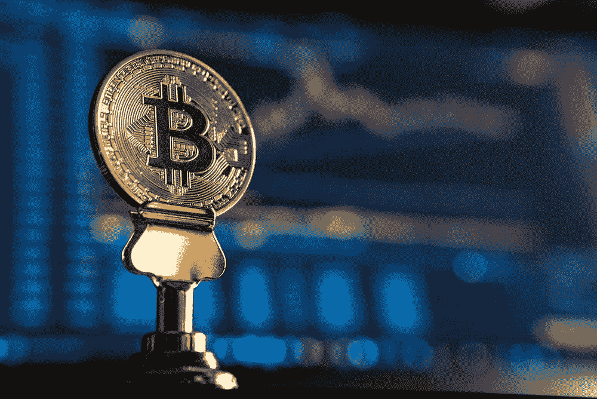
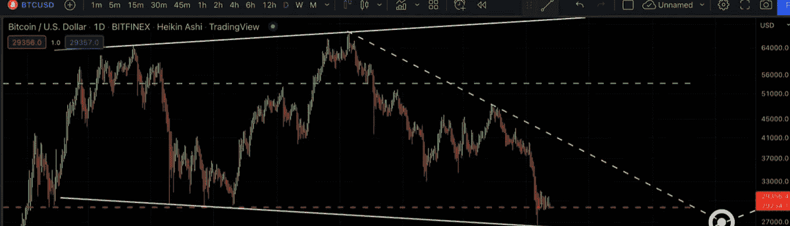
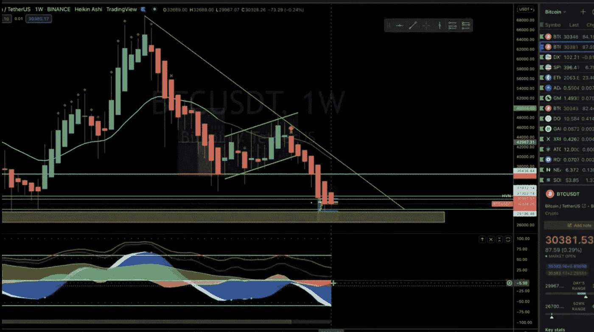

# 加密货币——未来一生中最好的购买机会？

> 原文：<https://medium.com/coinmonks/cryptocurrency-the-best-buying-opportunity-of-a-lifetime-ahead-47017bb49e27?source=collection_archive---------27----------------------->

关于可能要准备什么的简短总结。

加密货币——未来一生中最好的购买机会？

有人可能会说，以比特币目前的价格，比特币是一个好买卖，但再坚持一段时间可能会带来更好的购买机会。

比特币目前支撑在 29000 美元左右。一旦这个支撑被打破，回撤回到 200 周移动平均线是可能的。200 周移动平均线目前位于 22，000 美元左右。这个价位不仅对比特币来说是一生中最好的购买机会之一，对替代币来说也是如此。

目前投资 altcoins 风险特别大。在这种熊市趋势中，当比特币上涨时，流动性就会从替代币中流失，比特币相对于替代币的涨幅更高。当比特币价格下跌时，替代币遭受的损失更大。在这个市场上，比特币是你能持有的最好的资产。

市场密码(Market Cypher)是著名的“密码脸”(Cryptoface)发明的交易工具。这个交易指标预示了未来一段时间的许多看跌趋势。一个被称为“血钻”的指标，通常只在价格下跌时显示，在过去几天出现在几个时间框架中。这些指标何时发挥作用是一个谜，尽管一个非常好的估计，这种可能的投降可能会发生在 1-2 个月。

从现在到那时，由于 36k 是一个强大的阻力，可能会有一个通向 36000 美元的救济反弹，然后在 22k 下跌到 200 周移动平均线。由于比特币最近投入的红色周蜡烛数量之多，可能会出现一波令人宽慰的反弹。截至本文，比特币已经连续显示了 8 根红色周线蜡烛，目前处于第 9 根，这是比特币历史上的第一次。反弹是应该的。

请注意 2022 年 5 月 27 日，因为这一天是本月的最后一个星期五。本周五具有重要意义，因为许多期权和期货在这一天到期，导致价格波动，上涨或下跌。Max pain 目前的奖金约为 34，000 美元

Resistance at ~$36,000

8 confirmed weekly red candles

这个消极的消息可能很难听到，但是做好最坏的打算是很重要的。在我的上一篇文章中，我呼吁比特币回撤至夏季低点，而这一运动正如预测的那样发生了。如果你计划尝试把握市场时机，这是未来几个月要注意的。或者你可以直接找 DCA 和 HODL！

*牛市让你赚钱，熊市让你发财。那些不喜欢熊市的人也不明白熊市提供的机会。本杰明·考恩*

声明:以上文章不属于财务建议。请做出你自己明智的投资，罗伯

> 加入 Coinmonks [电报频道](https://t.me/coincodecap)和 [Youtube 频道](https://www.youtube.com/c/coinmonks/videos)了解加密交易和投资

# 另外，阅读

*   [5 款最佳加密交易终端](https://coincodecap.com/crypto-trading-terminals) | [最佳 DeFi 应用](https://coincodecap.com/best-defi-apps)
*   [比特币基地 vs 瓦济克斯](https://coincodecap.com/coinbase-vs-wazirx) | [比特鲁点评](https://coincodecap.com/bitrue-review) | [波洛涅克斯 vs 比特鲁](https://coincodecap.com/poloniex-vs-bittrex)
*   [德国最佳加密交易所](https://coincodecap.com/crypto-exchanges-in-germany) | [Arbitrum:第二层解决方案](https://coincodecap.com/arbitrum)
*   [币安交易机器人](/coinmonks/binance-trading-bots-d0d57bb62c4c) | [OKEx 评论](/coinmonks/okex-review-6b369304110f) | [阿塔尼评论](https://coincodecap.com/atani-review)
*   [最佳加密交易信号电报](/coinmonks/best-crypto-signals-telegram-5785cdbc4b2b) | [MoonXBT 评论](/coinmonks/moonxbt-review-6e4ab26d037)
*   如何在 Bitbns 上购买柴犬(SHIB)币？ | [买弗洛基](https://coincodecap.com/buy-floki-inu-token)
*   [CoinFLEX 评论](https://coincodecap.com/coinflex-review) | [AEX 交易所评论](https://coincodecap.com/aex-exchange-review) | [UPbit 评论](https://coincodecap.com/upbit-review)